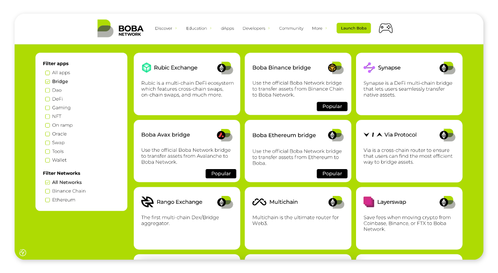

# FAQ

<figure><figcaption></figcaption></figure>


[Boba](https://boba.network) is a compute-focused Layer 2 (L2) solution built on top of the Layer 1 blockchain, [Ethereum](https://ethereum.org/en) and [BNB Chain](https://www.bnbchain.org/en/bnb-smart-chain). Ethereum is similar to L1 blockchains like Avalanche, BNB, and Moonbeam, and acts as a base blockchain platform that executes all on-chain transactions. Boba scales and augments the core _compute_ capabilities of Ethereum/BNB Chain, reducing gas fees and improving transaction throughput - while retaining the security guarantees of its underlying network.

The complexity of smart contract algorithms can make them expensive and slow to execute at speed. To solve this, Boba has designed a Hybrid Compute architecture that enables smart contracts to trigger much more complex algorithms off-chain (similar to running an app on AWS for example), and then bring the result back into the on-chain smart contract. Hence, the Boba Hybrid compute model runs both on-chain and off-chain.

<figure><figcaption></figcaption></figure>

Boba is built on the Optimistic Rollup developed by [Optimism](https://optimism.io). Boba chose to build on Optimism because it is essentially a modified version of Ethereum that makes it relatively easy to ensure Ethereum Virtual Machine (EVM) and Solidity compatibility. This minimizes the efforts required to migrate smart contracts from L1 to L2.

## Is Boba a side chain?

Boba is not a side chain. Side chains are their own blockchain systems with entirely separate consensus mechanisms. Boba Network lives _inside_ of Ethereum as a series of smart contracts that are capable of executing Ethereum transactions. Side chains on the other hand rely on their own consensus mechanisms for security. Boba as a child chain instead relies on the security of Ethereum itself.

## What is the difference between Boba and Ethereum?

Boba is an augumentation over Ethereum. Just like you would on Ethereum, you can create and interact with Solidity smart contracts using the same wallet software you are already familiar with. However, Boba does not have a consensus algorithm of its own and relies on Ethereum.

## Is Boba safe?

Boba Network is just as safe as the Ethereum chain. Optimistic Rollups like Boba are safe as long as Ethereum itself is _live_ (that is, not actively censoring transactions). In addition, Boba is in the process of implementing a security model backed by a system of _fraud proofs_, where users are paid to reveal bad transaction results published to the Boba Optimism based chain.

## Is there a delay moving assets from Boba to Ethereum?

Boba has developed a swap-based mechanism to deliver a smooth user experience for moving funds across chains. Porting assets from L1 to L2, L2 to L1, or between two L2s (as long as they are both EVM-compatible), is fast and dependable.

The users who choose to take advantage of this bridging between L1 and L2 will pay a small convenience fee that is shared among the liquidity providers of the pools backing the swaps. Acting as liquidity providers is just the first of several staking opportunities Boba will roll out to the community. The higher level goal is to encourage broad participation in the operations and governance of Boba. As a tokenized, EVM-compatible L2, Boba is in a position to use the Boba token responsibly for the long-term sustainability of the network.

One of the easiest way to bridge funds from and to Boba is the [Light Bridge](https://gateway.boba.network).

## How are developers incentivized to build on Boba?

The high gas fees of Ethereum itself is a pretty strong incentive for developers to move to layer 2 networks like Boba. Boba not only helps Ethereum scale, but also allows contracts to tap into advanced off-chain compute capabilities that are not available on other chains. Boba also has plans to create an ecosystem fund to incentivize some of the early-stage projects that are just starting out and that plan to launch interesting apps. It’s going to take some time to put something like that together. That’s in our plans.

## How do I connect my wallet to Boba Network?

Many wallets now allow applications to trigger a popup to switch between networks. If your wallet supports this feature, you will be automatically prompted to switch networks when an application wants to use the Boba Ethereum network. You can use these bridges to add the Boba network to your wallet:

\* [Universal gateway](https://gateway.boba.network).

If your wallet does not support this feature, you will have to connect manually. The exact process for connecting your wallet to a Boba Ethereum network depends on the specific wallet software you are using. To get started on Boba/Ethereum, you can use the available [community RPC endpoint](contents/developer/multichain/network-eth.md).

## How do I move assets into or out of Boba Network?

To move assets into or out of an Optimistic Ethereum network you can use the [**Boba Gateway**](https://gateway.boba.network). Detailed instructions in our [user documentation](contents/user/001\_how-to-bridge.md).

You can choose any of these two methods: [the **classical bridge**, or the **light bridge**](contents/boba-basics/bridge-basics/).

## Can I cancel a withdrawal after it has been submitted?

_No_, withdrawals currently cannot be cancelled once submitted.

## Can I transfer directly from Boba to a centralized exchange?

Only if the centralized exchange supports Boba Network. For exchanges that do not directly support Boba Network, you can still bridge your assets into a network they do support (such as Eth Mainnet or BNB Chain).

## Where can I find RPC endpoints and connection details?

Connection details for our Mainnet and Sepolia network are [here for ETH](developer/multichain/network-eth.md) and [here for BNB](developer/multichain/network-bnb.md).

## Are multicall contracts supported on Boba?

Yes. However, you will have to deploy your own version.

## What are the token decimals on L2 Boba?

The token decimals on Boba L2 are the same as on Ethereum L1. So if the token has 6 decimals on L1, it will have 6 decimals on L2.

You can check decimals using the [blockexplorer](https://bobascan.com). Here's an [example](https://bobascan.com/token/0x66a2A913e447d6b4BF33EFbec43aAeF87890FBbc/tokentrade?chainId=288).

You can also check the decimals by calling the token contracts:

```javascript
const decimals = await this.ERC20_Contract.attach(tokenAddress).connect(this.L2Provider).decimals()
//typical values are 18 or, in some rare but important cases, 6
```

## Why is the incentive contract for verification proofs disabled?

In the current release of the Boba Network protocol, there may be rare cases where the Sequencer submits a state root (transaction result), that is invalid and hence could be challenged. As a result, we have not yet deployed the [Bond Manager](packages/contracts/contracts/L1/verification/BondManager.sol) contract which compensates Verifier nodes for gas spent when submitting state root challenges. Additionally, our upgrade keys have the ability to directly remove state roots without going through an uncompensated state root challenge.

## Does Boba operate the only _Sequencer_ node?

A Sequencer node is a special node in an Optimistic Ethereum network that can order transactions on short timescales (on the order of minutes). This opens up the door to very fast transaction confirmation times with strong guarantees about finality. Eventually, the operator of the Sequencer node on a network will be determined by some governing mechanism. For now, Boba Network operates the only such node.

## What is the Gas price on Boba L2?

The Gas usage price on the Boba L2 updates every **10 minutes** if the Ethereum L1 gas price changes (with some smoothing to reduce sharp discontinuities in the price from one moment to the next). The maximum percentage change from one value to another is capped at no more than 5% in the gas price oracle. For example, if the current `gasPrice` is 10 Gwei then the next `gasPrice` will be between 9.5 and 10.5 Gwei. As on the Ethereum Mainnet, the current gas price can be obtained via `.getGasPrice()`, which is typically around 10 Gwei.

## Do you support EIP-2470: Singleton Factory?

Yes! [ERC-2470](https://eips.ethereum.org/EIPS/eip-2470) is deployed to `0xce0042B868300000d44A59004Da54A005ffdcf9f` on the Boba L2. The address on the Boba L2 is the same as on Ethereum mainnet.

## Are there any other documentation resources besides the docs on Boba Network?

In addition to the docs in this [Boba Developer Docs](https://docs.boba.network/faq) space, we have some [older examples](https://github.com/bobanetwork/boba\_legacy/tree/develop/boba\_examples) that could provide more context.

Here is an example that shows a [user's journey setting up NFT Bridges](https://github.com/bobanetwork/boba\_legacy/blob/develop/boba\_examples/nft\_bridging/README.md).

## Boba is based on the work done by Optimism. Do you plan to support Optimism Bedrock?

Yes, we call it Anchorage. It's already live on our Sepolia testnet and will soon go live on Mainnet.


***

<figure><figcaption></figcaption></figure>

## Why am I getting the 'contract size exceeds limit' error?

Instead of deploying just one contract, you need to deploy several.

## Are there any technical changes or differences in smart contracts and gas tables in Boba Network, in comparison to BNB Smart Chain or Ethereum Networks?

No, there is no difference.

## Is it safe to use Solc optimization on contracts?

Yes!

## Is it all right with the Boba Network if the source code of our app is closed source?

Boba network is a permission-less network and hence we cannot influence app creators about the disclosure of their source code. However, we do advise end users not to interact with smart contracts that use source code that is not verified in the Blockexplorer.

## Is there a way to run arbitrarily compiled Smart Contract native code, or a Smart Contract in a WebAssembly (WASM) environment?

Unfortunately no, not at the moment.

## Could you please explain the difference between the two mappings [mentioned in the token list](contents/developer/exchange-integration.md)?

Technically, an L1 token can have multiple representations on L2. This mean that an L1 token can be wrapped in distinct tokens: L2\_token\_A, or L2\_token\_B, both being valid and point to the same L1 token. But in order to standardize, the token list specifies only a single L2 token address for every corresponding L1 token.

## Could you share more information on how cross-chain messages are relayed?

[Here's some info on communication between contracts on Optimism and Ethereum](https://github.com/ethereum-optimism/optimism-tutorial/tree/01e4f94fa2671cfed0c6c82257345f77b3b858ef/cross-dom-comm).

[And here's the relayer service Boba uses for relaying messages from L2 to L1](https://github.com/bobanetwork/boba\_legacy/tree/develop/packages/message-relayer).

<figure><figcaption></figcaption></figure>

## Does Boba Network Have a testnet/How do I get Testnet Boba or Eth?

Yes! Please refer to [Boba Faucets](contents/developer/faucets.md).

For more information on Boba’s testnet and fountain, [check out our documentation](contents/developer/multichain/network-eth.md).

## I am trying to run Boba Network locally and I am able to run unit tests. However, integration tests give an error:

`./scripts/wait-for-sequencer.sh is getting timed out. Any Solutions?`

Please run `docker-compose logs`, as well as integration tests, and send us the output of the logs and test results via our [Discord server](https://boba.eco/discord).

## I have started deploying Boba Testnet, what can I use to index events?

You can use [GoldSky](contents/developer/features/subgraph.md) to index events.

<figure><figcaption></figcaption></figure>

## Why am I getting an error that says the gas limit is 1,000,000,000,000,000 Wei?

Although you will get an error message that says the gas limit is 1,000,000,000,000,000 Wei, the Boba Network will throw an error anytime the gas price is equal to, or more than three times the expected gas price for any given transaction.

When you make an Ethereum transaction, the user will be given an expected fee for the transaction. Say you are about to transfer some Ethereum into your friend’s account and you are given an expected transaction fee of 3 USD. Because the market changes quickly, the gas prices could sky-rocket, and the transaction fee is now 9 USD. In such cases you will receive an error message.

Here, Boba is looking out for you. Before that unexpected increased fee goes through, Boba throws an error message and prevents the payment from going through. If the transaction fee is at least three times what the expected cost was (in this example, your transaction fee of 3 USD jumped to 9 USD), the transaction will fail and saves you from the increased fee.

[Here's more info on fees](contents/developer/fee-scheme.md#for-frontend-and-wallet-developers).

## DAPPs require an XYZ gas amount to deploy. However, Boba's block gas limit of only 11,000,000 makes it impossible to deploy a smart contract. What can I do to deploy this smart contract on Boba?

Try to increase or decrease Solc optimizations. For more information, check out the [Solidity documentation](https://docs.soliditylang.org/en/latest/using-the-compiler.html). In addition, you can break down contracts into smaller chunks.

## I am trying to deploy a smart contract to Boba with Remix but get this error:

`"creation of SCContract errored: [ethjs-query] while formatting outputs from RPC '{"value":{"code":-32603,"data":{"code":-32000,"message":"invalid transaction: exceeds block gas limit"}}}'`

As mentioned above, try to increase Solc optimizations. For more information, check out the [Solidity documentation](https://docs.soliditylang.org/en/latest/using-the-compiler.html), or break down contracts into smaller chunks.

## Since the max value of runs is 2^32 - 1, do you recommend Solidity optimization?

Optimization does not mean that there’s a limit set to the number of transactions this contract can process.

[Check out Solidity’s official documentation for more information.](https://blog.soliditylang.org/2020/11/04/solidity-ama-1-recap/)

You can also [look into using compilers and optimization options](https://docs.soliditylang.org/en/v0.8.4/using-the-compiler.html#optimizer-options) in Solidity’s documentation.

## Does Boba Network have a public TheGraph Node for deploying Subgraphs?
No, but you can use GoldSky.

[Please refer to the Boba docs on using GoldSky](contents/developer/features/subgraph.md).

## Which bridge does Boba Network use?

There are multiple bridges available and are listed on our ecosystem page:

<figure><figcaption></figcaption></figure>

Find all bridges [here](https://boba.network/dapps/?filter=true\&project\_category=bridge)

## On Optimism it is possible to skip the sequencer entirely and submit transactions directly to the CanonicalTransactionChain via an Ethereum transaction. Can you do this with Boba too?

Yes, its possible on Boba as well. You could submit transactions [directly on L1 by calling 'enqueue()'](https://github.com/bobanetwork/boba\_legacy/blob/develop/packages/contracts/contracts/L1/rollup/CanonicalTransactionChain.sol#L207) on the Canonical Transaction Chain (CTC). The sequencer is forced to include your transaction on L2, but you would still need it to be up and running.

## On Optimism, commitments are regularly published (approximately once or twice per hour), to a smart contract on Ethereum called the StateCommitmentChain. Is the publishing frequency same for Boba?

Yes, state commitments are published on L1 [approximately every hour](https://etherscan.io/address/0xdE7355C971A5B733fe2133753Abd7e5441d441Ec). This applies to under-sized batches as well, which are published after waiting an interval.

## What is the duration of the fault challenge period on Boba?

The fault challenge period is 7 days.

## Do you have any information on bridging multiple assets in one transaction and the Liquidity Pool (LP) floating fee rate?

Bridging multiple assets in one transaction and LP floating fee rate are two tweaks that have been made to the Liquidity Pool contracts.

Bridging multiple assets in one transaction involves extending the LP1 contract to allow bridging eth, and/or multiple tokens, to L2 in a single transaction call. This primarily enables users to bridge gas token along with their desired token to L2 in one transaction. This is a method that is applicable only on bridging (on-ramp) through the Liquidity Pools, and works for only the tokens that the LPs support. Contract methods that enforce this bridging are: `clientDepositL1Batch()` on L1LP, and `clientPayL2Batch()` on L2LP.

LP floating fee rate refers to the change in the fee logic on LPs. LP fee consists of `userRewardFee` (fee distributed to liquidity providers), and `ownerRewardFee` (fee for the owner of the contract). Before the change, LPs had a configurable fixed value for both these fees. After the change, the `userRewardFee` is a dynamic value that depends on the pool balance, which moves between configured min/max ranges. The `ownerRewardFeeRate` continues to be a configurable fixed value.

<figure><figcaption></figcaption></figure>

## What are the limits on Hybrid Compute Web2 calls?

Boba's Hybrid Compute Turing model:

* limits strings returned from external endpoints to 322 characters (5\*64+2=322).
* allows only one Turing call per execution.
* imposes a 1200 ms timeout on API responses. Hence, please make sure that API responds promptly. If you are using AWS, note that some of their services take several seconds to spin up from a 'coldstart', and could result in persistent failure of the first call to your endpoint.

## If Hybrid Compute is automatic, does that mean contract execution now waits on API response? How long can an endpoint delay execution? Won't this hit the API endpoint even in cases of Simulations/Reverts?

Hybrid Compute calls need to execute estimateGas first. This puts the API response in a short lived cache, out of which the result is fetched in transaction processing.

[Check out additional info in Boba examples](https://github.com/bobanetwork/boba\_legacy/blob/develop/boba\_examples/turing-lending/README.md).

## When using the Hybrid Compute feature, the transaction pops up on Metamask, and if I submit it within a few seconds, everything works. However, waiting longer and submitting results in failure. Why does this happen?

That's because the Hybrid Compute feature puts the Hybrid Compute response in a cache bucket. Your request including a Hybrid Compute request will put the response under a cache key that expires in 5 seconds:

`const turingCacheExpire = 5 \* time.Second`

[Learn more about cache expiration.](https://github.com/bobanetwork/boba\_legacy/blob/develop/l2geth/core/vm/evm.go#L277)

## Is it possible to hide the API Key on Boba Hybrid Compute?

Not directly at the moment. We propose all authenticated calls that need API keys and similar go through a proxy/gateway that would act as an authentication layer for the caller - if that's a suitable design.
