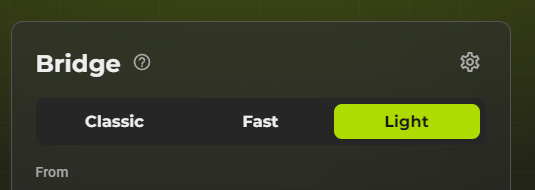
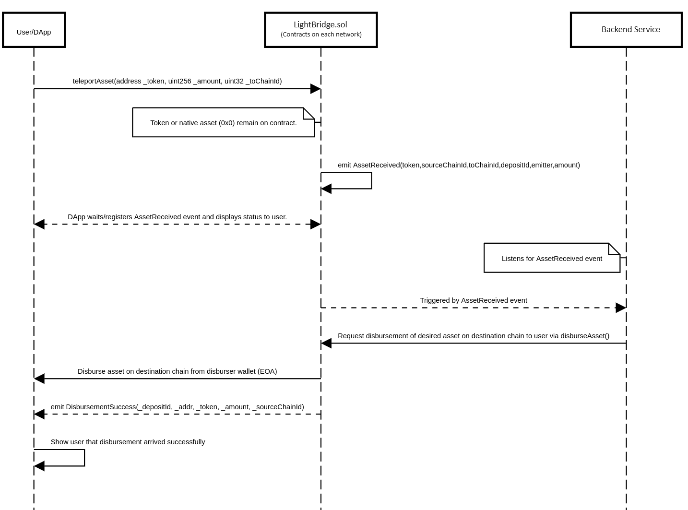

# Using the Light Bridge
The light bridge allows you to bridge particular assets into any direction that has been whitelisted. At the day of writing it is the fastest and most convenient way to bridge assets on Boba.

## How to use LightBridge?
1. Head over to the [Gateway](https://gateway.boba.network)
2. Connect your wallet
3. Select "Light Bridge" in the tabs
4. Happy bridging!



## How does it work?
From a birds-eye perspective we do have 3 components:
1. The User interacting with the user-interface such as the [Gateway DApp](https://gateway.boba.network/),
2. The Smart Contracts ([Proxy](https://github.com/bobanetwork/light-bridge/blob/main/contracts/Lib_ResolvedDelegateProxy.sol) + [Implementation](https://github.com/bobanetwork/light-bridge/blob/main/contracts/LightBridge.sol) contract) and
3. The [Backend](https://github.com/bobanetwork/light-bridge/tree/main/src)

### The Flow
1. The User deposits the funds to be bridged onto the Smart Contract.
2. The Smart Contract issues the `AssetReceived` event.
3. The Backend Service distributes funds on the destination network by calling the Smart Contract.
4. For some networks you might receive some free gas to conduct 1-2 transactions. Please check [Gas Airdrop](#gas-airdrop)

### In-Depth Flow


## Supported Routes
A Route is just a fancy name for defining what asset can be bridged to which network. So let's dive in.

`<->` = bi-directional, bridging in both directions possible
`->` = uni-directional, bridging only in one direction possible

Minor note: The routes and limits also apply to testnet.

### BOBA
BOBA can bridged between the following networks. For your convenience, we've added the chainId in brackets.

1. BOBA BNB Mainnet (56288) <-> BNB Mainnet (56)
2. BOBA BNB Mainnet (56288) <-> BOBA ETH Mainnet (288)
3. ETH Mainnet (1) <-> BOBA ETH Mainnet (288)
4. BOBA ETH Mainnet (288) <-> BNB Mainnet (56)

#### Limits for bridging BOBA
- Minimum Amount to be bridged: **20 BOBA**
- Maximum Amount to be bridged: **20 000 BOBA**
- Maximum Amount to be bridged per day & per route (for all users combined): **40 000 BOBA**

### BNB
These are the supported routes for BNB.

1. BOBA BNB Mainnet (56288) <-> BNB Mainnet (56)

#### Limits for bridging BNB
- Minimum Amount to be bridged: **0.01 BNB**
- Maximum Amount to be bridged: **2 BNB**
- Maximum Amount to be bridged per day & per route (for all users combined): **6 BNB**

### ETH
ETH can be bridged from and to these networks.

1. Arbitrum One (42161) -> BOBA ETH Mainnet (288)
2. Optimism Mainnet (10) -> BOBA ETH Mainnet (288)
3. ETH Mainnet (1) <-> BOBA ETH Mainnet (288)

#### Limits for bridging ETH
- Minimum Amount to be bridged: **0.01 ETH**
- Maximum Amount to be bridged: **2 ETH**
- Maximum Amount to be bridged per day & per route (for all users combined): **6 ETH**

## Gas Airdrop
If you bridge from **ETH Mainnet** to either **BOBA ETH** or **BOBA BNB Mainnet** you might receive some gas if you match certain conditions.

Along with the source network being **ETH Mainnet** you need to fulfill the following:
- have less than **0.5 BOBA** on Boba BNB (since BOBA is native there) or **0.0005 ETH** on Boba ETH,
- bridge a non-native asset. Means if you bridge BOBA from Boba Ethereum to Boba BNB you will not receive gas, since BOBA is the native asset on Boba BNB,
- must not have received an airdrop in the **last 24h**.


### How to Bridge programmatically
You can bridge any asset listed in the [Supported Routes](#supported-routes) section this way.


```js
const PRIVATE_KEY, L1_NODE_WEB3_URL, PROXY_LIGHT_BRIDGE_ADDRESS

const L1Provider = new ethers.providers.StaticJsonRpcProvider(L1_NODE_WEB3_URL)
const L1Wallet = new ethers.Wallet(PRIVATE_KEY).connect(L1Provider)

const Proxy__LightBridge = new ethers.Contract(
  PROXY_LIGHT_BRIDGE_ADDRESS,
  LightBridgeAbi,
  L1Wallet
)

// Approve amounts IF you want to bridge a token
const approveTx = await BobaTokenContract.approve(Proxy__LightBridge.address, depositAmount)
await approveTx.wait()

// Deposit asset
const depositTx = await Proxy__LightBridge.teleportAsset(
  bobaTokenAddress, // if you want to bridge ETH or BNB (or BOBA on Boba BNB) then provide the Zero-Address: 0x0000..0000
  depositAmount,
  destinationChainId, // e.g. 288
)
await depositTx.wait()
```
---

# Deployments
Here are the contract deployments for all networks. The most up-to-date version can be seen [here](https://github.com/bobanetwork/light-bridge/blob/main/README.md#mainnet-deployments).

## Mainnet deployments

### Ethereum Mainnet (L1)
- LightBridge deployed to: `0x3f7Da9C51138E0475aA26E80677d27A568cFD6b9`
- Proxy__LightBridge deployed to: `0x2dE73Bd1660Fbf4D521a52Ec2a91CCc106113801`

### Optimism Mainnet
- LightBridge deployed to: `0x3f7Da9C51138E0475aA26E80677d27A568cFD6b9`
- Proxy__LightBridge deployed to: `0x2dE73Bd1660Fbf4D521a52Ec2a91CCc106113801`

### Arbitrum Mainnet
- LightBridge deployed to: `0x3f7Da9C51138E0475aA26E80677d27A568cFD6b9`
- Proxy__LightBridge deployed to: `0x2dE73Bd1660Fbf4D521a52Ec2a91CCc106113801`

### Boba ETH Mainnet
- LightBridge deployed to: `0x670b130112C6f03E17192e63c67866e67D77c3ee`
- Proxy__LightBridge deployed to: `0x0dfFd3Efe9c3237Ad7bf94252296272c96237FF5`

### BSC Mainnet
- LightBridge deployed to: `0x670b130112C6f03E17192e63c67866e67D77c3ee`
- Proxy__LightBridge deployed to: `0x0dfFd3Efe9c3237Ad7bf94252296272c96237FF5`

### BSC Boba Mainnet
- LightBridge deployed to: `0x45B9877497d73C683D38e0C7FfCf089D5D9FDCDf`
- Proxy__LightBridge deployed to: `0x670b130112C6f03E17192e63c67866e67D77c3ee`

## Testnet deployments

### Sepolia (L1)
- LightBridge deployed to: `0x6550b0B7e3D2dD0E0382E0638B0f56F614921CA5`
- Proxy__LightBridge deployed to: `0xaeE12b8D99BBff7ED47866DF868CF5b4b3F73ffF`

### BNB Testnet (L1)
- LightBridge deployed to: `0xD151c8F0dc69618e6180a2dC74B05cCE3E08e0aC`
- Proxy__LightBridge deployed to: `0x7f6a32bCaA70c65E08F2f221737612F6fC18347A`

### Boba Sepolia
- LightBridge deployed to: `0x3f7Da9C51138E0475aA26E80677d27A568cFD6b9`
- Proxy__LightBridge deployed to: `0x2dE73Bd1660Fbf4D521a52Ec2a91CCc106113801`
- Disburser transferred to AWS KMS managed wallet on 3 March 2024: `0x48b722d8b1cdf5ebdaeb3f06f85d2560dc5d373a`

### Boba BNB Testnet
- LightBridge deployed to: `0x46FA6144C61d2bb9aCDc3Ca90C8673dd9B6caEB2`
- Proxy__LightBridge deployed to: `0xf4d179d3a083Fa3Eede935FaF4C679D32d514186`

### Arbitrum Sepolia
- LightBridge deployed to: `0x4f7E3fF7B52e9843097A8CB3F1b083a8fF6f8c9b`
- Proxy__LightBridge deployed to: `0x3fc06c53aa3Ef19ad7830f5F18C9186C676EdE29`

### Optimism Sepolia
- LightBridge deployed to: `0x4f7E3fF7B52e9843097A8CB3F1b083a8fF6f8c9b`
- Proxy__LightBridge deployed to: `0x3fc06c53aa3Ef19ad7830f5F18C9186C676EdE29`
