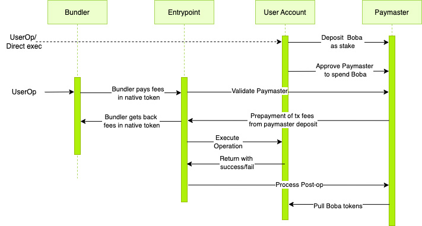
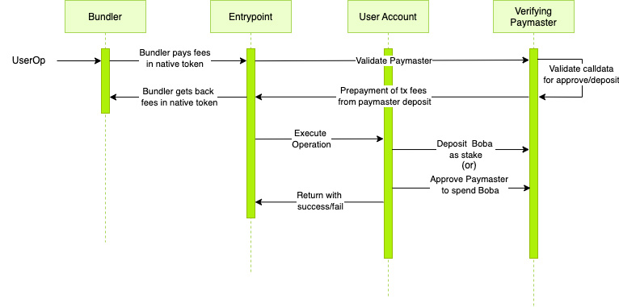

# Account Abstraction Paymasters

These custom paymasters, as per compatibiltiy with ERC4337 Account Abstraction design, will allow users to pay gas for txs using 'any' ERC20 token, and without needing any protocol level changes. The Sequencer however, would still only continue to accept the fee token it identifies as per the protocol, the Paymaster pays for the userOp execution, with their deposit on the Entrypoint in denominations of the native token and accepts the alt erc20 token as payment in return.

<figure><figcaption></figcaption></figure>

**Boba Deposit Paymaster** - uses an oracle for price data and charges an user the appropriate amount of erc20 tokens in exchange for sponsoring their transactions (through their deposit on the entrypoint). Users need to deposit a stake amount on the paymaster in order to start using it. The stake ensures the paymaster can collect the erc20 tokens as payment in all conditions. Since this paymaster uses an oracle(an external contract) to fetch the price ratio, the bundler would fail simulating the userOp validation, in which case - the bundler should whitelist this paymaster if they trust it.

**Boba Verifying Paymaster** (optional) - The Boba Deposit Paymaster (above) needs a stake from the user, before allowing them to use it. The stake amount should be approx. close to the gas fee for one call (which optionally could be sponsored by the Paymaster operator to make the UX easier - at their discretion). And, in addition to that, users would also have to approve the Deposit Paymaster and grant permission to spend their tokens (to deduct tx fees in the erc20 denominations). Both of these operations would require sending transactions/userOps, and in turn would need fees in the denominations of the native token. The functioanlity of the Deposit Paymaster can be extended to first time users, those without native tokens (or) those who only have a certain ERC20 token - with the help of the Verifying Paymaster. The Verifying Paymaster sponsors calls to the following methods: i) approve() for a specific token ii) deposit() on the Deposit Paymaster.

**Manual Deposit Paymaster** (alternate) - The Boba Deposit Paymaster uses an oracle to find out the conversion ratio between the erc20 and the native token. The bundler, while simulating the userOp validation would however fail if `paymaster.validatePaymasterUserOp` accesses the state of any other contract than itself, by default. And in which case, the paymaster would require whitelisting by the bundler. For those without bundler access, Manual Deposit Paymaster provides the same functionality as the Boba Deposit Paymaster, but does not requiring whitelisting at the bundler level. It does not access an oracle during the userOp validaiton, but uses a priceRatio (between the erc20 and the native token) that is asynchronously updated by the paymaster operator in the frequency as per their required precision.

**GPODepositPaymaster** (alternate) - The GPO Deposit Paymaster is primarily suited for alt-L1 deployments of Boba, and it uses the gas price oracle to find out the price ratio between boba and the alt-l1 native token. The functionality is the same as that of the Boba Deposit Paymaster, and the paymaster also requires to be whitlisted at the bundler level.

<figure><figcaption></figcaption></figure>

### Boba Deposit Paymaster

Here, 'Paymaster' can be substituted for 'Boba Deposit Paymaster','Manual Deposit Paymaster' or 'GPO Deposit Paymaster'. The sole distinction between them is the manner in which their priceRatio is adjusted.

<figure><figcaption></figcaption></figure>

### Boba Verifying Paymaster

<figure><figcaption></figcaption></figure>
