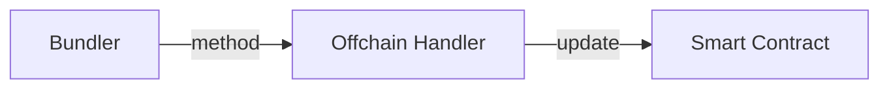

# Hybrid Compute

## Introduction

Welcome to the developer documentation for implementing a basic example with our system and API. This guide will walk
you through the necessary steps to get started and provide you with the information you need to successfully integrate
our system into your project. [Full Example](https://github.com/bobanetwork/aa-hc-example)

## Overview



### About Hybrid Compute

These are some basic information that might give you an easier time understanding this repository.
Hybrid Compute in the Boba Network allows smart contracts to interact with external data and services. Typically, smart
contracts on blockchains like Ethereum are limited to the data available on the blockchain, unable to access outside
information directly. Hybrid Compute changes this by enabling smart contracts to make API calls to external services.
This interaction allows smart contracts to access off-chain data and perform complex computations off-chain. The results
of these computations can then be used on-chain, enhancing the functionality and efficiency of smart contracts. By doing
so, Hybrid Compute reduces gas costs associated with complex computations and broadens the scope of what decentralized
applications (dApps) can achieve. In essence, it bridges the gap between the blockchain and the real world, allowing for
more sophisticated and dynamic applications.

### About a Bundler

An Account Abstraction Bundler is a component of a blockchain system designed to enhance the functionality and
flexibility of smart contract accounts. It facilitates the direct control of accounts by translating user intents, removing the
traditional division between externally owned accounts and their dependencies for contract accounts. This abstraction allows users to
interact more seamlessly and manage smart contract accounts directly. Additionally, the bundler aspect optimizes
transaction packaging by grouping multiple transactions together before adding them to a block. This optimization can
lead to more efficient use of block space and potentially lower transaction fees. Overall, Account Abstraction Bundlers
enable the development of more sophisticated decentralized applications (dApps) by empowering smart contracts with
greater control and functionality within the blockchain network

## Prerequisites

Before you begin, make sure you have the following prerequisites in place:

- [ ] API key: Obtain an API key from our system by reaching out on [Discord](https://discord.com/invite/Hvu3zpFwWd).
- [ ] Development environment: Set up your development environment with the necessary tools and dependencies. In this
  tutorial, make sure to have to following tools and technologies set up
  - Python
  - Docker

## Step 1: Writing the offchain handler

The first step is to write our ``offchain handler.`` This handler is responsible for receiving requests from the bundler
along with their payloads and returning the appropriate responses.

Let's begin with a simple example where the handler receives two numbers. It will perform both addition and subtraction
on these numbers. If the result of the subtraction results in an overflow (i.e., the first number is greater than the
second), the handler will respond with an underflow error.

```python
from web3 import Web3
from eth_abi import abi as ethabi
from offchain_utils import gen_response, parse_req


def offchain_addsub2(sk, src_addr, src_nonce, oo_nonce, payload, *args):
    print("  -> offchain_addsub2 handler called with subkey={} src_addr={} src_nonce={} oo_nonce={} payload={} extra_args={}".format(sk,
          src_addr, src_nonce, oo_nonce, payload, args))
    err_code = 1
    resp = Web3.to_bytes(text="unknown error")

    try:
        req = parse_req(sk, src_addr, src_nonce, oo_nonce, payload)
        dec = ethabi.decode(['uint32', 'uint32'], req['reqBytes'])

        if dec[0] >= dec[1]:
            s = dec[0] + dec[1]
            d = dec[0] - dec[1]
            resp = ethabi.encode(['uint256', 'uint256'], [s, d])
            err_code = 0
        else:
            print("offchain_addsub2 underflow error", dec[0], dec[1])
            resp = Web3.to_bytes(text="underflow error")
    except Exception as e:
        print("DECODE FAILED", e)

    return gen_response(req, err_code, resp)
```

First things first, we initialize an ``err_code`` and a resp object with values in case of an exception:

``` python
err_code = 1
resp = Web3.to_bytes(text="unknown error")
```

In the try-block we parse the request with the help of this function:

```python
def parse_req(sk, src_addr, src_nonce, oo_nonce, payload):
    req = dict()
    req['skey'] = Web3.to_bytes(hexstr=sk)
    req['srcAddr'] = Web3.to_checksum_address(src_addr)
    req['srcNonce'] = Web3.to_int(hexstr=src_nonce)
    req['opNonce'] = Web3.to_int(hexstr=oo_nonce)
    req['reqBytes'] = Web3.to_bytes(hexstr=payload)
    return req
```

and decode the ``reqBytes`` to an array of ``[uin32, uint32]`` since we want to receive two numbers.

``` python
dec = ethabi.decode(['uint32', 'uint32'], req['reqBytes'])
```

Now we can perform our custom logic on the received values:

```python
if dec[0] >= dec[1]:
```

When the calculation was successful, we overwrite the previously created err_code and resp variables with successful
values:

```python
resp = ethabi.encode(['uint256', 'uint256'], [s, d])
err_code = 0
```

As we decoded the ``reqBytes`` by letting the decode function know that we want to receive two numbers by giving it an
array
of ``['uin32', 'uint32']``, we let the encode function know, on how we want to decode both numbers. In this case
with ``['uint256', 'uint256']``.

In case of an underflow error, we encode a string containing a text to let the user know what happened:

```python
resp = Web3.to_bytes(text="underflow error")
```

Before we can return these objects, we need to transform them into a specific object:

``` python
def gen_response(req, err_code, resp_payload):
    resp2 = ethabi.encode(['address', 'uint256', 'uint32', 'bytes'], [req['srcAddr'], req['srcNonce'], err_code, resp_payload])

    enc1 = ethabi.encode(['bytes32', 'bytes'], [req['skey'], resp2])

    p_enc1 = "0x" + selector("PutResponse(bytes32,bytes)") + \
        Web3.to_hex(enc1)[2:]  # dfc98ae8

    enc2 = ethabi.encode(['address', 'uint256', 'bytes'], [
                         Web3.to_checksum_address(HelperAddr), 0, Web3.to_bytes(hexstr=p_enc1)])
    p_enc2 = "0x" + selector("execute(address,uint256,bytes)") + \
        Web3.to_hex(enc2)[2:]  # b61d27f6

    limits = {
        'verificationGasLimit': "0x10000",
        'preVerificationGas': "0x10000",
    }
    callGas = 705*len(resp_payload) + 170000

    print("callGas calculation", len(resp_payload), 4+len(enc2), callGas)

    p = ethabi.encode([
        'address',
        'uint256',
        'bytes32',
        'bytes32',
        'uint256',
        'uint256',
        'uint256',
        'uint256',
        'uint256',
        'bytes32',
    ], [
        HybridAcctAddr,
        req['opNonce'],
        Web3.keccak(Web3.to_bytes(hexstr='0x')),  # initCode
        Web3.keccak(Web3.to_bytes(hexstr=p_enc2)),
        callGas,
        Web3.to_int(hexstr=limits['verificationGasLimit']),
        Web3.to_int(hexstr=limits['preVerificationGas']),
        0,  # maxFeePerGas
        0,  # maxPriorityFeePerGas
        Web3.keccak(Web3.to_bytes(hexstr='0x')),  # paymasterANdData
    ])

    ooHash = Web3.keccak(ethabi.encode(['bytes32', 'address', 'uint256'], [
                         Web3.keccak(p), EntryPointAddr, HC_CHAIN]))

    signAcct = eth_account.account.Account.from_key(hc1_key)
    eMsg = eth_account.messages.encode_defunct(ooHash)
    sig = signAcct.sign_message(eMsg)

    success = (err_code == 0)
    print("Method returning success={} response={} signature={}".format(
        success, Web3.to_hex(resp_payload), Web3.to_hex(sig.signature)))
    return ({
        "success": success,
        "response": Web3.to_hex(resp_payload),
        "signature": Web3.to_hex(sig.signature)
    })
```

With that settled, we have successfuly implemented a function, which can receive a request from the bundler, perform
some calculation with its payload and return a response.

## Step 2: Setting up a server

With the offchain handler created, the next step is to set up a server to run it. In this example, we will create a
simple JSON-RPC server using the jsonrpclib library. We define

```python
from jsonrpclib.SimpleJSONRPCServer import SimpleJSONRPCServer, SimpleJSONRPCRequestHandler

def selector(name):
    nameHash = Web3.to_hex(Web3.keccak(text=name))
    return nameHash[2:10]


class RequestHandler(SimpleJSONRPCRequestHandler):
    rpc_paths = ('/', '/hc')


def server_loop():
    server = SimpleJSONRPCServer(
        ('0.0.0.0', 1234), requestHandler=RequestHandler)
    server.register_function(offchain_addsub2, selector(
        "addsub2(uint32,uint32)"))  # ASD97e0d7ba

    server.serve_forever()


server_loop()  # Run until killed
```

Here, we register our function ``offchain_addsub2``. Note the "identifier" passed to register_function. This identifier
is
generated by the selector function, which creates a hashed representation of the function signature provided as an
argument.

### Why is that?

The bundler sends us an JSON-RPC v2 request, containing a ``method`` identifier which is the function selector of the
desired offchain method, along with
several standard parameters (NOTE - names are subject to change) as well as a "payload" which contains the ABI-encoded
request data:

``` JSON
{
  "jsonrpc":"2.0",
  "id":0,
  "method":"ASD97e0d7ba",
  "params":{
    "sk":"f27fb73f63cd38cee89c48053fe8bb3248ddb7a98ce9f45b9176d017df47d9ce",
    "src_addr":"b43a2532e87583351b9024d6a6d0ba7acfa54446",
    "src_nonce":"0000000000000000000000000000000000000000000003eb0000000000000003",
    "oo_nonce":"0xb43a2532e87583351b9024d6a6d0ba7acfa544460000000000000003",
    "payload":"00000000000000000000000000000000000000000000000000000000000000020000000000000000000000000000000000000000000000000000000000000001"
  }
}
```

In *Step 3: Writing the Smart Contract* we intialize a request object by encoding the function signature along with it's
arguments.

``` solidity
bytes memory req = abi.encodeWithSignature("addsub2(uint32,uint32)", a, b);
 ```

So the JSON-RPC server maps the request to the actual function by the *encoded signature*.

## Step 3: Writing the Smart Contract

Now we can write the Smart Contract, which will call our previously created offchain-handler.
You can find the needed "HybridAccount"-Contract along with it's dependencies in the provided repository.

In the first part of the contract we are creating a mapping for the counters and we define a ``demoAddr``
This address will then be part of the the ``HybridAccount``.

```solidity
// SPDX-License-Identifier: GPL-3.0
pragma solidity ^0.8.12;

import "../samples/HybridAccount.sol";

contract TestCounter {
    mapping(address => uint256) public counters;

    address payable immutable demoAddr;

    constructor(address payable _demoAddr) {
        demoAddr = _demoAddr;
    }
}

```

Now let us add the count method. We initialize the `HybridAccount` with the `demoAddr` created prior. We define `x`
and `y`, do a quick check for ``b == 0`` and encode our function ``addsub2()``.
And the magic is going to happen within the ``HA.CallOffChain(userkey, req)``.
This call will return us the two numbers `a` and `b` given the fact that there has been no error. If we encounter an
error during the `CallOffChain` call, we either revert or set the counter. See the two `else if` statements for more
information.

Starting in the "count"-function, we initialize an "HybridAccount" along the with the address used when we deployed
the "Smart Contract"

```solidity

    function count(uint32 a, uint32 b) public {
        HybridAccount HA = HybridAccount(demoAddr);
        uint256 x;
        uint256 y;
        if (b == 0) {
            counters[msg.sender] = counters[msg.sender] + a;
            return;
        }
        bytes memory req = abi.encodeWithSignature("addsub2(uint32,uint32)", a, b);
        bytes32 userKey = bytes32(abi.encode(msg.sender));
        (uint32 error, bytes memory ret) = HA.CallOffchain(userKey, req);

        if (error == 0) {
            (x, y) = abi.decode(ret, (uint256, uint256)); // x=(a+b), y=(a-b)

            this.gasWaster(x, "abcd1234");
            counters[msg.sender] = counters[msg.sender] + y;
        } else if (b >= 10) {
            revert(string(ret));
        } else if (error == 1) {
            counters[msg.sender] = counters[msg.sender] + 100;
        } else {
            //revert(string(ret));
            counters[msg.sender] = counters[msg.sender] + 1000;
        }
    }
```

Last but not least, we define a function `countFail` as well as `justemit` - which will be used to emit the
event `CalledFrom`.

And that's about it!

```solidity
  function countFail() public pure {
      revert("count failed");
  }

  function justemit() public {
      emit CalledFrom(msg.sender);
  }

  event CalledFrom(address sender);

  //helper method to waste gas
  // repeat - waste gas on writing storage in a loop
  // junk - dynamic buffer to stress the function size.
  mapping(uint256 => uint256) public xxx;
  uint256 public offset;

  function gasWaster(uint256 repeat, string calldata /*junk*/) external {
      for (uint256 i = 1; i <= repeat; i++) {
          offset++;
          xxx[offset] = i;
      }
  }
```

The "HybridAccount" contract has been previously registered to provide access to the "addsub2" function on our
offchain-function. But more on that later.

### Calling Offchain

As already mentioned in Step 2, our offchain-server maps the request, made by the bundler, via the hashed representation
of our function-signature. So let's decode the function-signature we want to call on the offchain-server:

```solidity
bytes memory req = abi.encodeWithSignature("addsub2(uint32,uint32)", a, b);
bytes32 userKey = bytes32(abi.encode(msg.sender));
(uint32 error, bytes memory ret) = HA.CallOffchain(userKey, req);

require(result == HC_ERR_NONE, "Offchain call failed");
(x,y) = abi.decode(ret,(uint256,uint256)); // x=(a+b), y=(a-b)
```

We then generate an `userKey` by encoding "msg.sender". The `userKey` parameter is used to distinguish requests so that
they may be processed concurrently without interefering with each other.

Withing the Hybrid Account contract itself, the `CallOffchain` method calls through to another system contract named
`HCHelper`:

``` solidity
function CallOffchain(bytes32 userKey, bytes memory req) public returns (uint32, bytes memory) {
   require(PermittedCallers[msg.sender], "Permission denied");
   IHCHelper HC = IHCHelper(_helperAddr);
   userKey = keccak256(abi.encodePacked(userKey, msg.sender));
   return HC.TryCallOffchain(userKey, req);
}
```

In this example the HybridAccount implements a simple whitelist of contracts which are allowed to call its methods. It
would also be possible for a HybridAccount to implement additional logic here, such as requiring payment of an ERC20
token to perform an offchain call. Or conversely, the owner of a HybridAccount could choose to make the CallOffchain
method available to all callers without restriction.

There is an opportunity for a HybridAccount contract to implement a billing system here, requiring a payment of ERC20
tokens or some other mechanism of collecting payment from the calling contract. This is optional.

### Helper Contract Implementation

```solidity
function TryCallOffchain(bytes32 userKey, bytes memory req) public returns (uint32, bytes memory) {
    bool found;
    uint32 result;
    bytes memory ret;

    bytes32 subKey = keccak256(abi.encodePacked(userKey, req));
    bytes32 mapKey = keccak256(abi.encodePacked(msg.sender, subKey));

    (found, success, ret) = getEntry(mapKey);

    if (found) {
        return (result, ret);
    } else {
        // If no off-chain response, check for a system error response.
        bytes32 errKey = keccak256(abi.encodePacked(address(this), subKey));

        (found, result, ret) = getEntry(errKey);
        if (found) {
            require(result != HC_ERR_NONE, "Invalid error code");
            return (result, ret);
        } else {
            // Nothing found, so trigger a new request.
            bytes memory prefix = "_HC_TRIG";
            bytes memory r2 = bytes.concat(prefix, abi.encodePacked(msg.sender, userKey, req));
            assembly {
                revert(add(r2, 32), mload(r2))
            }
        }
    }
}
```

In the code above, the contract checks an internal mapping to see if a response exists for the given request. If not
then the method reverts with a special prefix, followed by an encoded version of the request parameters. If a response
does exist then it is removed from the internal mapping and is returned to the caller. The map key encodes the request
parameters, so that a response initiated by one request will not be returned later in response to a modified request
from the caller.

To populate the response mapping, HybridAccount contracts use another method in the Helper:

```solidity
function PutResponse(bytes32 subKey, bytes calldata response) public {
    //require(msg.sender == address(this)); // _requireFromEntryPointOrOwner();
    require(RegisteredCallers[msg.sender].owner != address(0), "Unregistered caller");
    //require(ResponseCache[mapKey].length == 0, "Cache entry already exists");

    require(response.length >= 32, "Response too short");
    bytes32 mapKey = keccak256(abi.encodePacked(msg.sender, subKey));
    ResponseCache[mapKey] = response;
}
```

Note that the msg.sender is included in the calculation of the internal map key, ensuring that only that HybridAccount
is able to populate the response which it will later receive back in the `TryCallOffchain() `call. However in the case of
error results `(success == false)` there is also a provision for the HC implementation to insert a result under a
different map key.

`PutResponse()` is called using Account Abstraction and the offchain userOperation must carry a valid signature in order
for the operation to be executed.

### Reading the response data

To retrieve the response from our `AddSub` contract, we handle the offchain call as follows:

```solidity
(uint32 error, bytes memory ret) = HA.CallOffchain(userKey, req);

if (error == 0) {
(x, y) = abi.decode(ret, (uint256, uint256)); // x=(a+b), y=(a-b)
}
```

In this snippet, we decode the returned object `ret` into two `uint256` values, as the offchain function returns two
integers. The variables x and y will hold the results of the addition and subtraction, respectively.

## Step 4: Deploy the Smart Contract

With a few adjustments to the deploy.py script, we can easily deploy our newly created smart contract.

First, we need to configure the script to connect to our L1 and L2 networks:

```solidity
l1 = Web3(Web3.HTTPProvider("http://127.0.0.1:8545"))
assert(l1.is_connected)
l1.middleware_onion.inject(geth_poa_middleware, layer = 0)

l2 = Web3(Web3.HTTPProvider("http://127.0.0.1:9545"))
assert(l2.is_connected)
l2.middleware_onion.inject(geth_poa_middleware, layer = 0)
```

Next, we load the contract using the loadContract function:

```solidity
TC = loadContract(w3, "TestCounter", path_prefix + "test/TestCounter.sol")
```

Here "path_prefix" indicates where the contract is located.

After loading the contract, we can deploy it as follows:

```solidity
epAddr = deploy2("EntryPoint", EP.constructor(), 0)
hhAddr = deploy2("HCHelper", HH.constructor(epAddr, boba_addr, 0), 0)
saAddr = deploy2("SimpleAccount", SA.constructor(epAddr), 0)
ha0Addr = deploy2("HybridAccount.0", HA.constructor(epAddr, hhAddr), 0)
ha1Addr = deploy2("HybridAccount.1", HA.constructor(epAddr, hhAddr), 1)
tcAddr = deploy2("TestCounter", TC.constructor(ha1Addr), 0)
```

The constructor of our smart contract takes an address as an argument. Therefore, we pass the address of
HybridAccount.1, which, along with other necessary contracts, is deployed as shown above.

## Additional Examples
The documentation above was precisely written for the addition of two numbers. \
The ``hybrid-compute `` folder contains more examples that can be used and experimented with.

Let's integrate them into our `server-loop`

```python
  def server_loop():
    server = SimpleJSONRPCServer(
        ('0.0.0.0', PORT),
        requestHandler=RequestHandler
    )

    // Add Sub
    server.register_function(offchain_addsub2, selector("addsub2(uint32,uint32)"))  # 97e0d7ba

    // Ramble
    server.register_function(offchain_ramble,  selector("ramble(uint256,bool)"))

    // CheckKyc
    server.register_function(offchain_checkkyc, selector("checkkyc(string)"))

    // getPrice
    server.register_function(offchain_getprice, selector("getprice(string)"))
```

