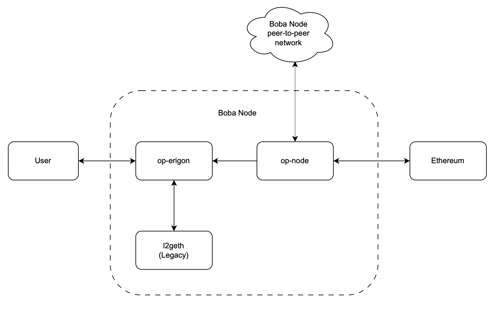

# Node Operators (Anchorage)

The anchorage is activated on Sepolia Testnet. For other networks, please refer to [Replica Node (Legacy)](https://github.com/bobanetwork/boba_legacy/blob/develop/boba_community/boba-node/README.md).

## Overview

The repliace node section is a collection of guides and tutorials help you run your own BOBA node.

## Node Architecture

Every node is made up of two main parts: the Rollup Node and the Execution Client. Additionally, there's an optional part called Legacy Geth, which is used for looking up information about blocks and transactions that were made before the [Anchorage Upgrade](https://github.com/bobanetwork/boba/blob/develop/boba-chain-ops/README.md#migration).

### Rollup Node

The Rollup Node is responsible for taking data from Layer 1 (L1) and use it to create Layer 2 (L2) block information, which it then sends to the Execution Client. Additionally, the Rollup Node can choose to join a network that lets it get blocks straight from the Sequencer before those blocks are sent to L1.

### Execution Client

The Execution Client takes care of running the block information it gets from the Rollup Node. It does this through a common method called JSON-RPC, using a set of rules known as the [Engine API](https://github.com/ethereum/execution-apis/blob/main/src/engine/common.md#engine-api----common-definitions). Boba allows the use of either geth or erigon as the Execution Client.

### Legacy Geth

Boba switched its database from **Geth** to **Erigon** during a significant update called the [Anchorage Upgrade](https://github.com/bobanetwork/boba/blob/develop/boba-chain-ops/README.md#migration). The old data from Geth, before this upgrade, can still be accessed with the new system but needs a special part called Legacy Geth to work properly. This means if you need to use certain commands, like `eth_call`, on the old data, you'll have to use Legacy Geth.

You don't always need Legacy Geth, though. It's mainly for those who want to keep a full historical record of Boba nodes.

### Diagram

The diagram below explains how three parts - the Rollup Node, Execution Client, and Legacy Geth - fit together to make a full Boba node. It uses examples called `op-node` for the Rollup Node and `op-erigon` for the Execution Client, but this setup is similar for other versions too.

### Software Release

Make sure to update your node software regularly. This keeps your node working well with others, especially when new updates come out. Updates can fix problems and improve stability. Check the [Software Releases](./releases.md) page to see the newest versions of the software. Also, follow the [@Boba Twitter account](https://twitter.com/bobanetwork) to get alerts about important updates.
