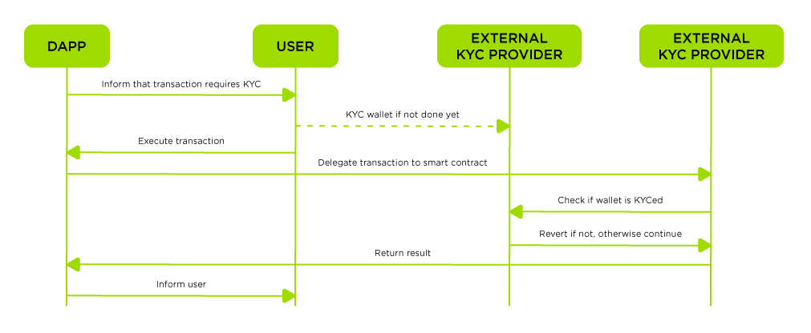

<figure><figcaption></figcaption></figure>

# KYC

<figure><figcaption></figcaption></figure>

Regulation is coming, there is no doubt. Some examples:

* The famous Otherside contract from YugaLabs required KYC on launch
* Some DeFi applications will be required to add KYC as well, depending on how regulations progress (EU, US, ..).

DeFi apps currently face a huge problem when trying to comply with those new regulations. But the good news is, Turing can help with this!

With Turing you can build your own KYC gatekeeper for specific smart contract functions with ease. We have written a simple `modifier` for that, which does the check for you. All you need to do, is checking a wallet's KYC status on the AWS backend and return if the wallet is allowed to call the smart contract function.

<figure><figcaption></figcaption></figure>

<figure><figcaption></figcaption></figure>

The idea is, that the user has to once KYC his wallet on any KYC provider that supports KYCing wallets. The KYC process itself is completely independent of this code base, as well as the process associated with it.

This means, that smart contracts that implement this KYC gatekeeper, will actually query the KYC status of the user's wallet and will revert for a KYC-only function, if the user hasn't KYCed his/her wallet yet. That's the magic :-).

<figure><figcaption></figcaption></figure>

This example basically consists just like all other Turing use cases, of a `TuringHelper.sol` and its corresponding interface called `ITuringHelper.sol`. The TuringHelper is just as usual needed, to actually be charged for your off-chain calls and to limit unauthorized access (refer to `permittedCallers` etc.). Please refer to the appendix of this ReadMe or to the general Turing documentation.

Our actual example lives in `KYCExample.sol` and its only purpose is to show you that you can constrain the access to specific smart contract functions based on whether a wallet has been KYCed (associated with a person's identity) by using a trusted KYC provider of your choice or not. As you can see, the example actually doesn't contain much code, but uses actually a so-called `modifier` named `onlyKYCed` which limits access to that function to KYCed wallets.

```solidity
function onlyForKYCedWallets() external onlyKYCed {
        emit FunctionCall("onlyForKYCedWallets");
    }
```

As you can see above, simply annotating a function with the specified modifier limits the wallets that have access to this function. If a wallet is not KYCed then it simply reverts. Your TuringCall basically returns `true` for KYCed or `false` for non-kyced wallets.

For that reason the real magic happens on the Turing backend, which basically queries the KYC status of the sender's wallet and returns either `true` or `false` depending on a wallet's KYC status. What type of provider you support and add to your Turing API is completely up to you.

#### Project structure

```
contracts/
│   KYCExample.sol
└───access/
│   │   KYCWrapper.sol
└───common/
│   │   TuringHelper.sol
│   │
│   └───interfaces/
│       │   ITuringHelper.sol
```

<figure><figcaption></figcaption></figure>

Inside the folder, run `yarn install`.

#### 0. Make sure that your have _AWS SAM_ installed.

You can find instructions [here](https://docs.aws.amazon.com/serverless-application-model/latest/developerguide/serverless-sam-cli-install.html). Assuming you have the AWS CLI and have everything set up correctly, installing SAM should just take two commands. On a Mac with `homebrew`, for example,

```bash
$ brew tap aws/tap
$ brew install aws-sam-cli
```

#### 1. Local testing of the example server

This assumes you have `python-lambda-local` installed. If not, install it via `pip3 install python-lambda-local`.

```bash
$ yarn start:lambda
```

If everything is working correctly, you will see:

```
{'statusCode': 200, 'body': '{"result": "0x00000000000000000000000000000000000000000000000000000000000000200000000000000000000000000000000000000000000000000000000000000001"}'}
```

#### 2. Local testing of the example SAM deployment

```bash
$ yarn start:lambda-sam
```

This will build and run the server image. It will ingest example inputs, as above.
