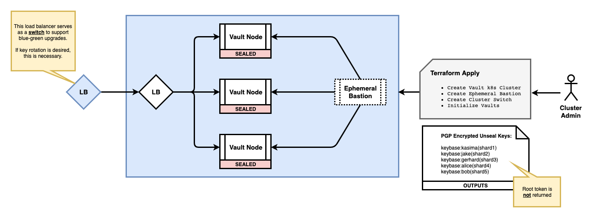
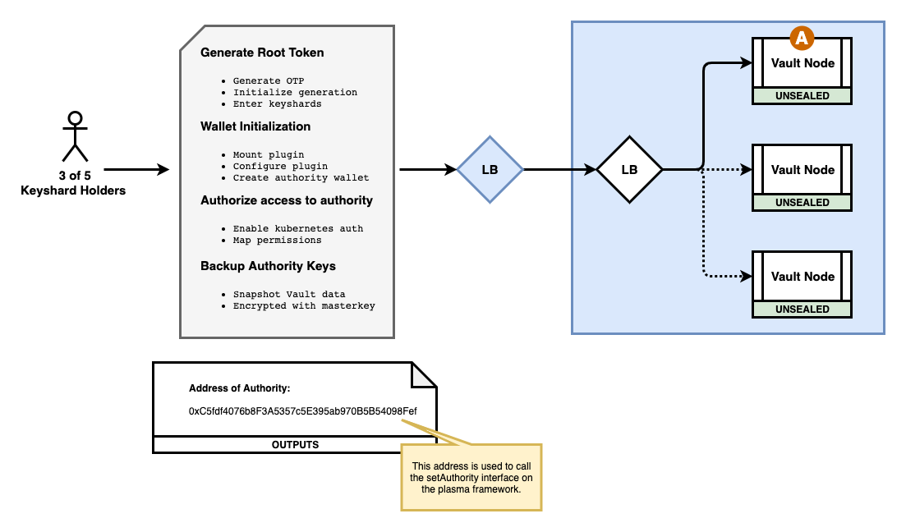
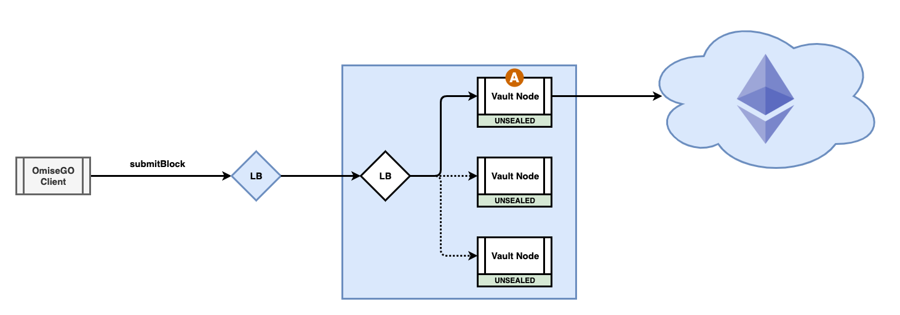
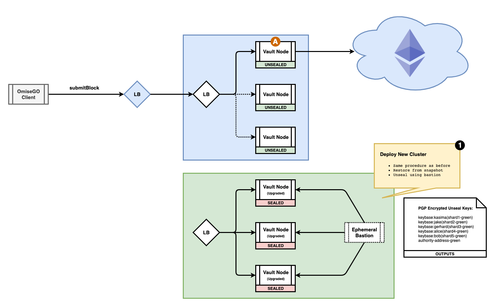

*********************************
Cluster Architecture Discussion
*********************************

Immutability's model for private key management for Ethereum is dependent upon the customer's risk tolerance. Specifically, the risk of a loss of availability is balanced against the risk of unauthorized access to private key material. In either case, security of private keys is of utmost importance. Follows is a set of pictures that describes an approach that balances these 2 dimensions (availability and security).

Initial Terraform of Cluster
#################################

First the cluster operator creates the Kubernetes Vault cluster (with the plugin) and we initialize Vault using the PGP identities of 5 OmiseGo parties. Depending on the need to support key rotation, we (optionally) deploy a load balancer outside the Kubernetes cluster to switch traffic.

Unseal Vault
#################################

Then 3 of the 5 OmiseGo parties unseal the Vault cluster.

.. image:: _static/omisego-Page-2.png
  :width: 1200
  :alt: Unseal Vault

Remove Bastion
#################################

Then the cluster operator removes the ephemeral bastion host to prevent SSH access to the Vault nodes.

.. image:: _static/omisego-Page-3.png
  :width: 1200
  :alt: Remove Bastion

Vault Configured
#################################

Then 3 of the 5 OmiseGo parties configure Vault and create the Authority wallet. All access to the Authority wallet is permissioned.

Out of band, the authority address is used to establish the authority on the mainnet. At this point the Vault data is snapshot and stored offline. This data is encrypted using the Vault master key - the Vault master key must be assembled from a quorum of key shards to decrypt this snapshot. We test the snapshot to validate integrity.

Vault Ready for Traffic
#################################

Vault is now ready for traffic.

  
Blue-Green Upgrade: Phase 1
#################################

We recommend a non-traditional (from a Vault point-of-view) blue-green cluster upgrade given the nature of your use case. We repeat the same steps above to create a completely self contained "green" Vault cluster. Since we can't establish a new Authority, we have to restore Vault's state from the previous snapshot.

We establish a quorum of keyshard holders and unseal the Vault nodes via the ephemeral bastion. At this point the new upgraded green cluster should be ready for traffic; but, the old blue cluster is still taking traffic. 

Blue-Green Upgrade: Phase 2
#################################

We verify that the new upgraded green cluster can take traffic and then the cluster admin switches traffic to route to the upgraded cluster ("green"). There should be no outage - the load balancer should handle connection draining gracefully.

.. image:: _static/omisego-Page-7.png
  :width: 1200
  :alt: Blue-Green Upgrade: Phase 2

Upgrade Complete
#################################

The newly upgraded cluster takes traffic.

.. image:: _static/omisego-Page-10.png
  :width: 1200
  :alt: Upgrade Complete

