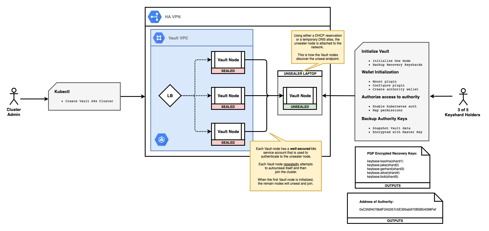

*********************************
Cluster Architecture
*********************************

Immutability's model for private key management for Ethereum is dependent upon the customer's risk tolerance. Specifically, the risk of a loss of availability is balanced against the risk of unauthorized access to private key material. In either case, security of private keys is of utmost importance. Follows is a set of pictures that describes an approach that balances these 2 dimensions (availability and security).

This new design attempts to provide the best mix of availability and security with a minimum of operational encumbrance.

Security Overview
####################

The important points to be aware of from a security standpoint are:

1. The Plasma Authority: The private key used to sign `submitBlock` transactions is generated inside a crypto-barrier and never leaves that barrier. Access to signing operations using this private key are controlled by Vault access controls.

2. Client Service Accounts: The OmiseGo client applications will have to authenticate to Vault with a Kubernetes service account to sign transactions using the Plasma Authority's private key. If any rogue client is able to assume the role of this Kubernetes service account, it will be able to sign transactions using the Plasma Authority's private key.

3. IP Constraints: IP whitelisting is available to further protect access to signing operations using the Plasma Authority's private key.

4. Shamir Key Sharing: The master encryption key that Vault uses to encrypt all data is constructed using Shamir key sharing. The key shards are PGP encrypted and kept offline. 

5. Unsealer Vault: The process to unseal Vault nodes is automated via an ephemeral unsealer Vault. This can be implemented as an air-gapped laptop that is temprorarily brought online during upgrade events or after container scheduling events.

6. Vault Node Service Accounts: The Vault nodes (which maintain the Authority's private key) have to authenticate to the Unsealer Vault with a Kubernetes service account to unseal themselves. These service accounts will only be used during unseal operations (during those brief moments that the Unsealer Vault is online.)

Create Unsealer Vault
#################################

The first, and heaviest, bit of operational workflow involves the creation of the unsealer Vault. For the purposes of this discussion, we will implement this with a laptop. On an air-gapped laptop, we initialize Vault using the PGP identities of 5 OmiseGo parties. The PGP encrypted keyshards are stored safely off-line. The data that comprises the initialization state of these keyshards is backed up. The Unsealer Vault is configured to allow a specific Kubernetes service account (see #6 above) to have access to encrypt and decrypt the unseal key used to form the master encryption key for the main Vault nodes.

This laptop is kept offline most of the time and is stored in a secure location.

.. image:: _static/new-0.png
  :width: 1200
  :alt: The Unsealer Vault

Initial Deployment
#################################

During the initial deployment of Vault, the laptop that is the Unsealer Vault is turned on (while still air-gapped) and it is itself unsealed. This is turtle 0. Once unsealed, and with all remnants of the decrypted keyshards removed from memory, the laptop is attached to the VPN and given a well-known address (IP or DNS.)

Then, the Kubernetes admin deploys the Vault cluster (a load balancer and 3 or more Vault nodes.) These Vault nodes will reach out to the Unsealer Vault to unseal themselves; but, since this is the initial deployment, that will fail since this newly deployed Vault cluster has not been initialized yet.

Then an operator on the Unsealer Vault will initialize this newly deployed cluster, saving the PGP encrypted recovery keys in much the same way that the initial PGP keyshards were saved. This initialization process will create a root token that is then used to configure the Vault cluster. The data for this Vault cluster (i.e., the Authority's private key) is snapshotted and backed up. This snapshot should be tested prior to using the Authority's address.

Ready for Business
#################################

After the Vault cluster was initialized, all nodes unsealed themselves and joined the cluster. The Vault nodes are ready to take traffic now. The OmiseGo clients are able to submit blocks now.

.. image:: _static/new-2.png
  :width: 1200
  :alt: Ready for Business

Upgrade (or Scheduling Event)
#################################

When an upgrade is needed or if there has been a scheduling event for a Vault node, we need to engage the Unsealer Vault again. This time will be simpler since the Vault cluster has already been initialized. We bring the Unsealer Vault online in the same fashion as before. If this is an upgrade event, then the next step is for the Kubernetes admin to perform a Rolling Update by patching the deployment with a new Vault container image. The new Vault nodes will auto-unseal themselves and join the cluster. Testing can validate that the new nodes are ready.

If a scheduling event was detected, then simply bring the Unsealer Vault online for a brief period of time should bring the re-scheduled nodes back into the cluster.

.. image:: _static/new-3.png
  :width: 1200
  :alt: Upgrade (or Scheduling Event)

Upgrade Ready for Traffic
#################################

Vault is now upgraded and ready for traffic.

.. image:: _static/new-4.png
  :width: 1200
  :alt: Upgrade Ready for Traffic
