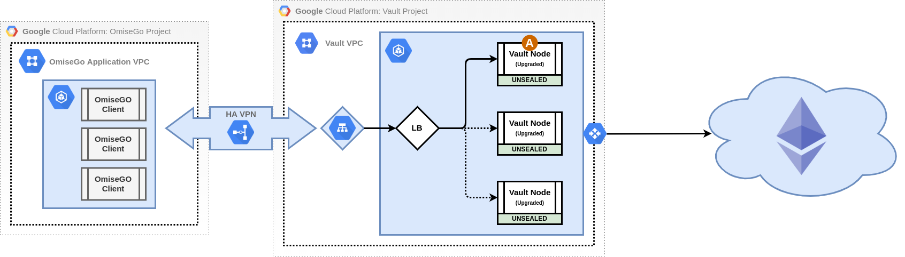
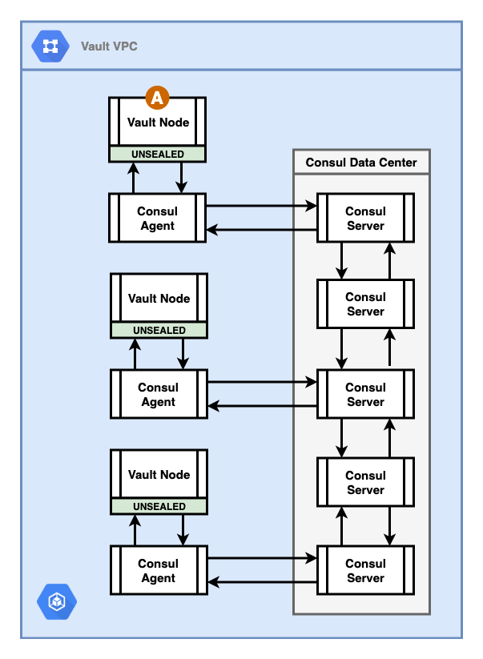

*********************************
Deployment Architecture
*********************************

Immutability's recommendation for Vault deployments is based on a number of factors which we will discuss in this section of the documentation.

Regardless of a client's risk tolerance we always recommend that Vault run in a separately provisioned and cordoned off network.  Using a walled garden approach with Vault significantly increases security and makes audits simpler as you only need be concerned with Vault, allowed traffic to Vault, and any monitoring solution.  This reduces the probability that mistakes will be made when doing things like opening ports, installing libraries, etc.

Note that the diagrams throughout this document will show a single instantiation of a Vault cluster deployment.  It is expected there will be multiple instantiations for dev/stage/prod/etc.

The Network
#################################

Our general recommendation is that Vault run in its own network with the only allowed traffic being ingress over a layer-4 load balancer.  Egress is allowed for certain operations but is tightly controlled.  Depending upon the requirements, risk tolerance of the client, and other factors we may recommend using or not using a cloud provider.

Base Network
*****************************

We show below what the base network should look like.  Access is allowed from same-level environments and some other trusted network which will be used for deployments.

Note that below it is assumed that only same-level environments are connected.  For example, only prod environments should be linked from prod OmiseGO GCP projects to the Vault GCP prod project.

In the case of GCP, we recommend a private network (VPC) be used with a VPN gateway and tunnels for access from external networks.  Note the image below assumes that Vault runs in GKE however running on virtual instances is similar.

There will most likely need to be 3 VPN gateways.  2 for GCP->GCP HA and 1 for administration:

https://cloud.google.com/vpn/docs/how-to/choosing-a-vpn

https://cloud.google.com/vpn/docs/how-to/creating-ha-vpn2

Ingress/Egress on GKE
*****************************

Generally speaking no ingress should be allowed except over a private load balancer and between nodes in the vault pod and control plane (master).  Egress should be tightly locked down.  Defaults are bad.

At a high level we need to:

1.  Create a VPC and subnets for a GKE cluster with private access

2.  Lock down VPC with firewall rules

      - block egress to 0.0.0.0/0
      - allow ingress from Google health checks
      - allow egress to Google health checks, restricted APIs, and GKE private master CIDRs.

3.  Remove default route automatically created in VPC (0.0.0.0/0 with default internet gateway as next hop).

4.  Create route to reach Google restricted APIs (199.36.153.4/30) through a default internet gateway

5.  Make the Cloud DNS changes and attach the zones to the VPC:

      - Create private DNS zone googleapis.com with a CNAME record to restricted.googleapis.com for '*'.googleapis.com and A record to 199.36.153.4/30 for restricted.googleapis.com
      - Create private DNS zone gcr.io with a CNAME record to gcr.io for '*'.gcr.io and A record to 199.36.153.4/30 for a blank gcr.io DNS name

A high level overview of creating a private GKE cluster is here:

https://cloud.google.com/kubernetes-engine/docs/how-to/private-clusters

Similar changes will need to be made if running on virtual instances instead of GKE.

Storage
#################################

The OmiseGo use case is unique in several regards, but mostly due to the simplicity of the data model:

Based on the current Plasma design, Vault will only store 1 private key: that of the Authority. This has the potential to drastically simplify several aspects of the storage model. 2 storage options will be discussed: Raft Integrated Storage (beta) and Consul.

From an I/O perspective, the Vault data store will be write-once/read-many. That is, once the private key has been generated, it will never be written again. This means that the storage medium will only be read from while active: each time a SubmitBlock transaction needs to be signed, the private key will be read (and decrypted) from storage.

Backup and Recovery
*****************************

Since the Vault data model is essentially static, the data can be snapshotted at a point prior to Vault taking traffic and stored securely offline. In the case of disaster, this backup can be used to restore the state of Vault (the Authority private key, the authentication mechanism and policy configurations) very straightforwardly with low MTTR (30-60 minutes depending on the availability of the key shard holders.)

Failover
*****************************

Since the Vault data is static, there is no need for replication. Therefore, it is possible to have independent (yet identical) hot (or warm) Vault clusters in multiple regions. After the first cluster was initialized, all subsequent clusters would be brought online from the snapshot. 

Security
*****************************

HashiCorp has clearly documented the Vault threat model: https://www.vaultproject.io/docs/internals/security.html. Vault encrypts data in transit and data at rest, so the primary concern with regard to the security of the storage is availability: can malicious actors delete or corrupt the data? Of secondary concern is the ability of a malicious actor to use brute force to decrypt the data if they are able to capture a snapshot.

With regard to the second concern, we advise a memory-based implementation of the storage model. This will make it more difficult for a malicious actor to gain access to the encrypted storage. With regard to the first concern, the recommendation is to minimize the surface area of the storage - limit access to only Vault agents.

Options
*****************************

Given the simplicity of the data model - effectively 1 key-value - the reduction of complexity of the storage mechanism should increase security without increasing the risk of loss of availability. That said, we still need a highly available storage mechanism to allow new (or rescheduled) Vault nodes to sync with the current data store.

**NOTE** All Vault data is encrypted at rest using Vault's master encryption key. Additional encryption may be applied at the storage layer; however, this is not essential. 

The storage backends used by Vault are also untrusted by design. Vault uses a security barrier for all requests made to the backend. The security barrier automatically encrypts all data leaving Vault using a 256-bit Advanced Encryption Standard (AES) cipher in the Galois Counter Mode (GCM) with 96-bit nonces. The nonce is randomly generated for every encrypted object. When data is read from the security barrier the GCM authentication tag is verified during the decryption process to detect any tampering.

Depending on the backend used, Vault may communicate with the backend over TLS to provide an added layer of security. In some cases, such as a file backend this is not applicable. Because storage backends are untrusted, an eavesdropper would only gain access to encrypted data even if communication with the backend was intercepted.

Given the desire to use a memory-based storage mechanism, we recommend using one of the 2 following options:

Consul Cluster
*****************************

HashiCorp Consul's key-value store can be used as a highly available storage backend for Vault. Since Consul uses a memory-based mechanism for persisting key-values, this has the security benefit that data does not reside on a disk. 

Consul is a very reliable storage mechanism and supported by HashiCorp as the *official* storage backend for Vault. That said, Consul is non-trivial to manage and operate in a secure manner - https://www.consul.io/docs/internals/security.html#secure-configuration. Consul can be deployed as a StatefulSet in Kubernetes - https://www.consul.io/docs/platform/k8s/run.html. The official HashiCorp Consule Helm chart (https://www.consul.io/docs/platform/k8s/helm.html) is the recommended way to install and configure Consul on Kubernetes.

Consul has the benefit of having been used successfully in conjunction with Vault for many years. However, the complexity of maintaining, securing monitoring and operating are not insignificant. The typical Consul installation for Vault is a 5 node cluster. This cluster needs access controls and network configuration. The Vault node needs a separate agent running to connect to this cluster. These agents provide a slew of features including support for the remote execution of commands (not default - but possibly misconfigured - behavior.) All of this amounts to a lot of surface area that needs to be accounted for.

Raft Storage Backend (beta)
*****************************

The Raft storage backend is used to persist Vault's data. Unlike other storage backends, Raft storage does not operate from a single source of data. Instead all the nodes in a Vault cluster will have a replicated copy of Vault's data. Data gets replicated across the all the nodes via the Raft Consensus Algorithm.

The Raft storage backend is currently in beta status. It is planned to be officially released in 1Q2020 with Vault 1.4. Raft can be configured to support a tmpfs file system - a tmpfs mount is temporary, and only persisted in the host memory - this would prevent data from being persisted. Since the only thing that will be stored in Vault are a private key (Authority), a few policies, and some mount configurations, the storage requirements are minimal.

.. image:: _static/new-6.png
  :width: 1200
  :alt: Integrated Storage with Raft

In Kubernetes, there are 2 approaches that are viable: 

1. RAM-based `emptyDir`. The default size of a RAM-based `emptyDir` is half the RAM of the node it runs on. 

2. As a Kubernetes `secret`. Kubelet stores the secret into a tmpfs so that the secret is not written to disk storage. Once the Pod that depends on the secret is deleted, kubelet will delete its local copy of the secret data as well. 

The Raft storage backend requires no agents and requires no additional cluster to manage, operate and secure. This drastically reduces the attack surface of the storage model. As with all software, beta or otherwise, it is probable that bugs will exist. The simplicity of the data model allows for quick patching and upgrade. 

Furthermore, the `operator migrate` command allows the Vault operator to migrate from one storage mechanism to another if so desired. A possible option is to go live with the Raft mechanism and then migrate to Consul if necessary.

Audit
#################################

The best practice, with regard to auditing, when running Vault on GKE is to leverage Stackdriver. This is done by enabling file-based auditing and `vault audit enable file file_path=stdout` and by giving the service account that Vault uses `roles/logging.logWriter` permissions.

Vault audit logs do not contain any sensitive information - all tokens and secrets are HMAC-ed for obfuscation. Auditing must be monitored for availability. This should be accomplished through alerting based on the following metrics:

`vault.audit.log_request_failure`: This is a particularly important metric. Any non-zero value here indicates that there was a failure to make an audit log request to any of the configured audit log devices; when Vault cannot log to any of the configured audit log devices it ceases all user operations, and you should begin troubleshooting the audit log devices immediately if this metric continually increases.

`vault.audit.log_response_failure`: This is a particularly important metric. Any non-zero value here indicates that there was a failure to receive a response to a request made to one of the configured audit log devices; when Vault cannot log to any of the configured audit log devices it ceases all user operations, and you should begin troubleshooting the audit log devices immediately if this metric continually increases.

Telemetry
#################################

DataDog can be used to monitor important events in the Vault lifecycle - especially leader election events and restarts (transitions from unsealed to sealed.) 

Vault needs to be configured with the address (https://docs.datadoghq.com/agent/kubernetes/dogstatsd/#pass-the-node-s-ip-address-to-your-application) of the DogStatD agent (https://docs.datadoghq.com/developers/dogstatsd) and any additional tags desired. These settings are documented here: https://www.vaultproject.io/docs/configuration/telemetry.html#dogstatsd

Vault emits many metrics. Of special note here are the metrics related to Vault leader election and seal status:

`vault.core.leadership_setup_failed`: Signals on cluster leadership setup failures which have occurred in a highly available Vault cluster. This should be monitored and alerted on for overall cluster leadership status.

`vault.core.leadership_lost`: Signals cluster leadership losses which have occurred in a highly available Vault cluster. This should be monitored and alerted on for overall cluster leadership status.

`vault.core.step_down`: Signals cluster leadership step downs. This should be monitored and alerted on for overall cluster leadership status.

Additionally, runtime metrics should be monitored for the overall health of the system: https://www.vaultproject.io/docs/internals/telemetry.html#runtime-metrics

