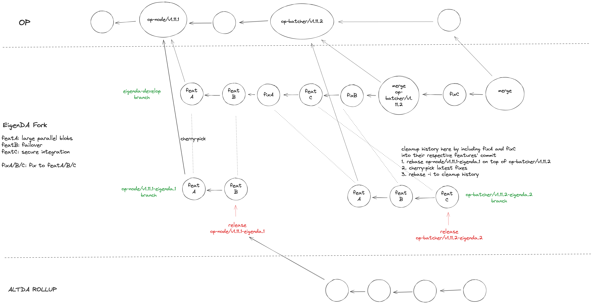

# Fork Release Runbook

This document describes the process for releasing a new version of the EigenDA powered Optimism-Fork. This adds details to the explanation in the main [README](../../README.md#releases-and-branching-strategy).



## Example Release For op-batcher/v1.11.2-eigenda.2

First we make the cleaned-up release branch/tag:

```bash
git checkout op-node/v1.11.1-eigenda.1
git rebase op-batcher/v1.11.2
# cherry pick all the new commits
# Can also do it manually: `git cherry-pick <fixA> <featC> <fixB>`
git cherry-pick op-node/v1.11.1-eigenda.1^..eigenda-develop
# cleanup history
git rebase -i op-batcher/v1.11.2
# tag the release
git tag op-batcher/v1.11.2-eigenda.2
git push --tags
```

Then we update the eigenda-develop branch:

```bash
git checkout eigenda-develop
git merge op-batcher/v1.11.2
git push # or can create a PR instead - but make sure to merge with merge commit
```
