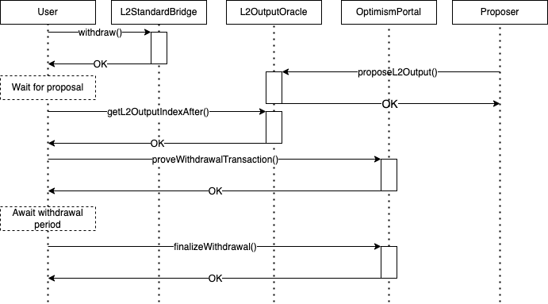

Bedrock is the next major release of the Optimism network, planned for the first quarter of 2023 (subject to approval by Optimism governance). 
It will further reduce [the differences between Optimism and L1 Ethereum](https://op-geth.optimism.io/).
Here are the major changes:

## Guide by persona

If you want to jump directly to the parts relevant to your job role, here are the parts we think will be most useful

Wallet developer

As a wallet developer you are most likely to interact with the JSON RPC, and your users want to know how much their transactions are going to cost.
Timing may also be relevant.

- [EIP-1559](#eip-1559)
- [JSON-RPC](#json-rpc)
- [Block Production](#block-production)

Dapp frontend developer

As an application developer you are probably interested in the fact Bedrock has a mempool and the changes in transaction fees. 
You might also be interested in changes in the RPC interface and block timing.

- [EIP-1559](#eip-1559)
- [Mempool](#mempool)
- [JSON-RPC](#json-rpc)
- [Block Production](#block-production)

Dapp backend (protocol) developer

As an application developer you are probably interested in the fact Bedrock has a mempool and the changes in transaction fees. 
You might also be interested in changes in the RPC interface and block timing.

- [EIP-1559](#eip-1559)
- [Mempool](#mempool)
- [JSON-RPC](#json-rpc)
- [Block Production](#block-production)

Infrastructure provider (or anybody else running a node)

To run a node you need to understand the executables required to run it. 
You might also be interested in the existence of the mempool and the changes in block timing, fess, and the JSON RPC.

- [Mempool](#mempool)
- [Block Production](#block-production)
- [Historical Data](#historical-data)
- [JSON-RPC](#json-rpc)
- [Chain Reorganizations](#chain-reorganizations)

[See here for a more detailed guide](./node-operator-guide.md) on how to run a Bedrock node.

Bridge developer

As a bridge developer you are likely most interested in deposits into Optimism and withdrawals back into Ethereum L1.

- [Two-Phase Withdrawals](#two-phase-withdrawals)
- [Deposits](#deposits-from-ethereum-to-optimism)

## The EVM

### Block Production

:::warning Block Time Subject to Change

Currently blocks are produced every two seconds.
However, that value may change in the future.

:::

Unlike the legacy network which mines a block for every incoming transaction, the Bedrock network will produce new blocks every two seconds. This introduces the following changes to the EVM:

- `TIMESTAMP` will return the timestamp of the block. It will update every two seconds.
- `BLOCKNUMBER` will return an actual block number. It will update every two seconds. The one-to-one mapping between blocks and transactions will no longer apply.

The Bedrock upgrade also introduces the concept of _system transactions_. System transactions are created by the `op-node`, and are used to execute deposits and update the L2's view of L1. They have the following attributes:

- Every block will contain at least one system transaction called the [L1 attributes deposited transaction](https://github.com/ethereum-optimism/optimism/blob/develop/specs/deposits.md#l1-attributes-deposited-transaction). It will always be the first transaction in the block.
- Some blocks will contain one or more [user-deposited transactions](https://github.com/ethereum-optimism/optimism/blob/develop/specs/deposits.md#user-deposited-transactions).
- All system transactions have an [EIP-2718](https://eips.ethereum.org/EIPS/eip-2718)-compatible transaction type of `0x7E`.
- All system transactions are unsigned, and set their `v`, `r`, and `s` fields to `null`.

For more information about these transactions, see the [deposited transactions specification](https://github.com/ethereum-optimism/optimism/blob/develop/specs/deposits.md) on GitHub.

:::warning Known Issue
Some Ethereum client libraries, such as Web3j, cannot parse the `null` signature fields described above. To work around this issue, you will need to manually filter out the system transactions before passing them to the library. 
:::

### EIP-1559

As part of the Bedrock upgrade, we have upgraded the network to support [EIP-1559](https://eips.ethereum.org/EIPS/eip-1559). In EIP-1559 the cost of a unit of gas is composed of two components:

- **Base fee**: This fee is the same for all transactions in a block. It varies between blocks based on the difference between the actual size of the blocks (which depends on the demand for block space) and the target block size. When the block uses more gas than the target block size the base fee goes up to discourage demand. When the block uses less gas than the target block size the base fee goes down to encourage demand.
- **Priority fee**: This fee is specified in the transaction itself and varies between transactions. Block proposers are expected to select the transactions that offer them the highest priority fees first.

There are some differences between Ethereum and Optimism in this regard:

- ETH is not burned. Burning ETH on L2 would only lock it in the bridge forever.
- The EIP 1559 parameters have different values. Once those values are finalized they will be posted here.

The L1 security fee, which is the majority of the transaction cost, uses the same mechanism as before the upgrade. However, the transactions to L1 are going to be submitted on a [non-contract address](#the-transaction-trail). Between that and improved compression, the L1 security fee should be reduced by about 20%.

From an application development perspective, EIP-1559 introduces the following changes:

- The `BASEFEE` opcode is now supported. The `BASEFEE` opcodes returns the base fee of the current block.
- The `eth_maxPriorityFeePerGas` and `eth_feeHistory` RPC methods are now supported. `eth_maxPriorityFeePerGas` returns a fee per gas that is an estimate of how much you can pay as a priority fee, or 'tip', to get a transaction included in the current block. `eth_feeHistory` returns a collection of historical gas information from which you can decide what to submit as your `maxFeePerGas` and/or `maxPriorityFeePerGas`.

### Removed Opcodes

One of the design goals of the Bedrock upgrade is to be maximally EVM equivalent. To reduce differences between Optimism's EVM and vanilla Ethereum's EVM, we have removed the `L1BLOCKNUMBER` opcode.

### ETH Balances

The previous version of the system used an ERC20 contract called `OVM_ETH` to represent ETH balances. These balances will be migrated into the Bedrock network's state as part of the migration. To preserve backwards compatibility, the methods on the `OVM_ETH` contract will continue to work. Note, however, that the `totalSupply()` method will return zero. 

## Chain Reorganizations

Unlike the legacy network, Bedrock nodes _always_ derive blocks from L1. This means that if L1 experiences a reorg, L2 will reorganize itself to match the state of L1. Blocks that have not been submitted to L1 yet are gossipped via a peer-to-peer network, and can be reorganized if the data on L1 does not match the data gossiped over P2P.

Bedrock adopts the same vocabulary as the Beacon Chain to describe block finality. Blocks can be in one of the following states:

- `unsafe`, meaning that the block has been received via gossip but has not yet been submitted to L1. Unsafe blocks can be reorged if L1 reorgs, or the sequencer reorgs.
- `safe`, meaning that the block has been submitted to L1. Unsafe blocks can be reorged if L1 reorgs.
- `finalized`, meaning that the block has reached sufficient depth to be considered final. Finalized blocks cannot be reorged.

The current `safe`, `unsafe`, and `finalized` blocks can be queried via [JSON-RPC](#json-rpc).

## Historical Data

Bedrock nodes can serve pre-Bedrock block bodies, transactions, and receipts out of the box. However, you will need to run a Legacy Geth instance to serve historical execution traces. See the [Node Operator Guide](./node-operator-guide.md) for more information about how to do this.

Note that the following legacy fields have been removed from pre-Bedrock JSON-RPC transaction responses:

- `queueOrigin`
- `l1TxOrigin`
- `l1BlockNumber`
- `l1Timestamp`
- `index`
- `queueIndex`
- `rawTransaction`

If your application needs these fields, query Legacy Geth instead of `op-geth`.

## JSON-RPC

Bedrock supports all of the standard JSON-RPC methods exposed by go-ethereum. In order to reduce differences between Bedrock and vanilla Ethereum, some legacy methods have been removed. These methods and their replacements are:

- `eth_getBlockRange`: Use `eth_getBlockByNumber` in a batch request instead.
- `rollup_getInfo`: None of the information returned by this method exists on Bedrock, so there is no replacement for this method.
- `rollup_gasPrices`: Use `eth_gasPrice` instead. The L1 and L2 fees are combined, and returned as a single value.

To query `op-node`'s sync status, use the `optimism_syncStatus` RPC method. This method will return the current `safe`, `unsafe`, and `finalized` as seen by the `op-node`.

## Mempool

Since the legacy network creates a block for every transaction, it processes new transactions in a first-come-first-serve manner. Bedrock, however, creates blocks on a fixed interval and therefore needs a mempool to store pending transactions until they are included in a block. To minimize MEV, Bedrock's mempool is private. To submit transactions, you will need to configure `op-geth` to forward transactions to the sequencer. This may change in the future.

The sequencer processes transactions in the mempool in order of their base and priority fees.

## Two-Phase Withdrawals

On the legacy network, funds are withdrawn as follows:

1. Users send a withdrawal message.
2. Users wait seven days for the withdrawal to be finalized.
3. Users post a withdrawal proof on L1, and claim their funds.

However, this introduces a security risk. If the withdrawal proof can be successfully forged, an attacker could withdraw funds from the bridge that they are not authorized to. This kind of attack has been exploited before - a fraudulent proof led to the loss of [$100M on Binance Smart Chain](https://www.nansen.ai/research/bnb-chains-cross-chain-bridge-exploit-explained).

To eliminate this risk, Bedrock requires users to post their withdrawal proofs upfront. Users must wait for a valid output root to be proposed so that the withdrawal proof can be validated on-chain. Once the seven-day waiting period has expired, users can then finalize the withdrawal and claim their funds. The updated withdrawal flow is as follows:

1. Users send a withdrawal message.
2. Users wait for a state output to be proposed on-chain. This can take up to an hour.
3. Users call `proveWithdrawalTransaction()` on the `OptimismPortal` to post and validate their proof.
4. Users wait for the withdrawal to be finalized. This takes seven days on mainnet.
5. Users call `finalizeWithdrawal()` on the `OptimismPortal` to claim their funds.

Visualized, this flow looks like this:

By posting the proof upfront, it gives on-chain monitoring tools enough time to detect a fraudulent withdrawal proof and attempt corrective action. 
Regular users can do this monitoring too. For example, an exechange could halt withdrawals in the event of a fraudulent proof.

Since this change fundamentally changes the way withdrawals are handled, it is **not** backwards-compatible with the old network. If you are performing withdrawals outside our standard bridge interface, you will need to update your software. The easiest way to to do this is to use our [TypeScript SDK](https://github.com/ethereum-optimism/optimism/tree/develop/packages/sdk), which includes two-phase withdrawals support out of the box.

For more information on two-phase withdrawals, see the withdrawals specification on [GitHub](https://github.com/ethereum-optimism/optimism/blob/develop/specs/withdrawals.md).

## Deposit Replayability

:::warning Breaking Change
The changes described in this section are **not** backwards-compatible with the old network. Please read this section carefully. 
:::

On the legacy network, deposits are replayable. This is no longer the case in Bedrock. Additionally, as part of the migration, all deposits on the legacy network that have not been replayed will no longer be replayable. **This means that if you have not replayed your deposit, you must do so before the migration.** This affects fewer than 100 transactions of the nearly 40 million on mainnet.

## Contracts

### L1 contracts

#### L2OutputOracle

[The `L2OutputOracle` contract](https://github.com/ethereum-optimism/optimism/blob/develop/packages/contracts-bedrock/contracts/L1/L2OutputOracle.sol) contains the state root of the Optimism blockchain.
Once fault proofs are activated, it will be the one that receives the result of the fault proof process.

This is the contract that replaces the old State Commitment Chain.

#### OptimismPortal

[The `OptimismPortal` contract](https://github.com/ethereum-optimism/optimism/blob/develop/packages/contracts-bedrock/contracts/L1/OptimismPortal.sol) provides [the low-level API for communications between layers](#deposits-from-ethereum-to-optimism). Unless you are trying to send L2 transactions via L1 to bypass the sequencer, we strongly recommend sending messages between L1 and L2 via the L1CrossDomainMessenger and L2CrossDomainMessenger.

#### Existing interface

These contracts provide the same interface as existed pre-Bedrock so dapps don’t have to be modified to run on Bedrock.

- [L1CrossDomainMessenger](https://github.com/ethereum-optimism/optimism/blob/develop/packages/contracts-bedrock/contracts/L1/L1CrossDomainMessenger.sol):
  The `L1CrossDomainMessenger` contract is used for sending messages between Ethereum and Optimism. Those messages may or may not have assets attached to them.
- [L1StandardBridge](https://github.com/ethereum-optimism/optimism/blob/develop/packages/contracts-bedrock/contracts/L1/L1StandardBridge.sol):
  The `L1StandardBridge` contract uses `L1CrossDomainMessenger` to transfer ETH and ERC-20 tokens between Ethereum and Optimism.

### L2 contracts (predeploys)

#### L1Block

[The `L1Block` contract](https://github.com/ethereum-optimism/optimism/blob/develop/packages/contracts-bedrock/contracts/L2/L1Block.sol) sits at address `0x4200000000000000000000000000000000000015`.
You can use [the getter functions](https://docs.soliditylang.org/en/v0.8.12/contracts.html#getter-functions) to get these parameters:

- `number`: The latest L1 block number known to L2 (the `L1BlockNumber` contract is still supported to avoid breaking existing applications)
- `timestamp`: The timestamp of the latest L1 block
- `basefee`: The base fee of the latest L1 block
- `hash`: The hash of the latest L1 block
- `sequenceNumber`: The number of the L2 block within the epoch (the epoch changes when there is a new L1 block)

Currently the L1 information is delayed by ten block confirmations (~2.5 minutes) to minimize the impact of reorgs. 
This value may be reduced in the future.

#### SequencerFeeVault

[The `SequencerFeeVault` contract](https://github.com/ethereum-optimism/optimism/blob/develop/packages/contracts-bedrock/contracts/L2/SequencerFeeVault.sol) handles funding the sequencer on L1 using the ETH base fee on L2.

The fees are calculated using [EIP 1559](https://github.com/ethereum/EIPs/blob/master/EIPS/eip-1559.md), the same mechanism that Ethereum uses (but with different parameter values).

#### L2ToL1MessagePasser

[The `L2ToL1MessagePasser` contract](https://github.com/ethereum-optimism/optimism/blob/develop/packages/contracts-bedrock/contracts/L2/L2ToL1MessagePasser.sol) is used internally by `L2CrossDomainMessenger` to initiate withdrawals.

#### Existing interface

These contracts provide the same interface as existed pre-Bedrock so dapps don’t have to be modified to run on Bedrock.

- [L1BlockNumber](https://github.com/ethereum-optimism/optimism/blob/develop/packages/contracts-bedrock/contracts/L2/L1BlockNumber.sol): 
  The `L1BlockNumber` contract provides the number of the latest L1 block. 
  In Bedrock it is simply a proxy to [`L1Block`](#l1block). 
- [L2CrossDomainMessenger](https://github.com/ethereum-optimism/optimism/blob/develop/packages/contracts-bedrock/contracts/L2/L2CrossDomainMessenger.sol):
  The `L2CrossDomainMessenger` contract is used to send messages from Optimism to Ethereum.
- [L2StandardBridge](https://github.com/ethereum-optimism/optimism/blob/develop/packages/contracts-bedrock/contracts/L2/L2StandardBridge.sol):
  The `L2StandardBridge` contract is used to "attach" assets (ETH and ERC-20 tokens) to messages that are then sent by `L2CrossDomainMessenger`.
- [WETH9](https://github.com/ethereum-optimism/optimism/blob/develop/packages/contracts-bedrock/contracts/L2/WETH9.sol): 
  [The WETH9 contract](https://weth.io/) is an ERC-20 token that wraps around ETH to provide extra functionality, such as approvals.

#### Historical contracts

These are contracts that are no longer relevant, but are kept as part of the state in case there is a call in any dapp that uses them.

- [DeployerWhitelist](https://github.com/ethereum-optimism/optimism/blob/develop/packages/contracts-bedrock/contracts/L2/DeployerWhitelist.sol):
  The `DeployerWhitelist` contract used to manage the whitelist before [Optimism moved out of beta](https://twitter.com/optimismFND/status/1471571415774023682).

- [OVM_ETH](https://github.com/ethereum-optimism/optimism/blob/develop/packages/contracts-bedrock/contracts/L2/OVM_ETH.sol):
  The `OVM_ETH` contract used to manage users ETH balances prior to Bedrock.

## Communication between layers

In Optimism terminology "deposit" refers to any message going from the Ethereum blockchain to Optimism, whether it has any assets attached or not.
Similarly, "withdrawal" refers to any message going from Optimism to Ethereum.

[See here for the messenger specs](https://github.com/ethereum-optimism/optimism/blob/develop/specs/messengers.md) and [here for the bridge specs](https://github.com/ethereum-optimism/optimism/blob/develop/specs/bridges.md).

<!--
### Gas cost changes

The gas costs for communication between layers are going to change, they will probably get lower. 
More information will be posted here once we have more exact information after we profile a test network.

-->

<!-- TODO get the figures and put them here -->

### Deposits (from Ethereum to Optimism)

To create a deposit we recommend that you use the pre-Bedrock contracts [`L1StandardBridge`](https://github.com/ethereum-optimism/optimism/blob/develop/packages/contracts-bedrock/contracts/L1/L1StandardBridge.sol) and [`L1CrossDomainMessenger`](https://github.com/ethereum-optimism/optimism/blob/develop/packages/contracts-bedrock/contracts/L1/L1CrossDomainMessenger.sol).
[`OptimismPortal`](https://github.com/ethereum-optimism/optimism/blob/develop/packages/contracts-bedrock/contracts/L1/OptimismPortal.sol) also has low-level deposit functionality.

With the OptimismPortal’s `depositTransaction` function you can do from L1 anything you can do by contacting L2 directly: send transactions, send payments, create contracts, etc.
This provides an uncensorable alternative in case the sequencer is down. 
Even though the sequencer is down, verifiers (nodes that synchronize the Optimism state from L1) are still going to receive such transactions and modify the state accordingly. 
When the sequencer is back up it has to process the transactions in the same order to have a valid state.

We recommend adding a 50% buffer to whatever is returned by `estimateGas` to ensure that your deposit will not run out of gas (Note: the Optimism SDK already does this under the hood). For example, if you wish to send a deposit of ETH, you might call `eth_estimateGas` and see that the deposit is expected to consume `100,000 gas`. You should then multiply that estimated about by `1.5` and then send your transaction with a `gasLimit` of at least `150,000 gas`.

:::tip
In order to prevent the Optimism network from being DOSed via forced L1 to L2 transactions that bypass the Sequencer, a fee adjustment schedule to all L1→L2 transactions that closely mimics EIP1559 is included with Bedrock. Like in the current network, deposit fees are paid by burning some amount of L1 gas proportional to your deposit's L2 gas limit. Unfortunately, this means that you may have cases where you estimate how much gas an L1→L2 deposit will cost, and deposit fees increase by the time your transaction gets included in a block and executed, causing your deposit to run out of gas and revert. This is why we recommend adding a 50% buffer to your `gasLimit` to ensure your deposit will not run out of gas.
:::

Deposits that come from contracts still use [address aliasing](../build/differences.md#address-aliasing).

Deposits will also be faster, probably about 2.5 minutes or less, rather than the 10-20 minutes they take now.

<!--
Deposits are implemented using [a new transaction type](https://github.com/ethereum-optimism/optimism/blob/develop/specs/deposits.md#the-deposited-transaction-type), 0x7E.
-->

[You can read the full deposit specifications here](https://github.com/ethereum-optimism/optimism/blob/develop/specs/deposits.md#the-deposited-transaction-type).

[You can read the full withdrawal specifications here](https://github.com/ethereum-optimism/optimism/blob/develop/specs/withdrawals.md)

## Behind the scenes

This section discusses some of the changes in Optimism internals.

### The transaction trail

There is no longer a CTC (cannonical transaction chain) contract. Instead, L2 blocks are saved to the Ethereum blockchain using a non-contract address to minimize the L1 gas expenses. Please see the [Public Testnets](./public-testnets.md) page for more information on where to find batch submission addresses. 

[The block and transaction format is also different](https://github.com/ethereum-optimism/optimism/blob/develop/specs/rollup-node.md#l2-chain-derivation).
