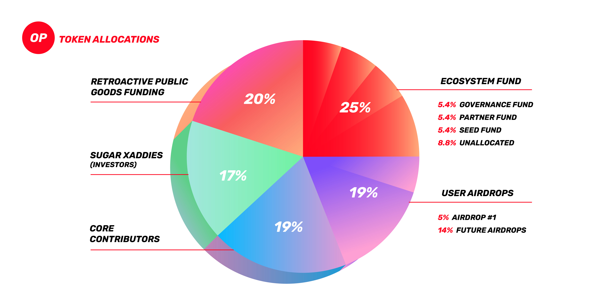
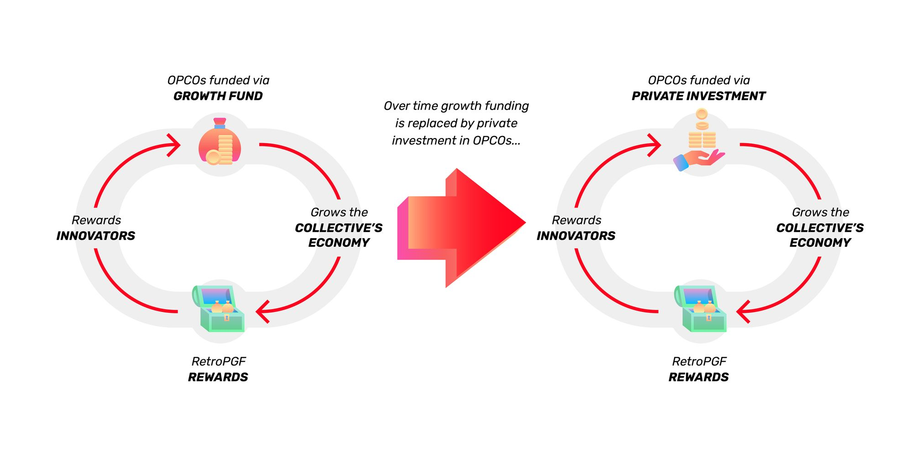
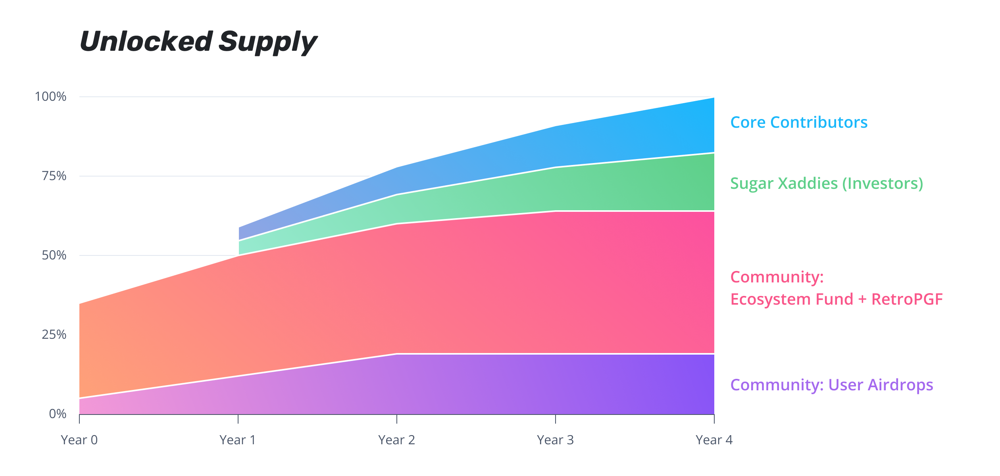

## Allocations at a glance

| Category | Percentage | Description |
| --- | --- | --- |
| Ecosystem Fund | 25% | The Ecosystem Fund is a proactive program meant to stimulate development in the Collective ecosystem by providing funding to projects and communities |
| Retroactive Public Goods Funding (RetroPGF) | 20% | RetroPGF is the Optimism Collective’s primary mechanism to adequately and reliably **reward** public goods for the impact they provide |
| User airdrops | 19% | A series of airdrops to reward users for specific helpful behaviors, beginning with Airdrop #1 |
| Core contributors | 19% | The people who’ve been working tirelessly to bring the Optimism Collective into existence |
| Sugar xaddies | 17% | Investors |

## User Airdrops

***Allocation: 19%***

The Optimism Foundation will distribute a portion of the OP allocation to members of the Optimism and Ethereum communities in multiple waves.

### Airdrop #1

The first user airdrop will distribute **5%** of the OP token supply. 
This airdrop is targeted towards people who:

- Behave in positive-sum ways.
- Contribute actively to their communities.
- Have been priced out of Ethereum.

The addresses and amounts were chosen to reward Optimism users, as well as attract core Ethereum users to the OP family. 
Airdrop #1 cast a wide net to distribute OP to more than 250k addresses. See the [Airdrop #1 documentation](airdrop-1.md) for a detailed breakdown of eligibility criteria.  

### Future airdrops (#2, 3, …)

An allocation of **14%** of the OP token supply will be held in reserve for future user airdrops. 
As a result of the game-able nature of airdrops, the Optimism Foundation will be responsible for determining airdrop metrics as fairly as possible. 
The intent behind airdrops is to distribute them to addresses which positively impact the Optimism community. 
The best way to improve your odds of receiving future airdrops is to get involved!

## Ecosystem Fund

***Allocation: 25%***

The Ecosystem Fund is an incentive program designed to stimulate development of the Collective ecosystem. 
The Ecosystem Fund will be used to directly fund the communities and companies that drive the expansion of the Collective ecosystem (OPCOs).

The allocation dedicated to the Ecosystem Fund is to be further split into the following categories:

1. Governance Fund **(5.4%)**
2. Partner Fund **(5.4%)**
3. Seed Fund **(5.4%)**
4. Unallocated **(8.8%)**

The Ecosystem Fund is intended to be a kick-starting mechanism that will be phased out entirely once the OP in the fund has been depleted. 
The Optimism Foundation expects the function served by the Ecosystem Fund (proactive funding) to eventually be replaced by private third-party investors who can expect to be paid out by the [Retroactive Public Goods Funding](https://medium.com/ethereum-optimism/retroactive-public-goods-funding-33c9b7d00f0c) mechanism.

The wide variety of funding mechanisms ensures that airdrops constantly flow to users who make valuable contributions to the ecosystem. 
These contributions result in ecosystem growth,  ecosystem growth results in demand for block space, demand for block space results in revenues, and these revenues are then productively re-deployed into the ecosystem as additional airdrops.

Each fund can be thought of as a parallel experiment in OP allocation, enabling rapid iteration and doubling down on what works to further grow the ecosystem.

### Governance Fund

An allocation of **5.4%** of the OP token supply will be dedicated to the first Governance Fund. 
All projects demonstrating usage on Optimism can request tokens from this fund at [gov.optimism.io](https://gov.optimism.io/)

### Partner Fund

An allocation of **5.4%** of the OP token supply will be dedicated to the Partner Fund. 
These funds will be distributed strategically by the Optimism Foundation to grow the Optimism ecosystem for the benefit of the entire Collective.

### Seed Fund

An allocation of **5.4%** of the OP token supply will be dedicated to the Seed Fund, a fund for early stage projects launching in and adjacent to the Optimism ecosystem. 

### Unspent allocation for future growth programs

An allocation of **8.8%** of the OP token supply will be held in reserve for future community growth programs.

## Retroactive Public Goods Funding

***Allocation: 20%***

[Retroactive Public Goods Funding (RetroPGF)](https://medium.com/ethereum-optimism/retroactive-public-goods-funding-33c9b7d00f0c) will initially be distributed by the [Citizens' House](citizens-house.md). 
RetroPGF rounds are expected to occur on a quarterly basis with the objective of ensuring that all OPCOs are rewarded adequately, appropriately, and reliably based on their impact to the Collective—key to our [vision](https://optimism.io/vision).

RetroPGF will be funded by several revenue sources:

1. 20% of the initial OP token supply held as the “RetroPGF Reserve”.
1. Optimism network transaction fees and sequencer revenue.

The Optimism Foundation may choose to increase the total OP payout of any given period by tapping into the 20% RetroPGF Reserve.

## Core Contributors

***Allocation: 19%***

The Core Contributors allocation will be distributed to the people who helped bring Optimism and the Optimism Collective from concept to reality, and will continue to pay for development of the protocol. 
All tokens distributed as part of the Core Contributors allocation will be subject to a lockup period.

## Sugar Xaddies

***Allocation: 17%***

Investors. 
They funded us and our crazy vision for the future. 
Couldn’t-a done it without ya. 
All tokens distributed as part of the Sugar Xaddies allocation will be subject to a lockup period.

## Token Distribution Details

At genesis there will be an initial total supply of 4,294,967,296 OP tokens. 
The total token supply will inflate at a rate of 2% per year.

64% of the initial token supply (i.e., the aggregate amount of OP **not** reserved for core contributors or sugar xaddies) will be distributed to the community as described above. 
These distributions will be administered over time by the Optimism Foundation in its role as steward of the Optimism Collective.

In Year 1, 30% of the initial token supply will be made available to the Foundation for distribution. 
After the first year, token holders will vote to determine the Foundation’s annual OP distribution budget. 
The Foundation expects to seek the following annual allocations:

- Year 2: 15% of the initial token supply
- Year 3: 10% of the initial token supply
- Year 4: 4% of the initial token supply

If the Foundation’s authorized OP expenditures ever reaches below 10% of the initial token supply, it is expected to request an additional allocation.

Taken together, the Foundation expects the total supply of unlocked OP tokens to approximate the graph below.

Note this graph is for illustration only, and actual unlocked supply will depend on governance and the rate that OP is allocated across user airdrops, the Ecosystem Fund, and RetroPGF.

