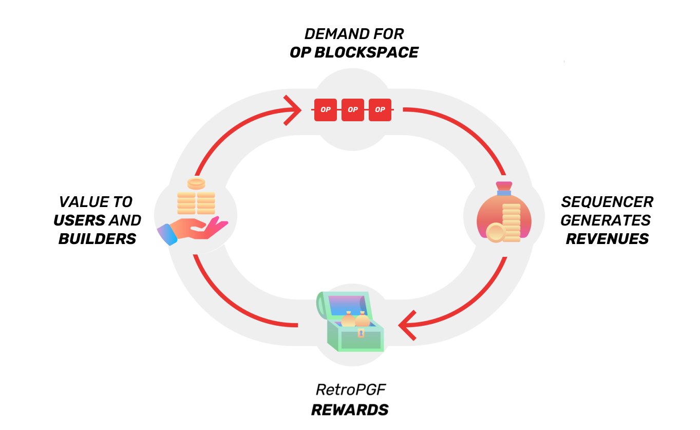

::: tip Notice: OP Airdrop #1 is now available to claim
[Click here to claim](https://app.optimism.io/airdrop/check)

*Airdrop #1 does not require payment.*
*Stay safe!*
:::

The Optimism Collective is based on the idea that healthy public goods create a thriving and valuable ecosystem. 
The economics of this ecosystem are designed to generate value for three constituencies:

- Value accrues to **tokenholders** through the productive re-deployment of sequencer revenue. 
  Sequencer revenue is primarily directed to fund public goods, which creates ecosystem value and drives demand for blockspace.
- Value accrues to **contributors and builders** directly from retroactive public goods funding and the markets it enables.
  Builders also benefit symbiotically: it’s better to build in an ecosystem with well-funded tools, education, apps, and infrastructure.
- Value accrues to **users and community members** from ongoing airdrops of OP, from project incentives made possible by OP ecosystem funding, and from the benefit public goods provide.

Together, it looks like this:

Let’s break it down ⤵️

## Demand for OP blockspace generates revenue

Funding for the OP economy comes from ownership of the Optimism network and the value of its blockspace. 
Today, funding comes directly from the centralized sequencer, accruing to The Optimism Foundation for redistribution. 
In the future, funding can accrue directly to the protocol by selling the right to participate in Optimism’s decentralized sequencing network.

Simply put: the right to blockspace is the sustainable source of revenue that drives OP’s economic model and grows with the network itself.

## Revenue is distributed to public goods

Communities benefit from all sorts of public goods, from education to city infrastructure to open source software. 
But many markets fail to provide adequate funding and support for those public goods. 
It’s here that Optimism takes a step forward, by building a sustainable funding source into the mechanisms of the network itself.

Direct or auctioned sequencer revenue is distributed back to the ecosystem primarily through Retroactive Public Goods Funding ([RetroPGF](https://medium.com/ethereum-optimism/retroactive-public-goods-funding-33c9b7d00f0c)).
This creates strong incentives for individuals to build for the public good of the Optimism Collective.

To start, the Citizens’ House will vote quarterly on distributions of funds to individuals, teams, projects, or communities that have provided subjective value over a specified time period. 
This directly rewards community members for the positive impact of their work.

RetroPGF also provides possible exit liquidity for public goods projects, which opens up a market for early investment in those projects. 
This means builders can:

- Be compensated for their positive contributions without generating direct revenue.
- Raise capital to bootstrap based on the early potential and promise of their project.

In the long-term, the Foundation expects this mechanism to drive a wide range of pro-social downstream effects, which the Collective can capture and expand upon through frequent experimentation and iteration.

## Value from public goods drives demand for blockspace

Funding public goods drives growth — and therefore network revenues — from the ground up. 
In our [first round](https://vitalik.ca/general/2021/11/16/retro1.html) of RetroPGF, Optimism funded a set of hugely valuable developer tools and core infrastructure. 
The aggregate effect is an ecosystem that is easier to build on, learn about, and connect to, in turn driving application usage and generating more demand for blockspace.

But what value do these public goods provide, and for whom is it valuable? 
This is a rich design space. 
Optimism’s governance is designed to create conditions for experimentation around this question. 
The Foundation draws heavily on the work of Ostrom, Vitalik, and others to make sure funding for public goods is maximally efficient, effective, and safe. 

To start, Foundation governance is shared and divided through a two-house system, where network parameters for the amount of funding are controlled by both houses, but the governance of RetroPGF allocation is determined by a set of Citizens with local knowledge and skin in the game.

Thoughtful allocation of public goods funding will create longterm value for builders, users, tokenholders, citizens and the entire Optimism Collective.
