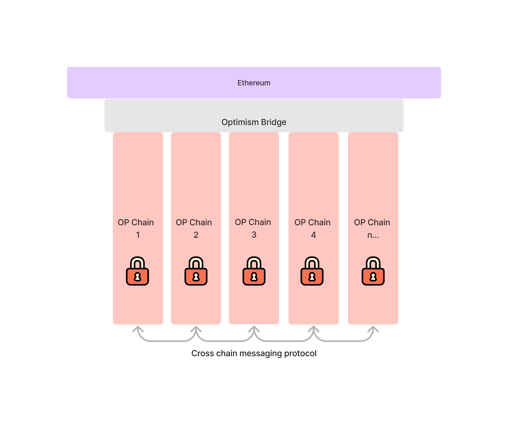

::: tip Staying up to date

[Stay up to date on the Superchain and the OP Stack by subscribing to the Optimism newsletter](https://optimism.us6.list-manage.com/subscribe/post?u=9727fa8bec4011400e57cafcb&id=ca91042234&f_id=002a19e3f0).

:::

The next major scalability improvement to the OP Stack after [Bedrock](../releases/bedrock/) is to introduce the concept of *a Superchain*: a network of chains that share bridging, decentralized governance, upgrades, a communication layer and more—all built on the OP Stack.

The launch of the Superchain would merge Optimism Mainnet and other chains into a single unified network of OP Chains (i.e., chains within the Superchain), and mark a major step towards bringing scalable and decentralized compute to the world. The goal of this document is to describe the scalability vision, the Superchain concept, and some changes to the OP Stack required to make this vision a reality.

This is the detailed explanation. [Click here for a less technical introduction](https://app.optimism.io/superchain/).

::: tip Note

Today, the Superchain is a concept and in-flight project, not a concrete reality.  This documentation represents our best current guess as to what the Superchain’s components, features, and roadmap will be. Ultimately, its actualization will depend on (and change alongside) contributions from across the entire Optimism Collective. We cannot wait to see where it goes. 

:::

## The Scalability Vision

### Blockchain tech today is insufficient for the decentralized web

The unfortunate truth is that the blockchain ecosystem has not realized the potential of creating the decentralized web, a re-architected internet where trusted entities are replaced by permissionless protocols. This is largely due to the fact that a majority of web applications are unable to be run onchain due to scalability constraints inherent to the current state of blockchain technology—a problem which has plagued the industry since its inception.

In fact, in a display of remarkable foresight, the very first response to the Bitcoin whitepaper was:

> **We very, very much need such a system, but the way I understand your proposal, it does not seem to scale to the required size.**

More than a decade later this has not changed.

### The value of scalable decentralized compute is immense…

Imagine a world where we solved the blockchain scalability problem. Imagine if transacting onchain would be as cheap as interacting with centralized backends. In this world, what would be possible?

- Developers wouldn’t need to worry about the backend infrastructure their app exists on because the chain guarantees correct execution, uptime, and [horizontal scalability](https://en.wikipedia.org/wiki/Scalability#Horizontal_(scale_out)_and_vertical_scaling_(scale_up)) of their app.
- Due to the shared smart contract execution environment, composability would be supercharged far beyond the capabilities of traditional REST APIs.
- With standardized gas markets, developers are not required to front all infrastructure costs for their users. Paying for a viral application would no longer be a barrier to entry for app devs, and more monetization strategies would be unlocked.

The combination of these features would make it possible to program highly scalable web applications without having to touch the traditional backend software stack. Removing the need to worry about backends is a value proposition which extends beyond decentralization enthusiasts into regular application developers who just want to ship a product. With scalability, blockchains can go from a niche interest to becoming a core component of every developer’s toolkit.

Additionally, in this world where most applications go onchain more data becomes cryptographically verifiable. This cryptographic verifiability enables users to build reputations which transfer across all of their applications. The reputation can then be used for voting, loans, and collateral—facilitating trust on the internet. Plus there is no risk of losing access because users retain ownership of their data, applications, and reputation.

There is no doubt that the promise of blockchains could change the internet as we know it.

### …and the decentralized web can still be realized

This hypothetical isn’t a dream, it’s a tangible vision for the future which has motivated many—including Optimism—to dedicate their lives to its pursuit. Due to these collective contributions, every year we learn more about the blockchain technology stack and get closer to realizing the vision.

With the support of the industry, we think a clear picture for how to architect a truly scalable blockchain is beginning to come into view. We call it the “Superchain”. This document lays out the core technical principles underlying the Superchain architecture, as well as a set of tangible projects which, when complete, we believe will finally realize the blockchain scalability vision. It will be a multi-year (if not decade) journey. However, if we know roughly where we’re going we’ll get there a little faster.

## Foundational Superchain Concepts

### Horizontal scalability requires multiple chains…

Horizontal blockchain scalability fundamentally requires multiple chains. This is because the hardware requirements to sync a chain increase linearly with the amount of compute the chain performs. Therefore, to achieve horizontal scalability we must run chains in parallel.

::: details Chain

A state [transition system](https://en.wikipedia.org/wiki/Transition_system)—consisting of an initial state, a state transition function, and a list of inputs (transactions)—which is cryptographically committed to and can be independently replicated with commodity computer hardware and internet connection.

:::

### …but traditional multi-chain architectures are insufficient

Traditional approaches to ‘multi-chain’ architectures suffer from two fundamental problems:

1. Each chain introduces a new security model, resulting in compounding systemic risk as new chains are introduced into the ecosystem. (related [link](https://twitter.com/VitalikButerin/status/1479501366192132099?s=20))
2. New chains are costly to spin up because they require new validator sets & block producers.

These issues come from a lack of a single shared blockchain (an “L1” chain) which serves as a shared source of truth for all of the chains (”L2” chains) within the multi-chain system. By using the shared source of truth it is possible to: a) enforce standard security models across all chains; and b) remove the requirement that chain deployments require a new set of validators because each L2 chain uses L1 consensus.

### Not multi-chain, not mono-chain… Superchain

By using L2 chains to comprise the multi-chain ecosystem, it becomes possible to begin to treat chains as commodities—interchangeable compute resources. This commodification of chains enables developers to build cross-chain applications without introducing systemic risk and without incurring large overhead as new chains are deployed for their application. The concept of a chain itself can become abstracted, and at this point it will become possible to treat this network of interoperable chains as a single unit: the Superchain.

::: details Superchain

A decentralized blockchain platform which consists of many chains that share security and a technology stack (OP Stack). The interoperability and standardization enables individual chains to be treated identically by tools and wallets.

:::

## Superchain Overview

### The Superchain at a glance

The Superchain is a network of L2 chains, known as OP Chains, which share security, a communication layer, and an open source technology stack. However, unlike multi-chain designs, these chains are standardized and intended to be used as interchangeable resources. This enables developers to build applications which target the Superchain as a whole, and abstract away the underlying chains the apps are running on.

::: details OP Chain

An individual chain within the Optimism Superchain. All chains, regardless of their specific properties are considered OP Chains if they are officially governed by the Optimism Collective, and therefore part of the Superchain.

:::

### Properties of the Superchain

In order for Optimism to upgraded to a Superchain, it must have the following properties:

| Property | Purpose |
| - | - |
| Shared L1 blockchain | Provides a total ordering of transactions across all OP Chains.
| Shared bridge for all OP Chains | Enables OP Chains to have standardized security properties.
| Cheap OP Chain deployment | Enables deploying and transacting on OP Chains without the high fees of transacting on L1.
| Configuration options for OP Chains | Enables OP Chains to configure their data availability provider, sequencer address, etc.
| Secure transactions and cross-chain messages | Enables users to safely migrate assets between OP Chains.

Once Optimism has satisfied these properties it may be considered a Superchain.

## Upgrading Optimism to Become a Superchain

We believe the following changes (after the Bedrock release) are required to create a initial Superchain that makes it possible to deploy and upgrade many chains with the same bridge:

### Upgrade the Bedrock bridge to be a chain factory

Bedrock introduced the [SystemConfig contract](https://github.com/ethereum-optimism/optimism/blob/74a63c94d881442b4edd4df6492513e0113eb064/packages/contracts-bedrock/contracts/L1/SystemConfig.sol) which began to define the L2 chain directly with L1 smart contracts. This can be extended to put *all information* defining the L2 chain, onchain. Including generating a unique chain ID, key configuration values such as block gas limit, etc.

Once the chain data is entirely onchain, we can create a factory which deploys the configuration and all other required contracts for each chain. This can be extended further by making the contract addresses deterministic with CREATE2, meaning that given a chain config it is possible to determine all bridge addresses associated with that chain. This also enables chains to be interacted with without having to deploy their bridge contracts, making (counterfactual) chain deployment virtually free, and allowing chains to inherit standard security properties. 

### Derive OP Chain data using the chain factory

[Bedrock introduced L2 chain derivation from an L1 chain](../releases/bedrock/explainer/#block-derivation), where all chain data can be synced based on L1 blocks. With the L1 chain factory extending this to put all configuration onchain, it should become possible for Optimism nodes to sync *any* OP Chain deterministically given a single L1 address plus a connection to L1.

::: tip 📌 

When the OP Chain is synced, the chain state is locally computed. This means determining the state of the OP Chain is fully permissionless & secure. No proof system is required for chain derivation because all invalid transactions are simply ignored by the local computation process performed by the node. A proof system is, however, still required to enable Superchain withdrawals.

:::

### Permissionless proof system to enable withdrawals

In Bedrock, there is a permissioned entity (the proposer) who is required for users to submit withdrawals. Additionally, proposers must submit proposals to L1 at a set interval. This introduces linear overhead as the number of chains in the Superchain increases, and even introduces an upper bound on the number of chains due to the limited L1 resources.

In order to address these issues, we can introduce two features:

1. Withdrawal claims (a.k.a. Permissionless proposals) — allow anyone to submit a withdrawal (aka a proposal), not just a designated proposer. This removes the permissioned entity from the system, enabling users to submit their own withdrawal messages.
2. Remove proposal submission interval — enable withdrawal claims to be made *only* when a user needs to withdraw. This removes the overhead incurred when deploying a new OP Chain.

::: details Withdrawal claims

A claim about the state of one chain made on another chain. For instance, I can claim that in OP Mainnet I have burned my tokens with the intent to withdraw those tokens back to L1.

:::

We can enable these two features first by introducing a permissionless proof system to the Optimism bridge contracts. With the modular proof design introduced in Bedrock, proofs may come in the form of fault proofs or validity proofs (e.g. zero knowledge proofs). However, until validity proofs are productionized, we assume withdrawals will use a fault proof system.

In the envisioned fault proof system, anyone can submit a withdrawal claim, and these withdrawal claims can be submitted at any time. Submitting withdrawal claims can be permissionless when claims come with bonds attached to them, as these bonds act as collateral if the claim is proven to be invalid. If a challenger successfully challenges the claim, the bond is paid out to the challenger for their participation in securing the system, thereby preventing spam even within this permissionless system. Additionally, there is no need to submit them at a regular interval because the fault proof game can efficiently prove the entire history of the chain since genesis.

The fault proof implementation may initially rely on a trusted set of chain attestors to be the final arbiter of disputes. Challengers must request attestations from a large number of chain attestors and combine these attestations into a single transaction called an attestation proof. The attestation proof is then used to challenge invalid claims.

The attestation-based fault proof should be designed to prefer safety over liveness. That means that if these chain attestors are malicious they cannot alone break the safety of withdrawals. The worst failure they can cause is preventing withdrawals from being processed until the next upgrade—a liveness failure.

In the future, the attestation proof will be incrementally phased out and replaced with trust-minimized proofs such as the [Cannon proof system](https://github.com/ethereum-optimism/cannon).

### Configurable sequencer per OP Chain

Bedrock introduced the ability to set the sequencer address in the SystemConfig contract. As we introduce multiple chains with their own SystemConfig contracts, we can enable the sequencer address to be configured by the OP Chain deployer. We call this configurable sequencer design modular sequencing. This enables OP Chains to be sequenced by different entities while retaining the standard [Superchain bridge] security model—a critical step towards sequencer decentralization.

::: details Modular sequencing

The ability to configure the sequencer address during OP Chain deployment. This value can be configured by the OP Chain deployer.

:::

::: details Superchain bridge

The L1 bridge contracts which govern all OP Chains in the Superchain. This bridge can be upgraded by the Optimism Collective.

:::

Within the Superchain bridge security model, chain safety (i.e. validity) as well as chain liveness (i.e. censorship resistance) is guaranteed. Safety is guaranteed by the proof system, and liveness is guaranteed by the ability to submit [transactions directly to L1](../releases/bedrock/explainer/#deposits). The combination of safety and liveness means that if an OP Chain sequencer were to misbehave, users can always submit transactions to L1 that migrates their usage to a new OP Chain with a correctly functioning sequencer.

Modular sequencing also enables permissionless experimentation with different sequencing models. Developers can envision implementing sequencing protocols such as: round robin sequencing, sequencer consensus protocols, PGA ordering, or FIFO ordering. We can expect that over time user friendly sequencing standards will emerge from the competition between competing sequencing protocols.

### One shared upgrade path for all OP Chains

To ship the initial Superchain with high confidence in security and decentralization, a decentralized security council should be introduced to govern upgrades. The security council should be able to update the set of chain attestors, initiate contract upgrades with a delay, and hit an emergency bridge pause button which also cancels pending upgrades.

The ability to pause the bridge in case of emergency means that in the worst case, where the requisite threshold of the security council participants had their private keys leaked, the result would be that withdrawals are indefinitely paused and bridge upgrades would be perpetually canceled. In other words, the L1 funds would be frozen. This follows the design principle of safety over liveness—the principle that one should always prevent the loss of funds (i.e. enforce safety) even if it means the funds get locked (i.e. sacrifice liveness).

#### Unfreezing the bridge via L1 soft fork

In order to address the frozen funds, there is a potential final recovery mechanism which has been discussed by the L2 community which we call the “L1 Soft Fork Upgrade Recovery” mechanism. This mechanism enables L1 to initiate a bridge upgrade with a soft fork, bypassing all other permissions within the Superchain bridge contracts. This approach may [introduce systemic risk](https://vitalik.ca/general/2023/05/21/dont_overload.html) to Ethereum and requires research and community buy-in before implementation. It is not required for implementing the Superchain and is being documented for research completeness. Without further research into the implications and safety, it is not an approach the team currently endorses.

The mechanism is as follows:

*Anyone* may propose an upgrade by submitting a transaction to a special bridge contract, along with a very large bond. This begins a two week challenge period. During this challenge period, anyone may submit a challenge which immediately cancels the upgrade and claims the bond. Under normal circumstances, it is impossible that an upgrade would go uncancelled for the required two weeks due to the large incentive provided for anyone to cancel the upgrade. However, if the upgrade is accompanied by a modification to Ethereum L1 validator software (the L1 soft fork), which ignores blocks that contain the cancellation transaction then it may succeed.

While a successful upgrade of this type would represent a soft fork of Ethereum L1, it would not incur long term technical debt to the Ethereum codebase because the soft fork logic can be removed once the upgrade has completed.

We expect this escape hatch will never be used, but its very existence could deter malicious behavior.

### The combination of these features results in a system satisfying the core Superchain properties

We believe these upgrades can provide a shared bridge for all OP Chains, cheap OP Chain deployment, important configuration options for the OP Chains, as well as secure transactions and cross-chain messages. Because the Bedrock release already provides the property of a shared L1 blockchain, after these changes we will have achieved all of the core properties required for the Superchain.

## Extending the Superchain—enhancements to realize the vision

We expect that, if successful, the post-Bedrock Superchain release will mark a major milestone in the scalability and decentralization of Optimism. However, there will still be significant pain points which must be addressed before the full scalable blockchain vision has been realized. Anticipated pain points include:

1. Withdrawal claims rely on a trusted set of chain attestors.
2. Cross-Chain transactions are slow because they require waiting a challenge period.
3. Cross-Chain transactions are asynchronous, breaking the ability to perform atomic cross-chain transactions (like flash loans).
4. Posting transactions to the Superchain is not-scalable because the transaction data must be submitted to L1 which has limited capacity.
5. There are no easy frameworks for building scalable dApps which utilize many OP Chains.
6. There is no easy wallet for managing assets and dApps across many OP Chains.

If each one of these pain points were addressed, it could be possible to build decentralized alternatives to even the most complex web2 applications.

The following is an overview of potential future enhancements, which when combined, addresses each one of these pain points.

### Multi-Proof Security

#### Pain Point:

1) Withdrawal claims rely on a trusted set of chain attestors.

#### Proposed Solution:

It is possible to replace the trusted set of chain attestors by introducing permissionless proofs—such as Cannon—where dispute resolution is entirely onchain. However, the challenge with entirely onchain proofs is there is no fallback mechanism if they were to break. To ensure that they will never fail, it is possible to introduce a multi-proof system which provides safety through redundancy. For more information on the multi-proof design click [here](https://medium.com/ethereum-optimism/our-pragmatic-path-to-decentralization-cb5805ca43c1).

### Low Latency L2 to L2 Message Passing

#### Pain Point:

2) Cross-Chain transactions are slow because they require waiting a challenge period.

#### Proposed Solution:

Fault proofs introduce a UX burden because they require waiting a challenge period in order to safely finalize. This means that, depending on your challenge period length, users need to wait a long time before their assets are migrated from one OP Chain to the next.

On the other hand, validity proofs do not have this problem. Validity proofs don’t have a challenge period and therefore provide instant withdrawals from one OP Chain to the next. This is extremely important if users are expected to migrate between chains frequently, even during normal dApp execution. However, validity proofs are commonly implemented using zero-knowledge proofs (ZKPs), which are expensive and bug-prone. It will likely take years to truly productionize ZKPs enough such that they can be the primary cross-chain communication protocol.

However, while ZKPs are being productionized, it is possible to achieve low latency L2 to L2 message passing using the OP Stack’s modular proof system. With modular proofs it is possible to use two proof systems for the same chain. This opens up the possibility to provide low latency bridging which trades off security while *also* providing high security high latency bridging.

This heterogeneous bridging system means that developers can build their applications using one of many bridge types, such as:

1. High security, high latency fault proof (standard high security bridge)
2. Low security, low latency fault proof (a short challenge period to achieve low latency)
3. Low security, low latency validity proof (using trusted chain attestors in place of a ZKP)
4. High security, low latency validity proof (once ZKPs are ready)

Mixing multiple proof systems enables developers to provide low latency bridging for low value assets and high latency for high value assets. It is even possible to turn a low security asset which was instantly bridged into a high security asset by proving the asset’s validity using a high security high latency bridge. This building block enables developers to make interesting security tradeoffs such as using a high threshold attestation proof with a high security high latency fault proof fallback.

### Synchronous Cross-Chain Transactions

#### Pain Point:

3) Cross-Chain transactions are asynchronous, breaking the ability to perform atomic cross-chain transactions (like flash loans).

#### Proposed Solution:

Traditional cross-chain messaging is done asynchronously, which means that cross-chain transactions are *not* atomic. For example, if a user would would like to execute a cross-chain arbitrage transaction—buying token A on chain A, and selling token B on chain B—there is no guarantee that their transaction executes in its entirety. The user might end up buying token A without having sold token B.

It is possible to introduce synchronous cross-chain messaging and enable atomic cross-chain interactions by using a shared sequencing protocol on both OP Chains. In our example, the sequencers on chain A and chain B would each receive the arbitrage transaction, come to consensus on when they will include it, and then atomically include each transaction in the linked block. Fees would only be paid if the transaction was indeed included on each chain, meaning the sequencers take the synchronization risk as opposed to the user in our initial example. These shared sequencing protocols can be implemented permissionlessly on top of the modular sequencing layer of the post-Bedrock Superchain.

With the combination of low latency L2 to L2 message passing as well as shared sequencing, it is possible to perform complex transactions such as cross-chain flash loans. It is even possible to go further and create an EVM abstraction where individual smart contracts (or even individual storage slots) exist on different chains.

### Alt-Data Availability Layer — Plasma Protocol

#### Pain Point:

4) Posting transactions to the Superchain is not-scalable because the transaction data must be submitted to L1 which has limited capacity.

#### Proposed Solution:

Today L1 data availability (DA) does not scale nearly enough to be able to support internet-level scale. However, it is possible to extend the amount of data availability accessible to OP Chains by using a Plasma protocol which enables alternative DA providers to supplement the more limited L1 DA.

A generic Plasma protocol is able to scale beyond what is possible on L1 because only the users who are interested in the transaction data will download the Plasma data, whereas on L1 every Ethereum node downloads all of the transaction data on L1. This means that Plasma data is extremely cheap. However, where Plasma has a worse security model than L1—it is possible for Plasma chain data to temporarily become unavailable, meaning users must withdraw from the chain. Note, this security model still guarantees safety of the Plasma chains, just not liveness.

::: details Plasma chain

A chain where transaction data is committed to on L1 but not supplied to L1 directly, with a data availability challenge fallback.

:::

**Plasma protocol overview:**

- Data Availability (DA) Providers receive transaction data from users.
- DA Providers then hash the transaction data and submit the hash to the Plasma Contract.
- Once the hash has been submitted, the DA Provider sends a proof to the user which proves inclusion of their transaction data in the hash. If the DA Provider is misbehaving, they will withhold the proof, not sending it to the user.
- If the DA Provider does not send the proof to the user, the user may submit a DA challenge. This forces the DA Provider to post the transaction data onchain. If the DA Provider does not submit the proof onchain, the hash is deleted. This ensures the user can always (after the challenge period) sync the Plasma chain.
    - DA challenge periods may be extended in case of heavy L1 congestion.
- The user may also submit an L1 transaction to withdraw from the Plasma chain in order to switch their DA Provider.
- Settlement of Plasma chains use a near identical fault proof system to Rollup chains with the only difference being that additional data is derived from the chain using the hashes that are finalized in the Plasma Contract.

Because of the ability for hashes to reduce arbitrary size data into a constant size commitment, and the ability to parallelize transaction data hashing, it is possible to achieve near-perfect horizontal scalability of data commitments using Plasma DA. This means that it is possible to put massively scalable applications such as games or social media on Plasma chains.

### Multi-Chain dApp Frameworks

#### Pain Points:

5) There are no easy frameworks for building scalable dApps which utilize many OP Chains.

6) There is no easy wallet for managing assets and dApps across many OP Chains.

#### Proposed Solution (Sketch):

This is not a core protocol change, but instead tooling which can be built on top of the core Superchain protocols. The suggestions here are intended to give rough intuitions for how to build tools which improve the experience of deploying to the Superchain.

These are some tools which could make developing on the Superchain a better experience:

1. Content-addressable smart contracts — this enables contracts to have the same address on all chains. This way developers can write smart contracts which are counterfactually deployed to all OP Chains at the same address. If a user on an OP Chain would like to use the smart contract that is not yet available on their chain, they can independently deploy the code.
2. Cross-chain contract state management standards — creating standards for how smart contract state can migrate from one chain to the next enables developers to shard their applications on many chains. Additionally, this logic can be used in wallets to display user state as if it is all on the same chain. For instance, if a user has tokens split across many chains, the wallet can use the cross-chain state management logic to know that it should display the user balance as a sum of all of their token balances across all chains.
    
    ::: tip 📌 

    For the Ethereum scalability nerds: the state growth problem can be addressed in these frameworks by making it easy to migrate user state from bloated chains into fresh chains. Old bloated chains can be maintained with a low gas limit or deprecated entirely.
        
    :::
    
3. Superchain RPC endpoint — creating a single RPC endpoint where users can send their Superchain transactions regardless of which OP Chain they are intended to enables users to avoid constantly switching their network.

With robust multi-chain dApp frameworks, it may become as easy to deploy cross-chain dApps as it is to deploy dApps which target a single chain.

## Get Involved

We believe scaling blockchains will radically decentralize the internet and make it easy to create horizontally scalable, secure, and decentralized web applications. We think the Superchain release of the OP Stack could mark a major step towards realizing this vision. However, after the release it will still take an enormous amount of work to realize the scalability vision.

However, with great challenge comes great opportunity! The work needed to arrive at the initial Superchain release of the OP stack, as well as the resulting ecosystem should be exciting greenfields of opportunities for developers who want to contribute. There will be an enormous amount of low hanging fruit contributions unlocked. We can’t pick it alone! The only way we can hope to achieve it is through open source contributions from folks like you! And with [retroactive public goods funding](https://medium.com/ethereum-optimism/retroactive-public-goods-funding-33c9b7d00f0c) your open source contributions may be rewarded too!

Exciting times ahead.

Stay Optimistic 🔴✨

## Glossary

- **Attestation-Based Fault Proof**: A fault proof where challenges can be successfully made by supplying an attestation proof which disagrees with the original withdrawal claim.

- **Attestation-Based Validity Proof**: A validity proof which can be verified by supplying an attestation proof which agrees with the withdrawal claim.

- **Attestation Proof**: A proof which consists of some number of signatures from a pre-agreed upon set of chain attestors.

- **Cannon Fault Proof**: A fault proof where challenges are evaluated using an onchain game which is guaranteed to result in a truthful outcome, given economic rationality assumptions.

- **Chain**: A state [transition system](https://en.wikipedia.org/wiki/Transition_system)—consisting of an initial state, a state transition function, and a list of inputs (transactions)—which is cryptographically committed to and can be independently replicated with commodity computer hardware and internet connection.

- **Chain Proof**: Difficult to forge evidence of the validity of a particular withdrawal claim. Proofs are commonly used to enable chains to communicate with each other.

- **Challenge Period**: The window of time in which a challenge can be made to disprove a fault proof.

- **Fault Proof**: A proof which relies on the absence of counter-evidence to prove correctness.

- **Modular Proof**: The ability to use multiple proof systems for the same OP Chain. For instance, it should be possible to prove an OP Chain using a fault proof or a validity proof.

- **Modular Sequencing**: The ability to configure the sequencer address during OP Chain deployment. This value can be configured by the OP Chain deployer.

- **OP Chain**: An individual chain within the Optimism Superchain. All chains, regardless of their specific properties are considered OP Chains if they are officially governed by the Optimism Collective, and therefore part of the Superchain.

- **Plasma Chain**: A chain where transaction data is committed to on L1 but not supplied to L1 directly, with a data availability challenge fallback.

- **Rollup Chain**: A chain where all transaction data is submitted to L1.

- **Sequencer**: The specific entity or smart contract which has priority when submitting transactions to an OP Chain.

- **Superchain**: A decentralized blockchain platform which consists of many chains that share security and a technology stack (OP Stack). The interoperability and standardization enables individual chains to be treated identically by tools and wallets.

- **Superchain Bridge**: The L1 bridge contracts which govern all OP Chains in the Superchain. This bridge can be upgraded by the Optimism Collective.

- **Validity Proof**: A proof of a withdrawal claim which can be immediately validated, without a challenge period.

- **Withdrawal Claim**: A claim about the state of one chain made on another chain. For instance, I can claim that in OP Mainnet I have burned my tokens with the intent to withdraw those tokens back to L1.

- **Zero Knowledge Proof**: A validity proof which relies on cryptographic properties and low error margins.
