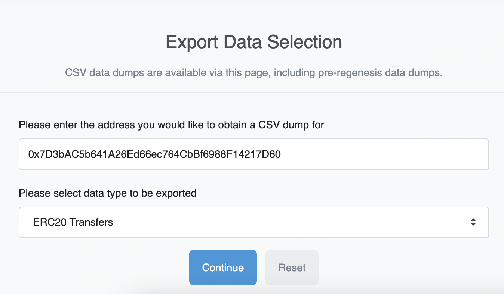

## Blockscout

We have a Blockscout explorer for the [Goerli testnet](https://blockscout.com/optimism/goerli/). It includes:

- [Verified contract source code, along with the ability to interact with it](https://blockscout.com/optimism/goerli/address/0x106941459A8768f5A92b770e280555FAF817576f/contracts#address-tabs)
- [Detailed transaction information](https://blockscout.com/optimism/goerli/tx/0xeb98c8279983cfee472c6067d2405acc130dca37e7536d6c83930e29aaa40e3e)


## Etherscan

We have Etherscan explorers for the [Optimism mainnet](https://explorer.optimism.io) and the  [Optimism  Goerli testnet](https://goerli-explorer.optimism.io).
Etherscan has lots of tools to help you debug transactions.

Optimistic Etherscan has all the tools you expect from Etherscan, such as:
- [Verified contract source code, along with the ability to interact with it](https://explorer.optimism.io/address/0x420000000000000000000000000000000000000F#code)
- [Detailed transaction information](https://explorer.optimism.io/tx/0x292423266d6da24126dc4e0e81890c22a67295cc8b1a987e71ad84748511452f)
- And everything else you might find on Etherscan!

It's also got some Optimism-specific features:
- [A list of L1-to-L2 transactions](https://explorer.optimism.io/txsEnqueued)
- [A list of L2-to-L1 transactions](https://explorer.optimism.io/txsExit)
- [A tool for finalizing L2-to-L1 transactions](https://explorer.optimism.io/messagerelayer)
- And more! Just check it out and click around to find all of the available features.

## Access to pre-regenesis history

Because of our final regenesis on 11 November 2021, older transactions are not part of the current blockchain. 
As such, they do not appear, for example, on [Etherscan](https://explorer.optimism.io/).
However, you **can** access transaction history between 23 June 2021 and the final regenesis using the Etherscan CSV exporting tool.

### Etherscan access

[Browse here](https://explorer.optimism.io/exportDataMain) and select your address and the type of report you want.




### Dune access

[Click here](https://dune.com/optimismfnd/OVM1.0-User-Address-Transactions).

<!--
If none of the Etherscan CSV files contains the information you need, you can use a query on [Dune Analytics](https://dune.xyz), similar to [this query](https://dune.xyz/queries/354886?addr=%5Cx25E1c58040f27ECF20BBd4ca83a09290326896B3).
You have to log on with a Dune account, but their free tier is sufficient.

```sql
SELECT * FROM optimism.transactions
WHERE "from"='{{addr}}' or "to"='{{addr}}'
LIMIT 100
```

Notes:
- Make sure to select the data source **Optimism (OVM 1.0)**
- This is how you specify parameters in Dune, `{{` followed by the parameter name and then `}}`. 
- Addresses are specified as `\x<hex address>` rather than `0x<hex address>`.  
- The limit is not required, but here to save resources
-->


### Pre 23 June 2021 history

Follow these steps:

1. Clone go-ethereum (the standard version) and checkout version v1.9.10:

   ```sh
   git clone https://github.com/ethereum/go-ethereum.git
   cd go-ethereum
   git checkout v1.9.10
   ```

1. Download the following three datadir folders:
   - [Generation #1 (Jan to April)](https://storage.googleapis.com/sequencer-datadirs/datadir-gen1.zip) 
   - [Generation #2 (April to May)](https://storage.googleapis.com/sequencer-datadirs/datadir-gen2.zip)
   - [Generation #3 (May to June)](https://storage.googleapis.com/sequencer-datadirs/datadir-gen3.zip)

1. Build and run the standard geth v1.9.10 with:

   ```sh
   ./build/bin/geth --datadir ./path/to/datadir --rpc
   ```

   You can then use ERC20 events filters to get the events that you want for each address. Note that you will have to repeat this process for each datadir to get the full event history.
   If you are non-technical and need help requesting this data please reach out to us in Discord and we will be happy to help.


