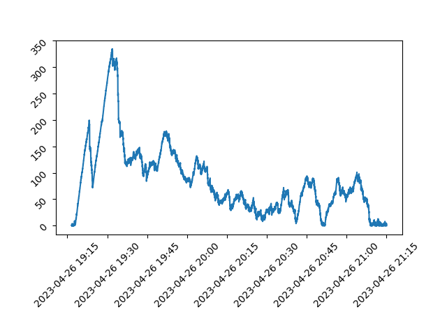

# [Public] 4/26 Transaction Delays Post-Mortem

# Incident Summary

On April 26, 2023 between the hours of 1900 and 2100 UTC, OP Mainnet experienced degraded service following a ~10x increase in the rate of `eth_sendRawTransaction` requests. 

While the sequencer remained online and continued to process transactions, users experienced transaction inclusion delays, rate limit errors, problems syncing nodes, and other symptoms of degraded performance.

The issue resolved itself once the rate of `eth_sendRawTransaction` requests subsided. However, we did not communicate the status of the network to our users, nor did we execute on mitigations quickly enough that could have reduced the impact of the degraded service. We recognize that this was a frustrating experience that caused significant impact to our users, particularly those participating in the DeFi ecosystem. We are sorry for this user experience, and hope that this retrospective provides insight into what happened and what we are doing to prevent similar issues from happening again.

# Leadup

OP Mainnet has not yet been upgraded to Bedrock. As a result, all OP Mainnet nodes run two components to sync the L2 chain:

- The `data-transport-layer` (or DTL), which indexes transactions from L1 or another L2 node.
- `l2geth`, which executes the transactions indexed by the DTL and maintains the L2 chain’s state.

The DTL and `l2geth` retrieve new data by polling for it. The DTL polls L1 or L2 depending on how it is configured, and `l2geth` polls the DTL. The higher the transaction throughput is, the more transactions will have to be processed between each “tick” of the polling loop. When throughput is too high, it is possible for the number of transactions between each tick to exceed what can be processed in a single tick. In this case, multiple ticks are necessary to catch up to the tip of the chain.

To protect the sequencer against traffic spikes, we route read requests - specifically `eth_getBlockRange`, which the DTL uses to sync from L2 - to a read-only replica rather than to the sequencer itself.

At 1915 UTC, sequencer throughput jumped from the usual ~8 transactions per second to a peak of 95 transactions per second over the course of 15 minutes.

# Causes

As a result of the increased throughput, our read-only replica started to fall behind. The graph below shows the delay, in seconds, between the sequencer creating new blocks and them being indexed by the read-only replica:

This meant that while the sequencer was processing transactions normally, users were unable to see their transactions confirmed on chain for several minutes. For DeFi apps relying on an accurate view of on-chain data, this caused transactions to be reverted and positions to be liquidated. It also made it difficult to retry transactions, since the user’s wallet nonce may have increased on the sequencer but not on the replica.

This issue was ecosystem wide. Infrastructure providers run replicas of their own, which use the same polling-based mechanism to sync data. This likely further increased the delay between when transactions were processed, and when they appeared as confirmed. This is not an error on the part of infrastructure providers, but rather a flaw in how the pre-Bedrock system is designed.

# Recovery and Lessons Learned

The issue resolved itself once the transaction volume dropped back down to normal levels. However, we did not communicate with our community for the duration of the outage. This is a significant miss, and for that we apologize. Going forward, we will do the following in an effort to avoid similar issues:

- We will add monitoring for replica lag, so that we can proactively route traffic directly to the sequencer when throughput increases beyond what the sync mechanism can handle.
- Though rate limits were not the direct cause of this incident, we will increase rate limits so that node operators can poll for new blocks more frequently.

Lastly, we will upgrade mainnet to Bedrock later this year. Bedrock fixes these issues from an architectural perspective. Specifically:

- There will be no more DTL, or polling-based sync mechanism. Blocks are either derived from L1, or gossipped over a peer-to-peer network.
- Blocks will be created every two seconds rather than on every transaction. This allows data to propagate across the network more efficiently and predictably.
- The sequencer will have a private mempool. This will allow fee-replacement transactions to work properly, and eliminate the need for aggressive rate limiting on the sequencer.

We recognize how frustrating an issue like this can be, and that is compounded when we are not proactively communicating. We’re sorry our users had this experience. We’re committed to applying these learnings moving forward and appreciate our community holding us accountable.
