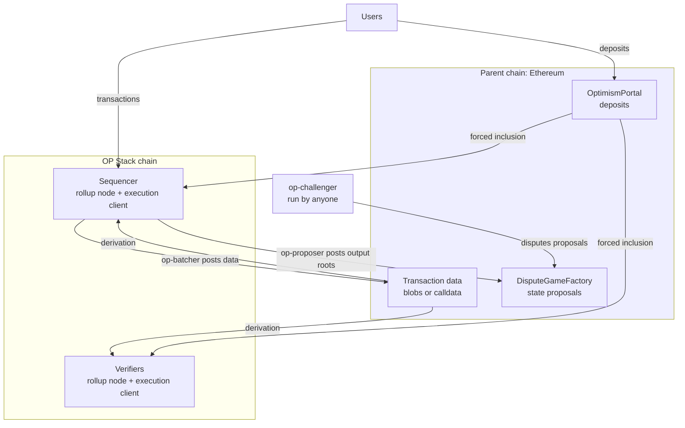
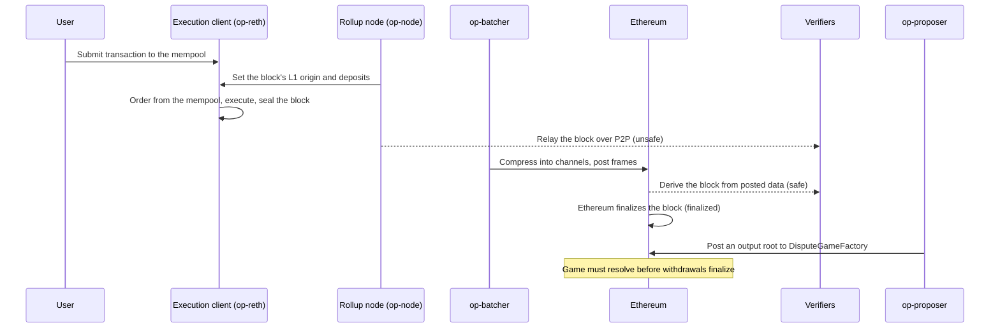

import { NormativeSpec } from "/snippets/normative-spec.mdx"

<NormativeSpec
  what="OP Stack protocol behavior"
  title="OP Stack specifications"
  href="https://specs.optimism.io/"
  note="This page explains how the system fits together; it does not restate the spec."
/>

<Info>
  **Learn the OP Stack — stop 2 of 14.**
  You know what the OP Stack is and what it powers. This page adds the
  system view: the components, who runs each, and how a transaction moves
  through them. When you're done, continue to
  [Design philosophy & principles](/op-stack/protocol/design-principles).
</Info>

An OP Stack chain is a *derived* chain: its canonical history is defined by
data published to a parent chain, and every other part of the system exists to
produce that data, to turn it back into blocks, or to convince the parent chain
of the result. That single property explains most of the architecture.

This page is the system view. It names the parts, says who runs each one, walks
one transaction through all of them, and marks where trust actually sits. Each
section links the page that owns the detail rather than repeating it, and terms
introduced here are defined in the [glossary](/op-stack/reference/glossary).

Examples throughout describe a chain in the standard configuration: Ethereum
for data availability, and permissionless fault proofs. Both are configurable,
and the sections below mark where a different choice changes the answer.

## The big picture

Two chains are involved. The *parent chain*, usually Ethereum, stores the L2's
transaction data and holds the contracts that settle its state. The *rollup*
produces blocks quickly and cheaply, and publishes everything it does back to
the parent.

Two edges carry most of the security argument. **Derivation** runs on the
sequencer and on every verifier alike, so a verifier reading only Ethereum
arrives at the same chain the sequencer built. **Forced inclusion** binds the
sequencer to the same deposit rules as everyone else, which is why a deposit
lands even if the sequencer would rather ignore it. See the
[derivation pipeline](/op-stack/protocol/derivation-pipeline).

## The actors, and who runs each

The OP Stack is a set of separate services rather than one program.

| Component | Role | Who runs it | What happens without it |
| --- | --- | --- | --- |
| [op-node](/op-stack/components/op-node) or [kona-node](/op-stack/components/kona-node) | Consensus layer. Sets each block's L1 origin and deposits; derives the chain from L1 | Operator (sequencer); anyone (verifier) | No blocks are built or derived |
| [op-reth](/op-stack/components/op-reth) | Execution layer. Holds the mempool, orders and executes transactions, holds state | Whoever runs the rollup node; one per node | No state transition |
| [op-batcher](/op-stack/components/op-batcher) | Posts L2 transaction data to the DA layer | Operator | The safe head stops advancing; the chain cannot be derived |
| [op-proposer](/op-stack/components/op-proposer) | Posts output roots (commitments to L2 state) to L1 | Operator, or anyone on a permissionless chain | No new withdrawals can be proven |
| [op-challenger](/op-stack/components/op-challenger) | Disputes invalid proposals, defends valid ones | Operator, or anyone on a permissionless chain | Invalid proposals go unchallenged |
| [op-conductor](/op-stack/components/op-conductor) | Leader election across a sequencer cluster | Operator (optional) | A sequencer failure stalls production until manual failover |
| [op-deployer](/op-stack/components/op-deployer) | Deploys the chain's L1 contracts | Operator | No chain to deploy |

The consensus and execution clients run as a pair, one to one, connected over
the Engine API. Two implementations of the consensus role exist, op-node in Go
and kona-node in Rust, which is what client diversity looks like at this layer.
Upgrades of the deployed contracts do not go through op-deployer; see
[Upgrading the contracts](/op-stack/protocol/smart-contracts#upgrading-the-contracts).

The security argument rests on **verifiers** being unprivileged. Anyone can run
a rollup node plus an execution client, derive the chain from Ethereum, and
detect a sequencer that published something the data does not support. Whether
*proposing and challenging* are equally open depends on the chain's configured
game type, covered in [Permissionless and privileged](#permissionless-and-privileged).

## Life of a transaction

The sequence below follows one transaction through every component on a chain
using Ethereum DA. It is the component view; for what the finality labels mean
and how long each stage takes, see
[Transaction finality](/op-stack/transactions/transaction-finality).

| Step | Component | What it does | Result |
| --- | --- | --- | --- |
| 1 | Execution client | Accepts the transaction into its mempool | Pending |
| 2 | Rollup node | Fixes the block's L1 origin and prepends any deposits due this epoch | Deposit prefix set |
| 3 | Execution client | Selects the remaining transactions from its mempool, executes them, seals the block | Ordering decided, new state root |
| 4 | Rollup node | Relays the block to peers | Verifiers see it as **unsafe** |
| 5 | op-batcher | Compresses blocks into channels, splits into frames, posts to the DA layer | Data available on the DA layer |
| 6 | Verifier rollup node | Derives the block from the posted data, independently of the sequencer | Block is **safe** |
| 7 | Ethereum | Finalizes the block holding the data | Block is **finalized** |
| 8 | op-proposer | Submits an output root to `DisputeGameFactory` on an interval, creating a dispute game | A claim withdrawals can be proven against |
| 9 | op-challenger | Checks the proposal against its own synced node and counters it if wrong | Game resolves for or against the proposal |

The sequencer's mempool is private, unlike L1 Ethereum's, which limits the
MEV opportunities that a public pending-transaction pool creates.

Ordering is decided by the execution client, not the rollup node. The rollup
node's job at block-building time is to fix what the protocol requires, the L1
origin and the deposits for that epoch, and to leave the rest to the execution
client's mempool.

Steps 1 through 4 depend on the sequencer behaving. Step 6 is where that
dependency ends: once the data is on the DA layer, the block's ordering is
fixed by that layer rather than by the sequencer's goodwill. On chains
streaming [Subblocks](/op-stack/features/subblocks), applications can act on a
preconfirmation roughly 200 milliseconds after submission, well before step 4.

Steps 8 and 9 are a separate track on its own schedule. The proposer posts on a
configured interval covering many blocks, not once per transaction, and by
default proposes only finalized L2 state. These steps serve withdrawals; they
do not advance the chain.

A proposal is not self-executing. Its dispute game must resolve in its favor
before a withdrawal proved against it can be finalized, and the Guardian can
still act during the window that follows. Proving and finalizing a withdrawal
are separate steps, described in
[Withdrawal flow](/op-stack/bridging/withdrawal-flow).

Transactions can also enter from L1. A user who submits a deposit to the
`OptimismPortal` gets it included in L2 by the derivation rules themselves,
which is what makes deposits censorship-resistant. See
[Deposit flow](/op-stack/bridging/deposit-flow) and
[Forced transactions](/op-stack/transactions/forced-transaction).

## Where data lives, and what you trust

Three different things go to the parent chain, and conflating them is the most
common source of confusion about rollup security.

| What is published | Contract or location | What it buys |
| --- | --- | --- |
| Transaction data | Blobs or calldata at a DA address | Anyone can reconstruct the chain without the sequencer |
| Deposits | `OptimismPortal` | L1 can force transactions into L2 |
| Output roots | `DisputeGameFactory` | L1 can authenticate L2 state for withdrawals |

An *output root* is a commitment to the whole L2 chain state at a given block,
not the block's state root alone. It is what a withdrawal proof is checked
against. The contracts involved are described in
[OP Stack smart contracts](/op-stack/protocol/smart-contracts).

Transaction data is what makes the chain *derivable*. Output roots are what
make it *settleable*. A chain that published data but no output roots would
still be a chain anyone could verify, but no one could withdraw from it. A
chain that published output roots but no data would be unverifiable, and its
proposals uncheckable.

The trust boundary moves as a transaction ages. Before its data is published, a
user is trusting the sequencer not to reorder or drop it. After, they are
trusting the DA layer. The fault proof system governs only the third row: it
decides whether a claim about L2 state is accepted on L1, and it does not
reorder the L2 chain. A defeated proposal removes a claim about the chain; it
does not roll the chain back. See the
[fault proofs explainer](/op-stack/fault-proofs/explainer).

## Topology options

The layered design means several choices are a chain's to make. Some can be
changed later; some are fixed at genesis.

- **Standard chain.** Ethereum for data availability, ETH for gas, governed
  upgrades. This is what the
  [blockspace charter](/op-stack/protocol/blockspace-charter) defines and what
  interoperability and shared tooling assume.
- **Custom data availability.** An [Alt-DA](/op-stack/features/experimental/alt-da-mode)
  layer instead of Ethereum blobs. Cheaper, and the chain's security becomes a
  function of that layer's availability guarantees rather than Ethereum's. The
  feature is experimental, and with it the claim that anyone can reconstruct
  the chain from Ethereum no longer holds: only a commitment reaches L1.
- **Custom gas token.** A [custom gas token](/op-stack/features/custom-gas-token)
  as the native fee asset instead of ETH. Configured at genesis; enabling it on
  a chain that is already running is strongly discouraged.
- **Interoperable cluster.** Chains in a shared dependency set exchange
  messages with low latency. In active development; see the
  [interoperability explainer](/op-stack/interop/explainer).

The data availability choice is a security decision before it is a
configuration change, because that layer determines whether the chain can be
derived at all. For the layer-by-layer view of what is swappable, see
[OP Stack components](/op-stack/protocol/components).

## Permissionless and privileged

**On any OP Stack chain, anyone may** run a verifying node and check the chain
against the DA layer, submit a deposit through the `OptimismPortal`, and prove
and finalize a withdrawal once the proposal backing it has resolved.

**Whether anyone may propose or challenge depends on the chain's respected game
type.** Under the permissionless `FaultDisputeGame`, proposing an output root
and moving in a dispute game are open to anyone with a synced node and the
bonded capital each move requires. Under the `PermissionedDisputeGame`, which
is the fallback and the starting configuration for many new chains, both are
restricted to the named Proposer and Challenger addresses. The Guardian chooses
which game type the chain respects and can switch back to the permissioned one
if the permissionless system fails. Migrating between them is a deliberate
operation; see
[Migrating to permissionless fault proofs](/chain-operators/tutorials/migrating-permissionless).

Even where challenging is open, it is not free: playing a game requires a
synced honest node, a bond to create or move in a game, gas for every move, and
patience for delayed payouts.

**Named roles** include the Proxy Admin (upgrades the system contracts), the
System Config Owner (chain parameters such as the gas limit, and the unsafe
block signer key), the Batcher, the Proposer and Challenger under a permissioned
game, and the Guardian (pauses withdrawals, blacklists games, and sets the
respected game type). Each of these roles, its risks, its mitigations, and its
live addresses are on [Privileged roles](/op-stack/protocol/privileged-roles).

## Next steps

- Follow one transaction in mechanical detail in [Transaction flow](/op-stack/transactions/transaction-flow).
- See the swappable layers and their modules in [OP Stack components](/op-stack/protocol/components).
- Find the hub page for any component in [Stack Components](/op-stack/components/index).
- Read the normative definitions in the [OP Stack specifications](https://specs.optimism.io/).
