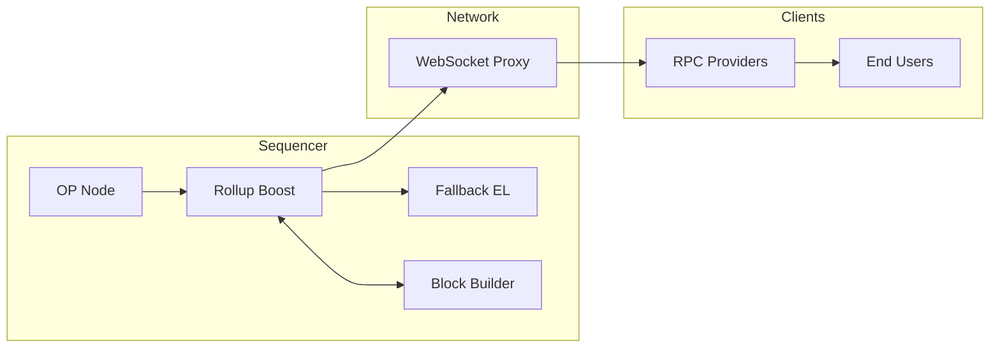

Flashblocks is a block builder sidecar for OP Stack chains that delivers sub-second transaction confirmations - 250 ms on OP Mainnet, configurable down to 200 ms.

By streaming pre-confirmations, "signals" that arrive before the next block is finalized, Flashblocks make OP Stack chains up to 10x faster, unlocking seamless user experiences without compromising security guarantees.

Built for developers who need lightning fast UX, flashblocks are ideal for DeFi apps, payments, games, and real-time interactions where instant is the only answer.

*   **Payments**: Instant payment confirmations
*   **DeFi**: Swaps and positions that update immediately
*   **Marketplaces**: Fast, frictionless checkout flows
*   **Games**: Real-time actions with no waiting between moves

This page explains how Flashblocks work and the components involved.
To read pre-confirmed state from your app, follow the [app integration guide](/app-developers/guides/transactions/integrating-flashblocks).
To enable Flashblocks on a chain you operate, follow the [chain operator guide](/chain-operators/guides/features/flashblocks-guide).

## How it works

By default, blocks are produced every 1–2 seconds.
Flashblocks break that window into smaller intervals so instead of waiting the full block time to execute all transactions, the execution client continuously creates and broadcasts a "flash" block every few hundred milliseconds.

Each flashblock includes all transactions processed so far, along with updated balances and contract states.
Apps can query this near-real-time state using RPC providers (Ankr, QuickNode, Alchemy, etc) and deliver the speed their users expect.

## Architecture

Flashblocks is coordinated by `rollup-boost`, a module that sits between the consensus layer and the execution layer and divides block construction into smaller, incremental sections.
Pre-confirmations stream out continuously, while finalization still occurs at standard block intervals.

Flashblocks relies on several components working together:

*   **`op-node`**: Consensus layer, initiates `engine_forkchoiceUpdated` calls and leads block building.
*   **`op-reth`**: Fallback block builder, produces standard blocks.
*   **`op-rbuilder`**: Reth-based execution client that builds both standard blocks and flashblocks.
    *   Exposes flashblocks on a WebSocket stream (not recommended for public exposure).
    *   Each event on the stream corresponds to a 250 ms flashblock.
*   **`rollup-boost`**: Sits between `op-node` and execution layers, coordinating block building in flashblocks mode.
    *   Validates `op-rbuilder` payloads against `op-reth`
    *   Falls back to `op-reth` if `op-rbuilder` diverges or lags
*   **`flashblocks-websocket-proxy`**: Relays the flashblocks stream from the active sequencer to RPC providers.
*   **`op-node-rbuilder`** *(optional)*: `op-node` pointing only to `op-rbuilder`, used for syncing at startup.
*   **`op-conductor`** *(optional but recommended)*: Manages multiple sequencers, ensuring only one healthy leader streams blocks.

See the [System architecture section](https://specs.optimism.io/protocol/flashblocks.html#system-architecture) of the specification to learn more.

### Flashblocks lifecycle

*   `op-node` coordinates block production through `rollup-boost`, targeting `op-rbuilder` instead of the fallback `op-reth`.
*   `op-rbuilder` acts as a full execution client: it builds blocks, exposes Ethereum JSON-RPC, and processes transactions.
*   In addition, `op-rbuilder` emits flashblocks every 250 ms, streamed over a WebSocket interface (e.g. `wss://`).
*   These flashblocks give early visibility into transaction inclusion before the final regular block is sealed.

For full details on design choices, data structures, construction rules, and invariants, see the [Flashblocks specification](https://specs.optimism.io/protocol/flashblocks.html).

## Flashblocks FAQ

### Block building and availability

<Expandable title="How often are Flashblocks produced?">
  The flashblocks target interval is variable.
  OP Mainnet runs flashblocks at 250ms while Base and Unichain run them at 200ms.
  A 2-second block at 250 ms produces 9 flashblocks, indexed 0 to 8.
  The index-0 block contains deposit-only transactions, followed by 8 normal Flashblocks.
</Expandable>

<Expandable title="Will the number of Flashblocks per block always be the maximum?">
  Not always. Heavy execution in one interval may reduce time available for subsequent intervals. The FLASHBLOCKS\_TIME setting is a target, not a strict guarantee.
</Expandable>

<Expandable title="Do large gas transactions get delayed?">
  High gas transactions can be included in any flashblock with sufficient gas capacity. Placement is optimized by heuristics, but available gas decreases as transactions fill earlier flashblocks.
  See [Flashblocks and gas usage](/app-developers/guides/transactions/flashblocks-and-gas-usage) for a detailed walkthrough.
</Expandable>

### High availability and safety

<Expandable title="What happens if the flashblocks builder fails?">
  In a default/non-HA setup, the system falls back to regular block building while preserving pre-confirmations. In an HA setup, `op-conductor` seamlessly transfers leadership to a healthy sequencer without interruption.
  When leadership changes, streaming continues seamlessly from the new leader so downstream consumers always receive a continuous stream from a single stable endpoint.
</Expandable>

<Expandable title="How is continuity handled in high availability setups with multiple sequencers?">
  Only the current leader streams Flashblocks. On leader change, streaming continues from the new leader so downstream consumers see a continuous stream from a single stable endpoint. For details on high-availability sequencer setups, see the [op-conductor documentation](/chain-operators/tools/op-conductor).
</Expandable>

<Expandable title="Do flashblocks change the safety model of the chain?">
  No. Each flashblock is validated by the same execution engine as normal blocks.
</Expandable>

### Pre-confirmations and reorgs

<Expandable title="Can pre-confirmations be revoked?">
  Rarely. If the sequencer reorgs, pre-confirmed state may change - but this carries no more risk than the reorg of normal blocks.
</Expandable>

<Expandable title="Why can a pre-confirmed transaction later disappear?">
  If the sequencer reorgs, pre-confirmed state can be replaced. This does not add risk beyond the pending state reorg risk that already exists.
</Expandable>

<Expandable title="Does Flashblocks change liveness or withdrawals?">
  No. Protocol guarantees remain the same; Flashblocks only speed up transaction confirmation.
</Expandable>

<Expandable title="What is the structure of a pre-confirmation response?">
  In pre-confirmation responses, `blockHash`, `stateRoot`, and `receiptsRoot` are the values that represent the cumulative state of all transactions included up to that point in the block. The blockNumber reflects the current pending block number.
  Each flashblock's view shows the complete state incorporating all transactions processed so far.
</Expandable>

## Next steps

*   Query pre-confirmed state from your app with the [Flashblocks integration guide](/app-developers/guides/transactions/integrating-flashblocks).
*   Learn how Flashblocks change [gas availability within a block](/app-developers/guides/transactions/flashblocks-and-gas-usage).
*   Enable Flashblocks on your chain with the [chain operator guide](/chain-operators/guides/features/flashblocks-guide).
*   Review the [technical specs](https://specs.optimism.io/protocol/flashblocks.html) for architecture details.
*   Join our [community](https://discord.gg/jPQhHTdemH) to share best practices and get support!
