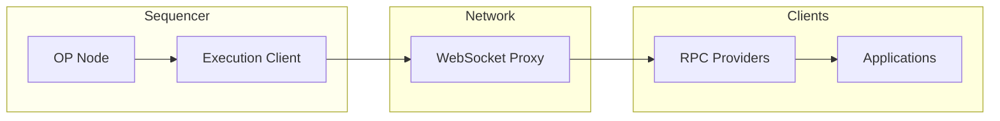

*Subblocks* (formerly Flashblocks) are partial blocks that an OP Stack sequencer streams while it is still building the full block.
A subblock arrives every 200 ms, so an application can act on a transaction's outcome well before the block containing it is sealed — roughly ten times sooner on a chain with a 2-second block time.

This page explains what a subblock is, what its payload does and does not carry, and how production is arranged.
To read pre-confirmed state from an application, follow the [app integration guide](/app-developers/guides/transactions/integrating-subblocks).
For the current interval and payload changes on OP Sepolia and OP Mainnet, see the [Subblocks notice](/notices/subblocks).

## How it works

A sequencer normally executes an entire block and publishes it once, at the end of the block time.
Subblocks split that window: the sequencer publishes what it has executed so far every 200 ms, and each subblock extends the previous one.

Two properties follow from that, and both matter to anyone consuming the stream.

*   **A subblock sequence is append-only.** The final sealed block is the concatenation of every subblock in the sequence, in order.
    Transactions already emitted in a subblock are never reordered or dropped from the block that seals them.
*   **A subblock is a projection, not a commitment.** It reports the transactions executed so far. It does not prove the resulting state.

The first subblock in a sequence carries the block's deposit transactions, because those execute before any transaction from the mempool is considered.
Subsequent subblocks each add a batch of mempool transactions.

The 200 ms interval is a target rather than a guarantee.
Heavy execution in one interval leaves less time for the ones after it, so the number of subblocks in a block varies.

## What a subblock payload carries

The payload is wire compatible with the Flashblocks format that preceded it, and the type is still named `ExecutionPayloadFlashblockDeltaV1`.
No field was added or removed. Four fields are present but set to their zero value:

| Field | Value on the stream |
| --- | --- |
| `state_root` | `0x0000...0000` |
| `block_hash` | `0x0000...0000` |
| `withdrawals_root` | `0x0000...0000` |
| `withdrawals` | `[]` |

Every other field carries a real value, including `transactions`, `gas_used`, `receipts_root`, and `logs_bloom`.

The state root is the root cause.
It is computed while execution continues and is only exact once the block is sealed, so a subblock cannot carry it.
A block hash commits to the state root, so it cannot be final either.

<Warning>
  Because the payload stayed wire compatible, reading a zeroed field returns a zero value rather than raising an error.
  An integration that treats the stream's `state_root` or `block_hash` as authoritative will fail silently.
  Treat both as absent, and derive state by executing the transactions the subblock carries.
</Warning>

A node that consumes the stream does not need the zeroed fields.
It executes the subblock's transactions against its own view of the chain and serves the result under the `pending` block tag, so `eth_call` and `eth_getBalance` answer correctly without any root on the wire.

## Architecture

Subblocks are produced by the sequencer's execution client as it builds the block, and published over a WebSocket stream.
Nothing sits between the consensus layer and the execution layer.

*   **`op-node`** drives block building through the engine API, exactly as it does on a chain without subblocks.
*   **The execution client** executes the block and publishes a subblock every 200 ms while it does so.
*   **`flashblocks-websocket-proxy`** relays the stream from the active sequencer to RPC providers.
*   **`op-conductor`** *(optional)* manages a multi-sequencer setup so only the healthy leader's stream reaches the proxy.

Producing subblocks is available to OP Enterprise customers.
Consuming them is not restricted: any node can follow the stream, and any application can read pre-confirmed state from a provider that does.

### The Flashblocks stack

Before subblocks, pre-confirmations were produced by the Flashblocks stack: `rollup-boost` coordinating between the consensus layer and two execution clients, with `op-rbuilder` building blocks and `op-reth` standing by as a fallback builder.

<Warning>
  The Flashblocks stack may still run, but OP Labs offers **no support** for it.
  It may stop working at a future fork.
  Chains running `rollup-boost` and `op-rbuilder` should plan a migration.
</Warning>

For availability information, see [Enabling Subblocks](/chain-operators/guides/features/subblocks-guide).

## Subblocks FAQ

### Block building and availability

<AccordionGroup>
  <Accordion title="How often are subblocks produced?">
    Every 200ms, but configurable to lower values.
    OP Sepolia and OP Mainnet both move to 200 ms; see the [Subblocks notice](/notices/subblocks) for the rollout dates.
  </Accordion>

  <Accordion title="Will a block always contain the maximum number of subblocks?">
    No. Heavy execution in one interval reduces the time available for the ones after it, so the count varies between blocks.
  </Accordion>

  <Accordion title="Do large transactions get delayed?">
    A large transaction can land in any subblock with enough gas capacity left, so in practice it lands later in the block.
    See [Subblocks and gas usage](/app-developers/guides/transactions/subblocks-and-gas-usage) for a worked example.
  </Accordion>
</AccordionGroup>

### Safety and continuity

<AccordionGroup>
  <Accordion title="What happens if the sequencer fails mid-block?">
    The subblocks already published for the abandoned block do not seal.
    In a multi-sequencer setup, `op-conductor` transfers leadership to a healthy sequencer, and the stream continues from the new leader through the same endpoint.
    For details, see the [op-conductor documentation](/chain-operators/tools/op-conductor).
  </Accordion>

  <Accordion title="Do subblocks change the safety model of the chain?">
    No. Every transaction in a subblock is executed by the same engine, under the same rules, as it would be in a block. Subblocks change when the sequencer tells you the outcome, not what the outcome is.
  </Accordion>

  <Accordion title="Can a pre-confirmation be revoked?">
    Yes, under the same conditions that let the sequencer reorg an unsafe block. A pre-confirmation carries the sequencer's trust assumption, not the protocol's. See [Transaction finality](/op-stack/transactions/transaction-finality) for what each stage guarantees.
  </Accordion>

  <Accordion title="What does a pre-confirmation response contain?">
    The transactions executed so far in the block, their receipts, and the cumulative `gas_used`, `receipts_root`, and `logs_bloom`.
    It does not contain a usable `state_root` or `block_hash` — both are zeroed, as described in [what a subblock payload carries](#what-a-subblock-payload-carries).
  </Accordion>
</AccordionGroup>

## Next steps

*   Read pre-confirmed state from your app with the [Subblocks integration guide](/app-developers/guides/transactions/integrating-subblocks).
*   Check the [Subblocks notice](/notices/subblocks) for rollout dates and the payload fields to audit.
*   Learn how subblocks change [gas availability within a block](/app-developers/guides/transactions/subblocks-and-gas-usage).
