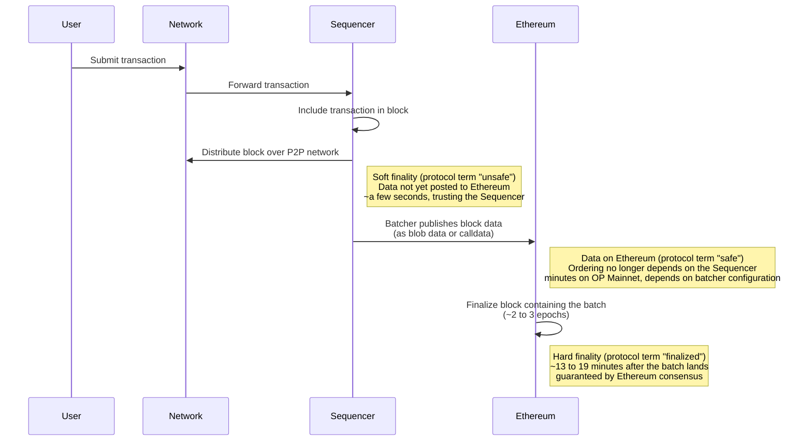

This guide explains when transactions on OP Stack chains are considered final and addresses common misconceptions about transaction finality on the OP Stack. It describes finality in the two stages that matter to most users, **soft finality** and **hard finality**, and maps both onto the protocol's own terms (unsafe, safe, and finalized) that node operators and RPC users work with.

## Basics of finality

Transaction finality refers to the point at which a transaction becomes irreversible under certain assumptions. For example, Ethereum transactions are considered finalized when specific conditions in Ethereum's consensus mechanism are met. Many applications built on Ethereum rely on this property when making decisions, such as crediting a user's account after they deposit funds.

## OP Stack finality

OP Stack chains in the standard configuration are Rollups that use Ethereum's consensus mechanism to order and finalize transactions rather than running a separate consensus protocol. Therefore, OP Stack chains inherit Ethereum's ordering and finality properties.

## Soft and hard finality

From a user's or application's point of view, two moments matter:

*   **Soft finality:** The Sequencer has processed your transaction and included it in a block. From this point the transaction's outcome is known and the resulting chain state can be computed, and in practice the Sequencer will not reorder it: reorgs of the Sequencer's own blocks are extremely rare. Applications that trust the Sequencer can act on the transaction immediately, typically within about 2 seconds of submission on OP Mainnet. On chains that run [Flashblocks](/op-stack/features/flashblocks), applications can act even earlier on a preconfirmation, a few hundred milliseconds after submission.
*   **Hard finality:** The transaction's data has been published to Ethereum and the Ethereum block containing it has been finalized by Ethereum's consensus mechanism. From this point the transaction is as final as an ordinary Ethereum transaction: reversing it would require breaking Ethereum's own finality guarantees. On OP Mainnet this typically happens within about 15 to 30 minutes of submission.

Soft finality comes with a trust assumption that you should understand: it relies on a single Sequencer, operated by the chain operator. Until the transaction's data lands on Ethereum, the Sequencer is technically able to reorg the transaction away, even though this essentially never happens in practice. If you do not trust the Sequencer, wait until the transaction's data is on Ethereum: from that point the ordering is fixed by Ethereum and no longer depends on the Sequencer.

That in-between moment is worth knowing on its own. Once the transaction's data is included in an Ethereum block, sequencer trust is no longer required for ordering, but the Ethereum block itself can still, in principle, reorg until Ethereum finalizes it. Hard finality removes that last caveat.

## How this maps to protocol terms

Under the hood, OP Stack nodes track three states: **unsafe**, **safe**, and **finalized**. The word "unsafe" can give people pause, but it is simply the protocol's technical term for the soft finality stage described above: the transaction is in a block whose data has not yet been posted to Ethereum. These are the labels that OP Stack nodes expose over JSON-RPC: the unsafe head is served as the `latest` block, and the safe and finalized heads back the `safe` and `finalized` block tags.

| What you see                                                                                    | Protocol term (RPC block tag) | Typical time on OP Mainnet   | What you are trusting                                                 |
| ----------------------------------------------------------------------------------------------- | ----------------------------- | ---------------------------- | --------------------------------------------------------------------- |
| Flashblocks preconfirmation, on chains that run [Flashblocks](/op-stack/features/flashblocks)   | pending state                 | A few hundred milliseconds   | The Sequencer                                                          |
| Soft finality: the transaction is in an L2 block                                                | unsafe (`latest`)             | ~2 seconds                   | The Sequencer                                                          |
| The transaction's data is in an Ethereum block                                                  | safe (`safe`)                 | A few minutes                | Ethereum ordering; the block could still reorg until it is finalized   |
| Hard finality: Ethereum finalizes the block containing the data                                 | finalized (`finalized`)       | ~15 to 30 minutes            | Ethereum's consensus and finality guarantees                           |

## The journey from soft finality to hard finality

1.  A user submits a transaction to the network, which forwards it to the Sequencer.
2.  The Sequencer includes the transaction in an L2 block and distributes that block over a public peer-to-peer network. This is **soft finality**, and the protocol marks the block **"unsafe"** because its data has not yet been posted to Ethereum. This typically takes a few seconds from transaction submission (OP Mainnet produces a new block every 2 seconds). On chains that run [Flashblocks](/op-stack/features/flashblocks), applications can additionally act on a preconfirmation a few hundred milliseconds after submission, before the full block is published.
3.  The chain's batcher publishes the block's data to Ethereum, either as [blob data](https://www.eip4844.com/) or as calldata attached to a standard Ethereum transaction. Once that data is included in an Ethereum block, the protocol marks the block **"safe"**: the transaction's ordering no longer depends on the Sequencer. How long this takes depends on the chain's batcher configuration and throughput: high-throughput chains such as OP Mainnet fill their batches quickly and post to Ethereum every few minutes, while chains tuned for lower data costs may hold data back for up to their configured maximum channel duration, which can be several hours. The protocol's sequencing window (12 hours in the standard configuration) is the hard upper bound for this step.
4.  The Ethereum block containing the batch data is finalized by [Ethereum's consensus mechanism](https://ethereum.org/en/developers/docs/consensus-mechanisms/pos/#finality). This is **hard finality**, the protocol's **"finalized"** state. Ethereum finalizes blocks in epochs of 6.4 minutes, and under normal conditions an Ethereum block is finalized roughly two to three epochs (about 13 to 19 minutes) after it is proposed. Finality can take longer during adverse network conditions on Ethereum. Adding this to the batch submission step, a transaction on OP Mainnet typically reaches the finalized state within about 15 to 30 minutes of submission; on chains that post batches less frequently, the wait is dominated by the batch submission interval.

## Common misconceptions

### Transactions take 7 days to finalize

A common misconception is that transactions on OP Stack chains take 7 days to finalize. **This is incorrect.** Transactions on OP Stack chains become finalized when their data is included in a finalized Ethereum block, typically about 15 to 30 minutes after submission on OP Mainnet. To reorg a finalized OP Stack chain transaction, a reorg of the corresponding Ethereum block would be required.

This misconception often arises due to the OP Stack's Standard Bridge, which includes a 7-day delay on *withdrawals* of ETH and ERC-20 tokens. Withdrawing tokens from an OP Stack chain to Ethereum using the Standard Bridge requires a minimum 7-day wait. This delay affects only withdrawals through the Standard Bridge and does not impact transaction finality on the OP Stack chain.

### Challenges in the Standard Bridge can cause a chain reorg

Another misconception related to the belief that [finalization takes 7 days](#transactions-take-7-days-to-finalize) is that **Fault Proof challenges** created in response to withdrawals in the Standard Bridge can reorganize the OP Stack chain. **This is incorrect.** OP Stack transactions are not reorganized in response to Fault Proof challenges.

The [Standard Bridge](/app-developers/guides/bridging/standard-bridge) is a bridge application that is included by default with any OP Stack chain and connects the chain to its "parent" blockchain (usually Ethereum). It offers a high level of security for ETH and ERC-20 tokens moved through the bridge.

When using the Standard Bridge, users who send ETH or ERC-20 tokens to Ethereum must first burn those tokens on the OP Stack chain and then create a **withdrawal claim** on Ethereum.

Because the Standard Bridge cannot immediately verify withdrawal claims, it delays the claim by 7 days to allow the OP Stack Fault Proof system to filter out any invalid claims. Challenges only remove bad claims without affecting the Standard Bridge or the OP Stack chain.

### The Sequencer can always reorg the chain

A common misconception is that the Sequencer can trigger reorganizations of the OP Stack chain at any time. However, while the Sequencer can reorganize **"unsafe"** blocks (not yet published to Ethereum), reorganizations become more challenging once blocks are **"safe"** and become effectively impossible once blocks are **"finalized."** This is the flip side of soft finality's trust assumption: the window in which sequencer trust matters closes as soon as the data lands on Ethereum.

*   **Unsafe blocks:** The Sequencer can reorganize these blocks until their data lands on Ethereum. That window is typically minutes on OP Mainnet and can be as long as the batch submission interval on chains that post batches less frequently.
*   **Safe blocks:** The Sequencer would need to trigger a reorg on Ethereum itself, which is complex and unlikely.
*   **Finalized blocks:** Once blocks are included in a finalized Ethereum block, the Sequencer cannot reorganize them without compromising Ethereum's finality guarantees.

### Ethereum reorgs cause OP Stack chain reorgs

If Ethereum experiences a reorg, OP Stack chains will attempt a graceful recovery. OP Stack nodes will downgrade **"safe"** transactions to **"unsafe"** if needed, while the Sequencer republishes transaction data to maintain chain continuity. Although extreme Ethereum network conditions could potentially affect the OP Stack chain, **"finalized"** OP Stack transactions are protected from reorgs.

## Conclusion

Transaction finality on the OP Stack is simpler than it may seem. Applications that trust the Sequencer get soft finality within seconds, and hard finality follows once Ethereum finalizes the transaction's data. OP Stack chains inherit Ethereum's finality guarantees, so once a transaction is **"finalized,"** it cannot be reversed.
