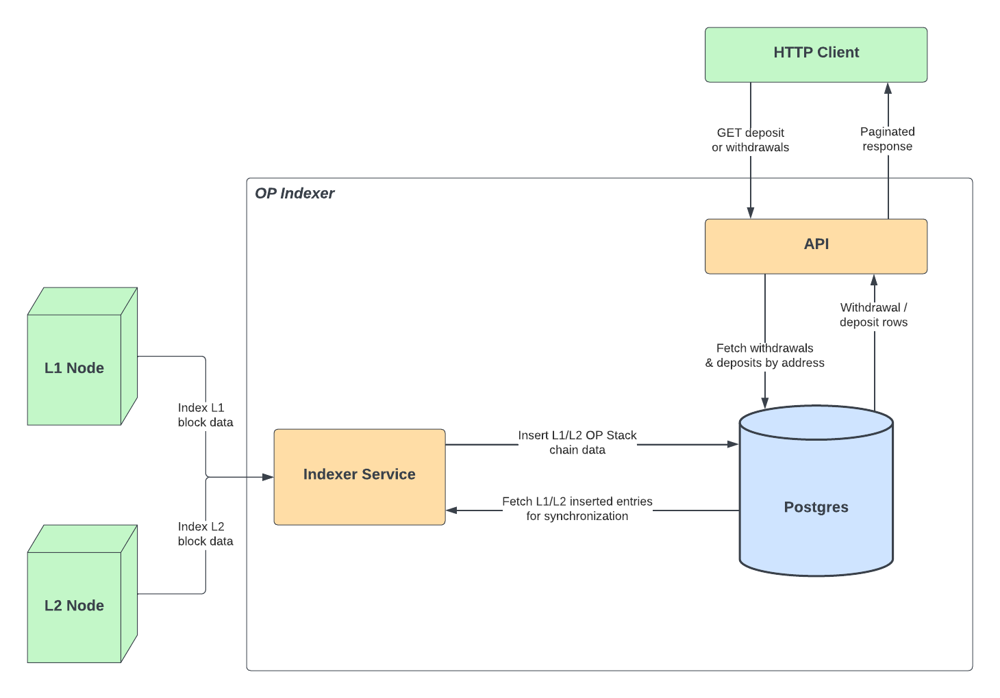
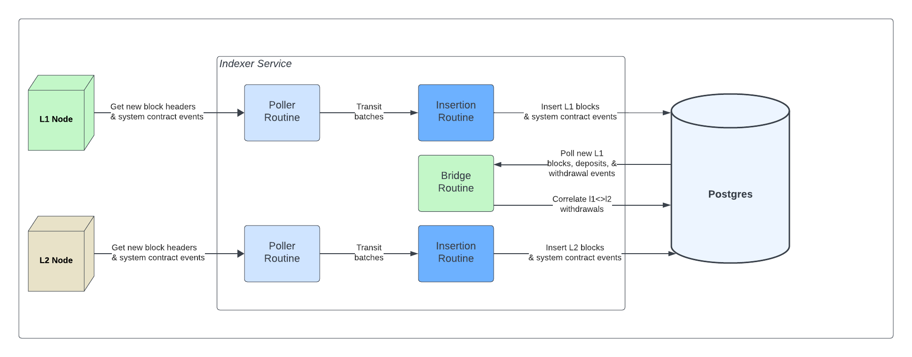

# @eth-optimism/indexer

## Getting started

### Configuration
The `indexer.toml` contains configuration for the indexer. The file is templated for the local devnet, however presets are available for [known networks](https://github.com/ethereum-optimism/optimism/blob/develop/indexer/config/presets.go). The file also templates keys needed for custom networks such as the rollup contract addresses and the `l1-starting-height` for the deployment height.

Required configuration is network specific `(l1|l2)-rpc` urls that point to archival nodes as well as the `(l1|l2)-polling-interval` & `(l1|l2)-header-buffer-size` keys which controls the of rate data retrieval from these notes.

### Testing
All tests can be ran by running `make test` from the `/indexer` directory.  This will run all unit and e2e tests.

> **NOTE:** Successfully running the E2E tests requires spinning up a local devnet via [op-e2e](https://github.com/ethereum-optimism/optimism/tree/develop/op-e2e) and pre-populating it with necessary bedrock genesis state. This genesis state is generated by invoking the`make devnet-allocs` target from the root of the optimism monorepo before running the indexer tests. More information on this can be found in the [op-e2e README](../op-e2e/README.md). A postgres database through pwd-less user $DB_USER env variable on port 5432 must be available as well.

### Run the Indexer (docker-compose)
The local [docker-compose.go](https://github.com/ethereum-optimism/optimism/blob/develop/indexer/docker-compose.yml) file spins up **index, api, postgres, prometheus and grafana** services. The `indexer.toml` file is setup for the local devnet. To run against a live network, update the `indexer.toml` with the desired configuration.

> The API, Postgres, and Grafana services are the only ones with ports mapped externally. Postgres database is mapped to port 5433 to deconflict any instances already running on the default port

1. Install Deps: Docker, Genesis State: `make devnet-allocs` 
2. Start Devnet `make devnet up`, Otherwise update `indexer.toml` to desired network config.
3. Start Indexer: `cd indexer && docker-compose up`
4. View the Grafana dashboard at http://localhost:3000
    - **User**: admin
    - **Password**: optimism

### Run the Indexer (Go Binary or Dockerfile)
1. Prepare the `indexer.toml` file
2. **Run database migrations**: `indexer migrate --config <indexer.toml>`
3. Run index service, cmd: `indexer index --config <indexer.toml>`
4. Run the api service, cmd: `indexer api --config <indexer.toml>`

> Both the index and api services listen on an HTTP and Metrics port. Migrations should **always** be run prior to start the indexer to ensure latest schemas are set.

## Architecture

The indexer application supports two separate services for collective operation:
**Indexer API** - Provides a lightweight API service that supports paginated lookups for bridge data.
**Indexer Service** - A polling based service that constantly reads and persists OP Stack chain data (i.e, block meta, system contract events, synchronized bridge events) from a L1 and L2 chain.

### Indexer API
See `api/api.go` & `api/routes/` for available API endpoints to for paginated retrieval of bridge data. **TDB** docs.

### Indexer Service

The indexer service is responsible for polling and processing real-time batches of L1 and L2 chain data. The indexer service is currently composed of the following key components:
- **Poller Routines** - Individually polls the L1/L2 chain for new blocks and OP Stack contract events.
- **Insertion Routines** - Awaits new batches from the poller routines and inserts them into the database upon retrieval.
- **Bridge Routine** - Polls the database directly for new L1 blocks and bridge events. Upon retrieval, the bridge routine will:
    * Process and persist new bridge events
    * Synchronize L1 proven/finalized withdrawals with their L2 initialization counterparts

#### L1 Poller
L1 blocks are only indexed if they contain L1 contract events. This is done to reduce the amount of unnecessary data that is indexed. Because of this, the `l1_block_headers` table will not contain every L1 block header unlike L2 blocks.
An **exception** to this is if no log activity has been observed over the specified `ETLAllowedInactivityWindowSeconds` value in the [chain config](https://github.com/ethereum-optimism/optimism/blob/develop/indexer/config/config.go) -- disabled by default with a zero value. Past this duration, the L1 ETL will index the latest
observed L1 header.

#### Database
The indexer service currently supports a Postgres database for storing L1/L2 OP Stack chain data. The most up-to-date database schemas can be found in the `./migrations` directory. **Run the idempotent migrations prior to starting the indexer**

#### HTTP
The indexer service runs a lightweight health server adjacently to the main service. The health server exposes a single endpoint `/healthz` that can be used to check the health of the indexer service. The health assessment doesn't check dependency health (ie. database) but rather checks the health of the indexer service itself.

#### Metrics
The indexer services exposes a set of Prometheus metrics that can be used to monitor the health of the service. The metrics are exposed via the `/metrics` endpoint on the health server.

## Security
All security related issues should be filed via github issues and will be triaged by the team. The following are some security considerations to be taken when running the service:
- Since the Indexer API only performs read operations on the database, access to the database for any API instances should be restricted to read-only operations.
- The API has no rate limiting or authentication/authorization mechanisms. It is recommended to place the API behind a reverse proxy that can provide these features.
- Postgres connection timeouts are unenforced in the services. It is recommended to configure the database to enforce connection timeouts to prevent connection exhaustion attacks.
- Setting confirmation count values too low can result in indexing failures due to chain reorgs.

## Troubleshooting
Please advise the [troubleshooting](./ops/docs/troubleshooting.md) guide for common failure scenarios and how to resolve them.
