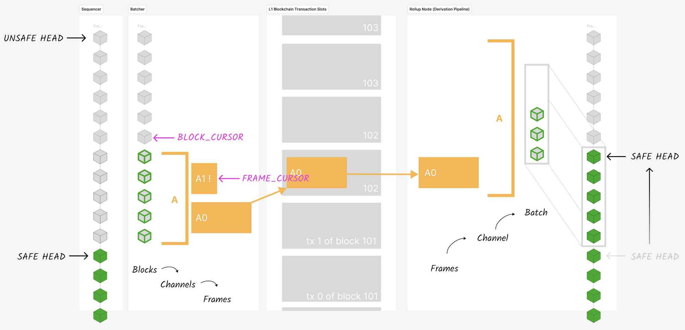

# op-batcher

The op-batcher is responsible for ensuring data availability. See the [specs](https://specs.optimism.io/protocol/batcher.html).

## Architecture

The architecture of this batcher implementation is shown on the left side of the following diagram:

Batch submitting (writing to the DA layer, in the middle of the diagram) works together with the derivation pipeline (on the right side of the diagram, reading from the DA layer) to progress the safe chain.

The philosophy behind the current architecture is:
* Blocks, channels and frames are kept around for as long as they might be needed, and discarded as soon as they are not needed. They are not moved from one part of state to another.
* We retain block data in a strict order for as long as necessary. We only garbage collect frames, channels and blocks when the safe head moves sufficiently and those structures have done their job.
* When something goes wrong, we rewind the state cursors by the minimal amount we need to get going again.

### Happy path

In the happy path, the batcher periodically:
1. Enqueues unsafe blocks and dequeues safe blocks from the sequencer to its internal state.
2. Enqueues a new channel, if necessary.
3. Processes some unprocessed blocks into the current channel, triggers the compression of the block data and the creation of frames.
4. Sends frames from the channel queue to the DA layer as (e.g. to Ethereum L1 as calldata or blob transactions).
5. If there is more transaction data to send, go to 2. Else wait for a tick and go to 1.

The `blockCursor` state variable tracks the next unprocessed block.
In each channel, the `frameCursor` tracks the next unsent frame.

### Reorgs
When an L2 unsafe reorg is detected, the batch submitter will reset its state, and wait for any in flight transactions to be ingested by the verifier nodes before starting work again.

### Tx Failed
When a Tx fails, an asynchronous receipts handler is triggered. The channel from whence the Tx's frames came has its `frameCursor` rewound, so that all the frames can be resubmitted in order.

### Channel Times Out
When at Tx is confirmed, an asynchronous receipts handler is triggered. We only update the batcher's state if the channel timed out on chain. In that case, the `blockCursor` is rewound to the first block added to that channel, and the channel queue is cleared out. This allows the batcher to start fresh building a new channel starting from the same block -- it does not need to refetch blocks from the sequencer.

