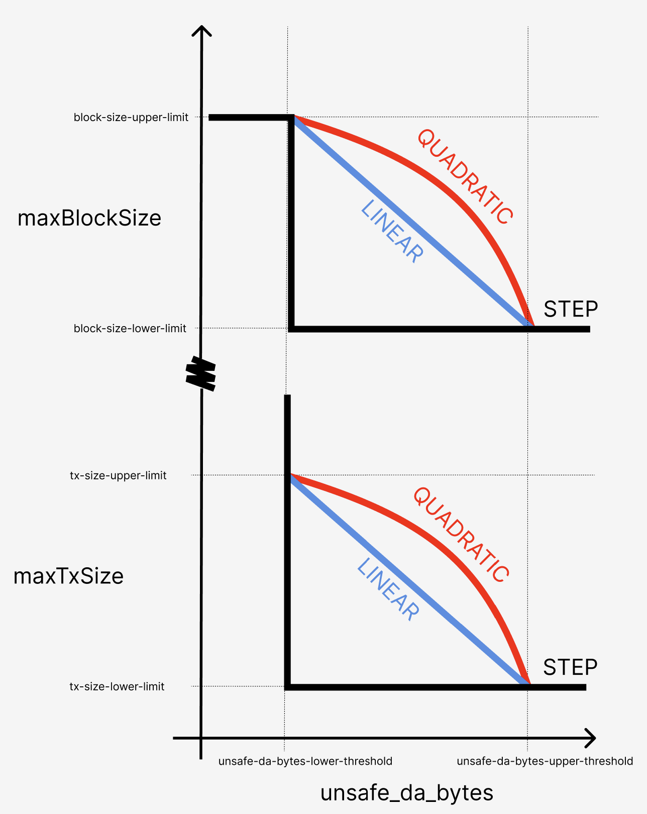

# Enhanced DA Throttling Mechanisms

The `op-batcher` includes sophisticated throttling mechanisms to manage data availability (DA) backlogs and prevent excessive costs during high-load periods. These mechanisms dynamically adjust block building constraints based on current DA load.

## Overview

Data availability throttling addresses situations where transaction volume exceeds the DA layer's throughput capacity. Without throttling, this can lead to:

- Large backlogs of pending data
- Significant delays between transaction submission and DA posting
- Substantial cost overruns when DA prices spike during posting
- Degraded user experience due to delayed transaction finalization

The throttling system prevents these issues by instructing sequencers to limit block data production when backlogs exceed configured thresholds.

## Throttling Controller Types

The batcher supports four throttling strategies, each with different response characteristics. The strategies can be understood in this
diagram:


- Each strategy responds primarily to the number of pending DA bytes (derived from blocks fetched but not yet in a channel) and the configured thresholds `throttle.unsafe-da-bytes-lower/upper-threshold`, producing a throttling intensity between 0 and 1.
- This intensity is then mapped to a maximum tx size and maximum block size to control the `miner_setMaxDASize(maxTxSize, maxBlockSize)` API calls made to block builders, depending on the configuration variables shown in the diagram above.
- When the throttling intensity is zero (below the lower threshold), blocks are limited at `throttle.block-size-upper-limit`. Transactions can either be unthrottled (`maxTxSize=0`) or honor an optional always-on limit via `throttle.tx-size-always-limit`.

> NOTE
> Be aware that using `0` for either
> `throttle.block-size-lower-limit` and `throttle.tx-size-lower-limit`
> results in no throttling limits being applied (for blocks and transactions respectively).

### Step Controller (Default)

**Behavior**: Binary on/off throttling
- **Below threshold**: No throttling applied
- **Above threshold**: Maximum throttling applied immediately
- **Use case**: Simple, predictable throttling behavior
- **Best for**: Environments requiring clear, binary throttling states

You can choose how the step threshold aligns within the linear/quadratic range using `--throttle.step-threshold-alignment`:
- `start`: aligns to lower threshold
- `middle` (default): aligns to the midpoint of [lower, upper]
- `end`: aligns to upper threshold

> [!WARNING]
> If selecting the step controller, you should **not** rely on default throttling parameters as this could cause too much throttling to be applied too quickly.

### Linear Controller

**Behavior**: Linear scaling throttling intensity
- **Response curve**: Gradual increase from threshold to maximum threshold
- **Scaling**: Throttling intensity = (current_load - threshold) / (max_threshold - threshold)
- **Use case**: Moderate, proportional response to load increases
- **Best for**: Steady load patterns with predictable growth

### Quadratic Controller

**Behavior**: Quadratic scaling throttling intensity
- **Low overload**: Gentle throttling response
- **High overload**: Aggressive throttling response
- **Scaling**: More tolerant of brief spikes, strong response to sustained overload
- **Use case**: Environments with occasional spikes but need strong protection against sustained overload
- **Best for**: Variable load patterns with tolerance for brief excursions

### PID Controller (⚠️ EXPERIMENTAL)
[What a PID Controller is](https://en.wikipedia.org/wiki/Proportional%E2%80%93integral%E2%80%93derivative_controller)

PID Controller is a control mechanism that automatically adjusts the batcher's throttling intensity output to maintain a desired load.

**Behavior**: Proportional-Integral-Derivative control
- **Proportional**: Immediate response to current error
- **Integral**: Corrects for accumulated error over time
- **Derivative**: Anticipates future error based on current rate of change
- **Use case**: Complex load patterns requiring precise control and minimal overshoot
- **Best for**: Expert users with control theory knowledge

> ⚠️ **EXPERIMENTAL FEATURE WARNING**
>
> The PID controller is experimental and should only be used by users with deep understanding of control theory. Improper configuration can lead to system instability, oscillations, or poor performance. Use at your own risk and only with extensive testing.

## Runtime Management via RPC

The batcher exposes admin RPC endpoints for dynamic throttling control without restarts:

### Get Controller Status
```bash
curl -X POST -H "Content-Type: application/json" \
  --data '{"jsonrpc":"2.0","method":"admin_getThrottleController","params":[],"id":1}' \
  http://localhost:8545
```

### Switch Controller Type

```bash
# Step
curl -X POST -H "Content-Type: application/json" \
  --data '{"jsonrpc":"2.0","method":"admin_setThrottleController","params":["step", null],"id":1}' \
  http://localhost:8545

# Linear
curl -X POST -H "Content-Type: application/json" \
  --data '{"jsonrpc":"2.0","method":"admin_setThrottleController","params":["linear", null],"id":1}' \
  http://localhost:8545

# Quadratic
curl -X POST -H "Content-Type: application/json" \
  --data '{"jsonrpc":"2.0","method":"admin_setThrottleController","params":["quadratic", null],"id":1}' \
  http://localhost:8545

# PID (experimental)
curl -X POST -H "Content-Type: application/json" \
  --data '{"jsonrpc":"2.0","method":"admin_setThrottleController","params":["pid", {"kp": 0.3, "ki": 0.15, "kd": 0.08, "integral_max": 50.0, "output_max": 1.0, "sample_time": "5s"}],"id":1}' \
  http://localhost:8545
```

### Reset Controller State
```bash
curl -X POST -H "Content-Type: application/json" \
  --data '{"jsonrpc":"2.0","method":"admin_resetThrottleController","params":[],"id":1}' \
  http://localhost:8545
```

## Configuration

Key flags:
- `--throttle.unsafe-da-bytes-lower-threshold`: start throttling above this many pending DA bytes
- `--throttle.unsafe-da-bytes-upper-threshold`: full throttling above this value (linear/quadratic)
- `--throttle.tx-size-lower-limit` / `--throttle.tx-size-upper-limit`: bounds for interpolating max tx size when throttling
- `--throttle.tx-size-always-limit`: optional always-on tx size cap, even when intensity == 0
- `--throttle.block-size-lower-limit` / `--throttle.block-size-upper-limit`: bounds for interpolating max block size
- `--throttle.controller-type`: step | linear | quadratic | pid
- `--throttle.step-threshold-alignment`: start | middle | end (step only)

Deprecated:
- `--throttle.threshold-multiplier`: deprecated in favor of explicit upper threshold; if set and `--throttle.unsafe-da-bytes-upper-threshold` is not provided, the multiplier is applied to the lower threshold to derive the upper threshold.

### Recommended defaults
- Minimum threshold should allow one to two channels to fill without throttling.
- Max threshold should be 10× to 50× the lower threshold for smoother behavior. Default is 20×.

## How It Works

1. Batcher tracks both unsafe bytes and pending DA bytes.
2. Throttling intensity is computed from pending DA bytes against thresholds.
3. Intensity maps to tx/block size limits.
4. Limits are pushed to endpoints via `miner_setMaxDASize`.

## Metrics and Monitoring
- `op_batcher_throttle_intensity`
- `op_batcher_throttle_max_tx_size`
- `op_batcher_throttle_max_block_size`
- `op_batcher_throttle_controller_type`
- `op_batcher_unsafe_bytes_ratio` (vs threshold, based on pending bytes)
- `op_batcher_unsafe_da_bytes` (raw)
