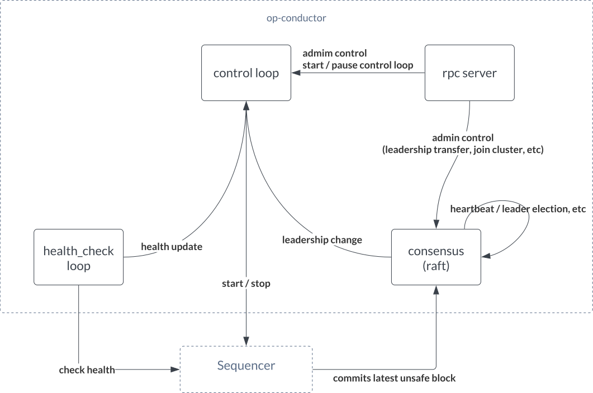

# op-conductor

op-conductor is an auxiliary service designed to enhance the reliability and availability of a sequencer in
high-availability setups, thereby minimizing the risks associated with single point of failure.
It is important to note, however, that this design does not incorporate Byzantine fault tolerance.
This means it operates under the assumption that all participating nodes are honest.

## Summary

The design will provide below guarantees:

1. No unsafe reorgs
2. No unsafe head stall during network partition
3. 100% uptime with no more than 1 node failure (for a standard 3 node setup)

## Design

On a high level, op-conductor serves the following functions:

1. serves as a (raft) consensus layer participant to determine
   1. leader of the sequencers
   2. store latest unsafe block within its state machine.
2. serves rpc requests for
   1. admin rpc for manual recovery scenarios such as stop leadership vote, remove itself from cluster, etc
   2. health rpc for op-node to determine if it should allow publish txs / unsafe blocks
3. monitor sequencer (op-node) health
4. control loop => control sequencer (op-node) status (start / stop) based on different scenarios

This is initial version of README, more details will be added later.
