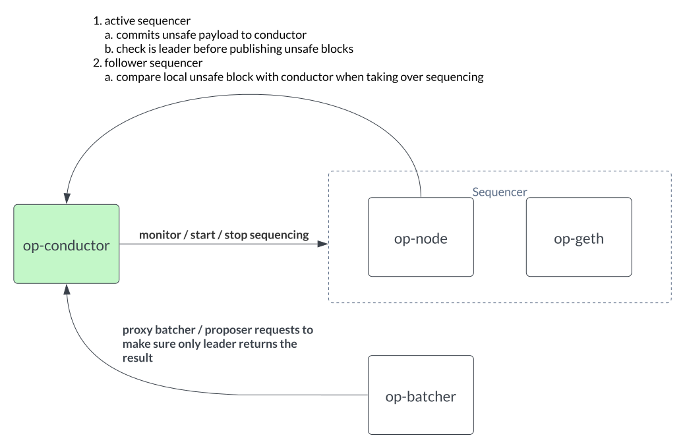
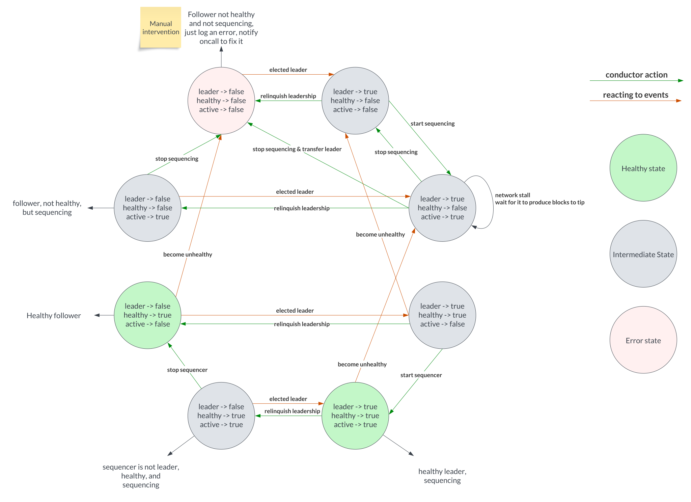
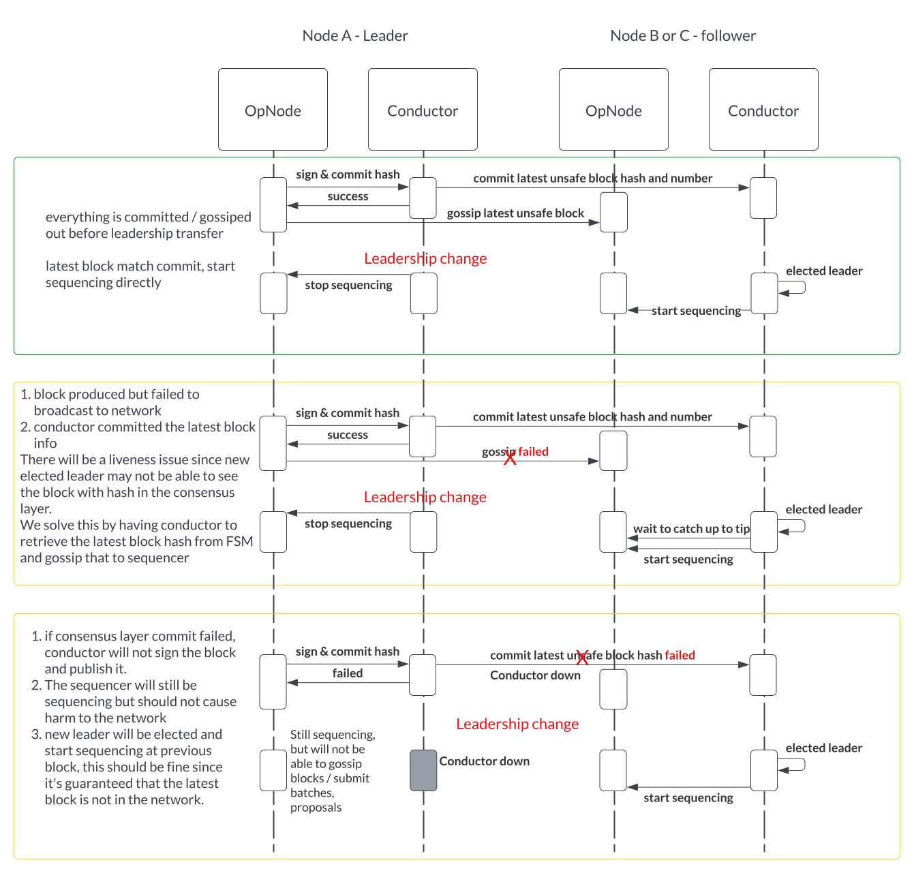

# op-conductor

op-conductor is an auxiliary service designed to enhance the reliability and availability of a sequencer in
high-availability setups, thereby minimizing the risks associated with single point of failure.
It is important to note, however, that this design does not incorporate Byzantine fault tolerance.
This means it operates under the assumption that all participating nodes are honest.

## Summary

The design will provide below guarantees:

1. No unsafe reorgs
2. No unsafe head stall during network partition
3. 100% uptime with no more than 1 node failure (for a standard 3 node setup)

For configuration and runbook, please refer to [RUNBOOK.md](./RUNBOOK.md)

## Design

### Architecture

Typically you can setup a 3 nodes sequencer cluster, each one with op-conductor running alongside the sequencer in different regions / AZs.
Below diagram showcaes how conductor interacts with relevant op-stack components.

On a high level, op-conductor serves the following functions:

1. serves as a (raft) consensus layer participant to determine
   1. leader of the sequencers
   2. store latest unsafe block within its state machine.
2. serves rpc requests for
   1. admin rpc for manual recovery scenarios such as stop leadership vote, remove itself from cluster, etc
   2. health rpc for op-node to determine if it should allow publish txs / unsafe blocks
3. monitor sequencer (op-node) health
4. control loop => control sequencer (op-node) status (start / stop) based on different scenarios

### Conductor State Transition

Helpful tips:
To better understand the graph, focus on one node at a time, understand what can be transitioned to this current state and how it can transition to other states.
This way you could understand how we handle the state transitions.

### RPC design

conductor provides rpc APIs for ease of cluster management, see [api](./op-conductor/rpc/api.go) for rpc definitions and how they can be used.

### Failure Scenario walkthrough

Below is a high level summary of how each failure scenario is handled:

| Failure Scenario | Category | Scenario and Solution | Notes |
| ---------------- | -------- | --------------------- | ----- |
| 1 sequencer down, stopped producing blocks | sequencer failure | Conductor will detect sequencer failure and start to transfer leadership to another node, which will start sequencing instead | Cannot tolerate 2 node failures, at that time, would need to manually start sequencing on the remaining sequencer |
| 1 sequencer temporarily down, we transferred leadership to another sequencer, but it came back after leadership transfer succeeded and still be in sequencing mode | Sequencer failure | We stop this by:  1. commit latest unsafe block to conductor, if node is not leader, commit fails and the block won't be gossiped out, this prevents any p2p blocks going out to the network. 2. for control loop health update handling logic, stop sequencer when it’s not leader but healthy.  | |
| 2 or more sequencer down (regardless of if active sequencer is healthy) | sequencer failure | Scenario #1: active sequencer and 1 follower are down  Solution: At this point, the Conductor will notice the sequencer not being healthy and start to transfer leadership to another node. To avoid leadership transfer between two faulty nodes, we will implement a round robin mechanism to choose a leader to avoid the cycle. | |
| 2 or more sequencer down (regardless of if active sequencer is healthy) | sequencer failure | Scenario #2: 2 standby are down  Solution: Cluster will still be healthy, active sequencer is still working, and raft consensus is healthy as well, so no leadership transfer will happen (standby sequencer is not leader and will not be able to start leadership transfer process, and we will have logic to rule this out).  So the solution here is adding monitors for the health of every node and fixing it by any means needed. | |
| one Conductor failed / stopped working | Conductor failure | At this point:  1. the raft cluster will elect a leader on the remaining healthy nodes and start sequencer  2. however, old sequencer isn’t shut down yet (since Conductor is down and unable to perform the action)  Solution  1. Before enabling sequencing on the new sequencer, make sure no other sequencer is running by sending admin_stopSequencer / stopBatcher commands to all participating nodes | |
| 2 or more Conductor failed | Conductor failure | At this point, the cluster will work in two scenarios depending on the failure scenario:  1. if service on 2 standby sequencer failed, active sequencer service will step down from leader and stop sequencing  2. if service failed on 1 active and 1 standby sequencer, chain will still work as active sequencer will not be turned off due to Conductor failure  Solution  1. This should be an extremely rare situation and we can manually start sequencing on the active sequencer  2. network is still healthy at this time, we just need to be notified and fix the Conductor, pause control loop | |
| Infra failure * sequencer host disappeared * region failure * etc | Infra failure | Conductor alongside with active sequencer will no long exist, and with raft protocol, a new leader will be elected within the next 1s (300ms heartbeat) and start producing blocks | Cannot tolerate 2 node failures, at that time, would need to manually start sequencing on the remaining sequencer |
| There is a network partition that leads to some nodes not able to talk to others for leader election / lease renewal | Network partition | This should be handled automatically by raft consensus protocol, it will guarantee that there will be at most one leader at any point in time.  | In extreme situations where none of the raft nodes are able to talk to each other (therefore form a quorum), no leader will exist and we will need to manually start a sequencer in a healthy node. |
| split brain during deployment where there will be 4 sequencers running (1 new sequencer deploy) | Sequencer deployment / upgrades | During deployment, we will start a 4th sequencer and try to replace one of the 3 sequencers in the raft consensus protocol, how to switch atomically is key to prevent split brain situations.  Solution  1. Add new sequencer as nonvoter first  2. When new sequencer catches up to tip     a. Remove old sequencer from server group     b. Promote new sequencer to be voter | |
| 2 or more nodes (either Conductor or sequencer) are down | Disaster recovery | During this situation, there should be no healthy leader in the raft cluster and no sequencer actively producing blocks.  Solution  1. manual intervention with tooling built to stop using Conductor to manage sequencer  2. force start sequencer on one of the working sequencer | |

### Leadership Transfer Process

During leadership transfer, we need to determine:

1. Which block hash we want to start sequencing on the sequencer candidate (i.e. what is the canonical chain head?)
2. Which candidate do we want to transfer leadership to? (ideally the one with the latest block information)

#### Which block hash we want to start sequencing on the sequencer candidate (i.e. what is the canonical chain head?)

To decide the canonical chain head, we will implement a FSM inside raft consensus protocol that stores the head unsafe block payloads.

However, we still need to deal with some edge cases which is illustrated in the diagram below:

1. Case #1 (happy case) should be majority of the case, we will experience a smooth leadership transfer with no issue
2. Case #2 (failure case) if latest block X failed to be gossiped out, but was already committed in the consensus layer, we need to
statically pair conductor with sequencer in p2p (without exposing it to the broader network), and get the latest unsafe block and gossip it to sequencer
this way, we could guarantee that there will always be a latest block being synced to the newly elected leader (either through normal p2p or through conductor)
3. Case #3 (failure case), if the conductor is down and we fail to commit the latest hash to the consensus layer, starting the new sequencer elsewhere would be safe.

#### Which candidate do we want to transfer leadership to? (ideally the one with the latest block information)

There are 2 situations we need to consider.

1. Leadership transfer triggered by raft consensus protocol (network partition, etc)
   1. In this case, a new leader will be elected regardless of its sync status, it could be behind for a few blocks
   2. The solution is to simple, wait until the elected leader catch up to tip (same as the FSM tip)
2. Leadership transfer triggered by us (Conductor detected unhealthy sequencer)
   1. In this case, we have the choice to determine which node to transfer leadership to, we can simply query the latest block from candidates within the network and transfer directly to the one with the most up to date blocks.
