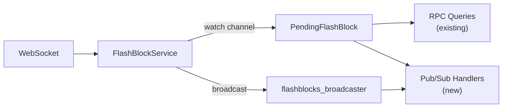

# Flashblocks: Validation, Speculative Execution, and Extended RPC
_Upstreaming node-reth flashblock features_

## Overview

This document proposes extensions to `op-reth/crates/flashblocks/`:

1. **Validation** — Detect reorgs and sequence gaps to clear stale pending state
2. **Speculative execution** — Stop discarding flashblocks that arrive before their canonical parent
3. **Extended RPC** — Let clients subscribe to real-time updates instead of polling
4. **Transaction caching** — Incrementally apply flashblocks to avoid repeated flashblock execution

All changes integrate into the existing `FlashBlockService` rather than creating a parallel execution pipeline.

## Background

Flashblocks are partial block updates streamed via WebSocket from the sequencer. They arrive with lower latency than canonical blocks, which propagate through P2P gossip. A typical OP Stack block period (2 seconds) produces multiple flashblocks at 200ms intervals, each containing the transactions processed since the previous update. The complete set of flashblocks for a single canonical block is called a *sequence*.

This latency difference creates an opportunity: nodes can act on flashblock data before the corresponding canonical block arrives, improving responsiveness for downstream consumers. A trading bot, for example, can observe a pending transaction 500ms before that transaction becomes part of a canonical block.

However, this opportunity comes with complexity. Flashblocks may arrive out of order. The canonical chain may diverge from what flashblocks predicted (a reorg). Pending state must be reconciled when canonical blocks eventually arrive.

### Current State

The `reth-optimism-flashblocks` crate processes incoming flashblocks and executes their transactions to produce pending state. The flow works as follows:

1. **FlashBlockService** receives flashblocks from an incoming stream and inserts them into a `SequenceManager`
2. **SequenceManager** accumulates flashblocks into sequences and caches up to three completed sequences in a ring buffer
3. When the service attempts to execute, it calls `next_buildable_args()` which checks if any sequence's parent hash matches the canonical tip
4. **FlashBlockWorker** executes the transactions against the canonical state provider and produces a `PendingFlashBlock`

The produced `PendingFlashBlock` serves two purposes:

- **RPC queries**: The `reth-optimism-rpc` crate integrates with flashblocks via `LoadPendingBlock`, allowing `eth_getBalance(addr, "pending")` and similar queries to return flashblock state
- **Chain advancement**: The optional `FlashBlockConsensusClient` submits completed sequences to the Engine API via `engine_newPayload` and `engine_forkChoiceUpdated`, advancing the chain before canonical blocks arrive via P2P

### Deficiencies

This design has four significant limitations:

**1. No validation or reconciliation logic.** The code checks for parent hash match but has no explicit handling for sequence gaps, duplicates, or reorgs. When the canonical chain diverges from pending state, there is no systematic way to detect this or recover gracefully. For example: flashblocks predict block 101 will contain transactions [A, B, C], but the canonical block 101 arrives with [A, B, D] due to a sequencer reorg. Without reconciliation, stale pending state persists until eventually overwritten, and there's no explicit signal to downstream consumers that a reorg occurred. (The RPC layer does check parent hashes before returning pending blocks, providing implicit protection, but this is a passive check rather than active invalidation.)

**2. No speculative building.** The sequence manager will only return an executable sequence if its parent hash matches the current canonical tip:

```rust
// cache.rs - next_buildable_args()
if let Some(base) = self.pending.payload_base()
    .filter(|b| b.parent_hash == local_tip_hash) { ... }
```

This discards flashblocks that arrive before their canonical parent, losing the latency advantage of the WebSocket connection. For example: canonical tip is block 100, flashblocks for block 101 are being processed, then flashblocks for block 102 start arriving at t=0ms. Block 101 doesn't become canonical until t=500ms when it propagates via P2P. The block 102 flashblocks sit idle for 500ms — the same latency as waiting for P2P, negating the benefit of the WebSocket feed.

**3. Limited RPC capabilities.** While basic pending block queries work via `reth-optimism-rpc`, the integration lacks:
- No pub/sub subscriptions for real-time flashblock updates (`newFlashblocks`, `pendingLogs`)
- No `eth_sendRawTransactionSync` to wait for flashblock inclusion

**4. No transaction execution caching.** When a new flashblock arrives, pending state is rebuilt by re-executing all transactions from all flashblocks in the sequence, even though earlier transactions were already executed. For example, if a block produces 10 flashblocks with 50 transactions each, the 10th flashblock arrival triggers execution of all 500 accumulated transactions. Over the block's lifetime, this results in 50+100+150+...+500 = 2,750 transaction executions instead of 500.

### Goals

This proposal addresses all four deficiencies by extending the existing `FlashBlockService`:

1. **Validation module** — Sequence validation, reorg detection, reconciliation strategies
2. **Speculative execution** — Execute flashblocks before canonical parent arrives
3. **Extended RPC** — Pub/sub handlers subscribing to existing service channels
4. **Transaction caching** — Add caching to the existing `FlashBlockBuilder`

## Validation Module

The validation module will provide correctness guarantees that both speculative execution and flashblock RPC depend on. It answers three questions:

### Is this flashblock in sequence?

`FlashblockSequenceValidator` will examine an incoming flashblock relative to the current state and return one of:

| Result | Meaning |
|--------|---------|
| `NextInSequence` | Valid continuation within the current block |
| `FirstOfNextBlock` | Valid start of a new block |
| `Duplicate` | Already processed; ignore |
| `InvalidNewBlockIndex` | New block started with non-zero index; corrupted stream |
| `NonSequentialGap` | Gap in block numbers; missed flashblocks |

The validator is stateless. It takes four inputs: current block number, current flashblock index, incoming block number, incoming flashblock index. This simplicity makes it easy to test and reason about.

### Did the canonical chain diverge?

`ReorgDetector` will compare transaction hashes between tracked pending state and a canonical block. It returns:

| Result | Meaning |
|--------|---------|
| `Match` | Transactions align; pending state is valid |
| `Reorg` | Divergence detected; pending state must be discarded |
| `Empty` | No transactions to compare |

The detector will not attempt to identify the fork point or salvage partial state. When divergence occurs, the safest action is to discard pending state and rebuild from canonical. This conservative approach trades some efficiency for correctness.

### How should we reconcile with the canonical chain?

`CanonicalBlockReconciler` will determine the appropriate action when a canonical block arrives:

| Strategy | Condition | Action |
|----------|-----------|--------|
| `CatchUp` | Canonical caught up to pending | Clear pending state |
| `HandleReorg` | Transaction mismatch detected | Clear and rebuild from canonical |
| `DepthLimitExceeded` | Pending too far ahead of canonical | Clear to bound memory |
| `Continue` | Canonical behind pending, no issues | Keep building |
| `NoPendingState` | Nothing tracked | No action needed |

The depth limit deserves explanation. Without it, a node could accumulate unbounded pending state if canonical blocks stop arriving. The limit (configurable, typically 64 blocks) ensures memory remains bounded even under adversarial conditions.

## Speculative Execution

Speculative building will allow the service to build on pending (not-yet-canonical) blocks by tracking execution state from previous builds.

```
Timeline (ms)    0       100      200      300      400      500      600
                 │        │        │        │        │        │        │
Before:          ├─apply──┤        ├────waiting for parent────┤─apply──┤
                 ▲                 ▲                          ▲
                 FB100             FB101                      Block100
                 arrives           arrives                    canonical

After:           ├─apply──┤        ├─apply──┤                 ├rec┤
                 ▲                 ▲                          ▲
                 FB100             FB101                      Block100
                 arrives           arrives                    canonical
```

### Three-Priority Build Selection

The sequence manager will use a priority system when selecting what to build:

1. **Canonical-Pending**: Pending sequence parent matches canonical tip. Build canonically.
2. **Canonical-Cached**: Cached sequence parent matches canonical tip. Build canonically.
3. **Speculative**: Pending parent state available and matches sequence parent. Build speculatively.

Canonical builds always take precedence. Speculative builds occur only when no canonical option exists.

### Pending State Tracking

```rust
pub struct PendingBlockState<N: NodePrimitives> {
    pub block_hash: B256,
    pub block_number: u64,
    pub parent_hash: B256,
    pub execution_outcome: Arc<ExecutionOutcome<N::Receipt>>,
    pub cached_reads: CachedReads,
}
```

The `execution_outcome` contains the full bundle state from execution. For speculative builds, this bundle will be applied as prestate via revm's `with_bundle_prestate()`, overlaying pending changes on the canonical state provider.

### Design Decisions

**Single pending state.** We track only the most recent build, not a chain of speculative builds. This covers the common case (blocks arrive sequentially with small delays) while keeping the implementation simple.

**Clear on any reconciliation issue.** When the reconciler signals anything other than `Continue`, pending state is cleared. This conservative approach prioritizes correctness over optimization.

## Extended RPC

### Problem

The existing `FlashBlockService` integration in `reth-optimism-rpc` provides basic pending block queries, but lacks:

- **Pub/sub subscriptions** for real-time flashblock updates
- **`eth_sendRawTransactionSync`** to wait for flashblock inclusion

### Existing Infrastructure

The `FlashBlockService` already has broadcast channels that can support pub/sub:

```rust
// Already exists in service.rs
pub fn flashblocks_broadcaster() -> &broadcast::Sender<Arc<FlashBlock>>
pub fn block_sequence_broadcaster() -> &broadcast::Sender<FlashBlockCompleteSequence>
pub fn subscribe_block_sequence() -> FlashBlockCompleteSequenceRx
// run() outputs via watch::Sender<Option<PendingFlashBlock<N>>>
```

### Proposed Solution

Rather than building a parallel execution pipeline, we extend the existing service with thin RPC handlers that subscribe to these existing channels.



### Pub/Sub Extensions

New subscription types for real-time flashblock updates:

| Subscription | Implementation |
|--------------|----------------|
| `newFlashblocks` | Subscribe to output watch channel, emit on each `PendingFlashBlock` update |
| `pendingLogs` | Filter logs from `PendingFlashBlock.receipts` |
| `newFlashblockTransactions` | Extract transactions from `PendingFlashBlock.block()` |

These are thin wrappers over existing channels — no new execution pipeline needed.

### `eth_sendRawTransactionSync`

This new method:
1. Sends the transaction to the mempool (existing functionality)
2. Subscribes to the output watch channel
3. Waits until the transaction hash appears in `PendingFlashBlock` (or timeout)

This provides a synchronous API for clients that want confirmation of flashblock inclusion without polling.

## Transaction Caching

### Problem

When a new flashblock arrives, the existing `FlashBlockBuilder` re-executes all transactions from all flashblocks _in the sequence_. This is wasteful because earlier transactions were already executed.

### Proposed Solution

Add cumulative state caching to the existing `FlashBlockBuilder`:

```rust
pub struct TransactionCache<N: NodePrimitives> {
    /// Block number this cache is valid for
    block_number: u64,
    /// Transaction hashes in execution order
    executed_tx_hashes: Vec<B256>,
    /// Cumulative bundle state after executing all cached transactions
    cumulative_bundle: BundleState,
    /// Receipts for all cached transactions
    receipts: Vec<N::Receipt>,
}
```

Rather than caching individual transaction results, we cache the cumulative state after executing a sequence of transactions. Before executing transactions, the builder checks if the incoming transaction list is a continuation of what was previously executed:

- If the incoming transactions share a prefix with cached transactions → use `with_bundle_prestate()` to resume from cached cumulative state, skip already-executed transactions
- If no prefix match → execute all transactions from scratch

This approach mirrors how speculative execution uses `with_bundle_prestate()` for pending state, providing a consistent state overlay mechanism throughout the codebase.

The cache is cleared when:
- A new block starts (different block number)
- Reconciliation detects a reorg
- Depth limit exceeded

This integrates into the existing execution path rather than creating a parallel pipeline.

## Testing Strategy

### Validation Tests

The validation module will have comprehensive unit tests covering:
- Sequence validation: all edge cases (sequential, gaps, duplicates)
- Reorg detection: exact match, partial overlap, complete mismatch, empty sets
- Reconciliation: each strategy and its triggering conditions

### Speculative Execution Tests

Integration tests will verify:
- Flashblock processing and sequence management
- Speculative execution priority selection
- Canonical block reconciliation
- Depth limit enforcement

### Transaction Caching Tests

Unit tests for the caching layer:
- Prefix matching and resumable state detection
- Cache invalidation on block change
- Cache invalidation on reorg

### Test Harness

A test harness will provide infrastructure for integration testing:
- `FlashBlockServiceTestHarness` for controlling service inputs/outputs
- `TestSequenceManager` for testing sequence logic in isolation
- `TestFlashBlockFactory` for creating properly-sequenced test flashblocks

## Metrics

### Speculative Execution
- Speculative vs canonical execution count
- Reconciliation strategy distribution
- Execution latency histograms

### Transaction Caching
- Cache hit rate
- Cache size
- Transactions skipped via cache

### Pub/Sub
- Subscription count by type
- Messages published per subscription type

## Limitations and Future Work

**Single-level speculation.** The proposed implementation supports building N+1 on pending N, but not N+2 on pending N+1 on pending N. Supporting deeper speculation would require maintaining a chain of pending states and more complex reconciliation.

**No parallel speculation.** When reorg is possible, we will not speculatively build multiple futures in parallel. This would improve latency in reorg scenarios but adds significant complexity.

## Project Stages

This work is organized into PRs that extend the existing `FlashBlockService`.

### Implemented

#### PR 1: Validation Module

**Files:** `validation.rs`, `lib.rs`

Adds stateless validation primitives:

- `FlashblockSequenceValidator` - Validates flashblock ordering
- `ReorgDetector` - Compares transaction hash sets to detect reorgs
- `CanonicalBlockReconciler` - Determines reconciliation strategy

All types are stateless with comprehensive unit tests.

#### PR 2: Canonical Block Reconciliation

**Files:** `cache.rs`, `service.rs`, `lib.rs`

Integrates validation into the existing service:

- Adds `process_canonical_block()` to `SequenceManager`
- Adds `CanonicalBlockNotification` for external callers
- Adds `max_depth` configuration to bound memory
- Adds `reorg_count` metric

#### PR 3: Speculative Execution

**Files:** `pending_state.rs`, `cache.rs`, `worker.rs`, `service.rs`, `lib.rs`, `tests/it/*`

Enables building on pending (not-yet-canonical) blocks:

- `PendingBlockState` - Tracks execution outcome
- `PendingStateRegistry` - Stores most recent pending state
- Three-priority build selection in `next_buildable_args()`
- Uses revm's `with_bundle_prestate()` to overlay pending state
- Integration test harness

#### PR 4: Transaction Caching

**Files:** `tx_cache.rs`, `worker.rs`, `service.rs`, `cache.rs`, `lib.rs`

Adds cumulative state caching to `FlashBlockBuilder`:

- `TransactionCache` - Stores cumulative `BundleState` and receipts for executed transactions
- Prefix matching to detect resumable execution state
- Uses `with_bundle_prestate()` to resume from cached state (same mechanism as speculative execution)
- Cache invalidation on block change/reorg

## References

- revm `StateBuilder::with_bundle_prestate()` for speculative execution
- Flashblocks protocol: OP Stack sequencer specification
