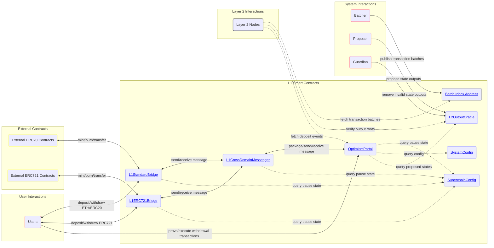
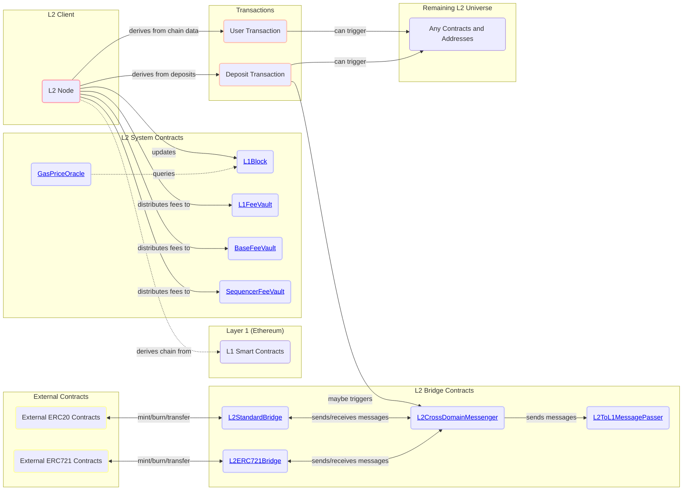
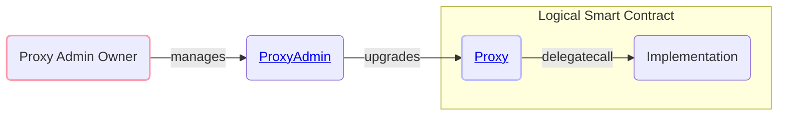

# OP Stack Smart Contracts

This package contains the L1 and L2 smart contracts for the OP Stack.
Detailed specifications for the contracts contained within this package can be found at [specs.optimism.io](https://specs.optimism.io).
High-level information about these contracts can be found within this README and within the [Optimism Developer Docs](https://docs.optimism.io).

<!-- START doctoc generated TOC please keep comment here to allow auto update -->
<!-- DON'T EDIT THIS SECTION, INSTEAD RE-RUN doctoc TO UPDATE -->
## Table of Contents

- [Architecture Overview](#architecture-overview)
  - [Core L1 Smart Contracts](#core-l1-smart-contracts)
    - [Notes for Core L1 Smart Contracts](#notes-for-core-l1-smart-contracts)
  - [Core L2 Smart Contracts](#core-l2-smart-contracts)
    - [Notes for Core L2 Smart Contracts](#notes-for-core-l2-smart-contracts)
  - [Smart Contract Proxies](#smart-contract-proxies)
- [External Usage](#external-usage)
  - [Using OP Stack Contracts in Solidity](#using-op-stack-contracts-in-solidity)
  - [Using OP Stack Contracts in JavaScript](#using-op-stack-contracts-in-javascript)
  - [Deployed Addresses](#deployed-addresses)
- [Contributing](#contributing)
  - [Contributing Guide](#contributing-guide)
  - [Style Guide](#style-guide)
- [Deployment](#deployment)
  - [Deploying Production Networks](#deploying-production-networks)
- [Generating L2 Genesis Allocs](#generating-l2-genesis-allocs)
  - [Configuration](#configuration)
    - [Custom Gas Token](#custom-gas-token)
  - [Execution](#execution)
  - [Deploying a single contract](#deploying-a-single-contract)
- [Testing](#testing)
  - [Test Setup](#test-setup)
  - [Static Analysis](#static-analysis)

<!-- END doctoc generated TOC please keep comment here to allow auto update -->

## Architecture Overview

> **NOTE**: Smart contract names in the architecture diagrams below are links to source code. Click them!

### Core L1 Smart Contracts

Below you'll find an architecture diagram describing the core L1 smart contracts for the OP Stack.
Smart contracts that are considered "peripheral" and not core to the operation of the OP Stack system are described separately.



#### Notes for Core L1 Smart Contracts

- The `Batch Data Address` described above (**highlighted in GREY**) is *not* a smart contract and is instead simply an arbitrarily chosen account that is assumed to have no known private key. This account is typically chosen as the account `0xFF0000....<L2 chain ID>` where `<L2 chain ID>` is chain ID of the Layer 2 network for which the data is being posted. For instance, for OP Mainnet, this account is chosen as `0xFF00000000000000000000000000000000000010`. However, this is not a strict requirement and some OP Stack chains may not follow this convention.
- Smart contracts that sit behind `Proxy` contracts are **highlighted in BLUE**. Refer to the [Smart Contract Proxies](#smart-contract-proxies) section below to understand how these proxies are designed.
  - The `L1CrossDomainMessenger` contract sits behind the [`ResolvedDelegateProxy`](https://github.com/ethereum-optimism/optimism/tree/develop/packages/contracts-bedrock/src/legacy/ResolvedDelegateProxy.sol) contract, a legacy proxy contract type used within older versions of the OP Stack. This proxy type is used exclusively for the `L1CrossDomainMessenger` to maintain backwards compatibility.
  - The `L1StandardBridge` contract sits behind the [`L1ChugSplashProxy`](https://github.com/ethereum-optimism/optimism/tree/develop/packages/contracts-bedrock/src/legacy/L1ChugSplashProxy.sol) contract, a legacy proxy contract type used within older versions of the OP Stack. This proxy type is used exclusively for the `L1StandardBridge` contract to maintain backwards compatibility.

### Core L2 Smart Contracts

Here you'll find an architecture diagram describing the core OP Stack smart contracts that exist natively on the L2 chain itself.



#### Notes for Core L2 Smart Contracts

- Contracts highlighted as "L2 System Contracts" are updated or mutated automatically as part of the chain derivation process. Users typically do not mutate these contracts directly, except in the case of the `FeeVault` contracts where any user may trigger a withdrawal of collected fees to the pre-determined withdrawal address.
- Smart contracts that sit behind `Proxy` contracts are **highlighted in BLUE**. Refer to the [Smart Contract Proxies](#smart-contract-proxies) section below to understand how these proxies are designed.
- User interactions for the "L2 Bridge Contracts" have been omitted from this diagram but largely follow the same user interactions described in the architecture diagram for the [Core L1 Smart Contracts](#core-l1-smart-contracts).

### Smart Contract Proxies

Most L1 and L2 smart contracts for OP Stack chains today sit behind `Proxy` contracts that themselves are managed by a `ProxyAdmin` contract.
The `ProxyAdmin` contract is controlled by some `owner` address that can be any EOA or smart contract.
Below you'll find a diagram that explains the behavior of the typical proxy contract.



## External Usage

### Using OP Stack Contracts in Solidity

OP Stack smart contracts are published to NPM and can be installed via:

```sh
npm install @eth-optimism/contracts-bedrock.
```

Refer to the [Optimism Developer Docs](https://docs.optimism.io/builders/dapp-developers/contracts/system-contracts#using-system-contracts-in-solidity) for additional information about how to use this package.

### Using OP Stack Contracts in JavaScript

Contract ABIs and addresses are published to NPM in a separate package and can be installed via:

```sh
npm install @eth-optimism/contracts-ts
```

Refer to the [Optimism Developer Docs](https://docs.optimism.io/builders/dapp-developers/contracts/system-contracts#using-system-contracts-in-javascript) for additional information about how to use this package.

### Deployed Addresses

See the [Optimism Developer Docs](https://docs.optimism.io/chain/addresses) for the deployed addresses of these smart contracts for OP Mainnet and OP Sepolia.

## Contributing

### Contributing Guide

Contributions to the OP Stack are always welcome.
Please refer to the [CONTRIBUTING.md](https://github.com/ethereum-optimism/optimism/blob/develop/packages/contracts-bedrock/CONTRIBUTING.md) for more information about how to contribute to the OP Stack smart contracts.

### Style Guide

OP Stack smart contracts should be written according to the [STYLE_GUIDE.md](./STYLE_GUIDE.md) found within this repository.
Maintaining a consistent code style makes code easier to review and maintain, ultimately making the development process safer.

## Deployment

The smart contracts are deployed using `foundry`. The `DEPLOYMENT_OUTFILE` env var will determine the filepath that the
deployment artifact is written to on disk after the deployment. It comes in the form of a JSON file where keys are
the names of the contracts and the values are the addresses the contract was deployed to.

The `DEPLOY_CONFIG_PATH` is a filepath to a deploy config file, see the `deploy-config` directory for examples and the
[DeployConfig](https://github.com/ethereum-optimism/optimism/blob/develop/op-chain-ops/genesis/config.go) definition for
descriptions of the values.

```bash
DEPLOYMENT_OUTFILE=deployments/artifact.json \
DEPLOY_CONFIG_PATH=<PATH_TO_MY_DEPLOY_CONFIG> \
  forge script scripts/deploy/Deploy.s.sol:Deploy \
  --broadcast --private-key $PRIVATE_KEY \
  --rpc-url $ETH_RPC_URL
```

The `IMPL_SALT` env var can be used to set the `create2` salt for deploying the implementation
contracts.

This will deploy an entire new system of L1 smart contracts including a new `SuperchainConfig`.
In the future there will be an easy way to deploy only proxies and use shared implementations
for each of the contracts as well as a shared `SuperchainConfig` contract.

### Deploying Production Networks

Production users should deploy their L1 contracts from a contracts release.
All contracts releases are on git tags with the following format: `op-contracts/vX.Y.Z`.
See the [release process](https://github.com/ethereum-optimism/optimism?tab=readme-ov-file#development-and-release-process)
for more information.

## Generating L2 Genesis Allocs

A foundry script is used to generate the L2 genesis allocs. This is a JSON file that represents the L2 genesis state.
The `CONTRACT_ADDRESSES_PATH` env var represents the deployment artifact that was generated during a contract deployment.
The same deploy config JSON file should be used for L1 contracts deployment as when generating the L2 genesis allocs.
The `STATE_DUMP_PATH` env var represents the filepath at which the allocs will be written to on disk.

```bash
CONTRACT_ADDRESSES_PATH=deployments/artifact.json \
DEPLOY_CONFIG_PATH=<PATH_TO_MY_DEPLOY_CONFIG> \
STATE_DUMP_PATH=<PATH_TO_WRITE_L2_ALLOCS> \
  forge script scripts/L2Genesis.s.sol:L2Genesis \
  --sig 'runWithStateDump()'
```

### Configuration

Create or modify a file `<network-name>.json` inside of the [`deploy-config`](./deploy-config/) folder.
Use the env var `DEPLOY_CONFIG_PATH` to use a particular deploy config file at runtime.

The script will read the latest active fork from the deploy config and the L2 genesis allocs generated will be
compatible with this fork. The automatically detected fork can be overwritten by setting the environment variable
`FORK` either to the lower-case fork name (currently `delta`, `ecotone`, or `fjord`) or to `latest`, which will select
the latest fork available (currently `fjord`).

By default, the script will dump the L2 genesis allocs of the detected or selected fork only, to the file at `STATE_DUMP_PATH`.
The optional environment variable `OUTPUT_MODE` allows to modify this behavior by setting it to one of the following values:
* `latest` (default) - only dump the selected fork's allocs.
* `all` - also dump all intermediary fork's allocs. This only works if `STATE_DUMP_PATH` is _not_ set. In this case, all allocs
          will be written to files `/state-dump-<fork>.json`. Another path cannot currently be specified for this use case.
* `none` - won't dump any allocs. Only makes sense for internal test usage.

#### Custom Gas Token

The Custom Gas Token feature is a Beta feature of the MIT licensed OP Stack.
While it has received initial review from core contributors, it is still undergoing testing, and may have bugs or other issues.

### Execution

Before deploying the contracts, you can verify the state diff produced by the deploy script using the `runWithStateDiff()` function signature which produces the outputs inside [`snapshots/state-diff/`](./snapshots/state-diff).
Run the deployment with state diffs by executing: `forge script -vvv scripts/deploy/Deploy.s.sol:Deploy --sig 'runWithStateDiff()' --rpc-url $ETH_RPC_URL --broadcast --private-key $PRIVATE_KEY`.

1. Set the env vars `ETH_RPC_URL`, `PRIVATE_KEY` and `ETHERSCAN_API_KEY` if contract verification is desired.
1. Set the `DEPLOY_CONFIG_PATH` env var to a path on the filesystem that points to a deploy config.
1. Deploy the contracts with `forge script -vvv scripts/deploy/Deploy.s.sol:Deploy --rpc-url $ETH_RPC_URL --broadcast --private-key $PRIVATE_KEY`
   Pass the `--verify` flag to verify the deployments automatically with Etherscan.

### Deploying a single contract

All of the functions for deploying a single contract are `public` meaning that the `--sig` argument to `forge script` can be used to
target the deployment of a single contract.

## Testing

### Test Setup

The Solidity unit tests use the same codepaths to set up state that are used in production. The same L1 deploy script is used to deploy the L1 contracts for the in memory tests
and the L2 state is set up using the same L2 genesis generation code that is used for production and then loaded into foundry via the `vm.loadAllocs` cheatcode. This helps
to reduce the overhead of maintaining multiple ways to set up the state as well as give additional coverage to the "actual" way that the contracts are deployed.

The L1 contract addresses are held in `deployments/hardhat/.deploy` and the L2 test state is held in a `.testdata` directory. The L1 addresses are used to create the L2 state
and it is possible for stale addresses to be pulled into the L2 state, causing tests to fail. Stale addresses may happen if the order of the L1 deployments happen differently
since some contracts are deployed using `CREATE`. Run `just clean` and rerun the tests if they are failing for an unknown reason.

### Static Analysis

`contracts-bedrock` uses [slither](https://github.com/crytic/slither) as its primary static analysis tool.
Slither will be run against PRs as part of CI, and new findings will be reported as a comment on the PR.
CI will fail if there are any new findings of medium or higher severity, as configured in the repo's Settings > Code Security and Analysis > Code Scanning > Protection rules setting.

There are two corresponding jobs in CI: one calls "Slither Analysis" and one called "Code scanning results / Slither".
The former will always pass if Slither runs successfully, and the latter will fail if there are any new findings of medium or higher severity.

Existing findings can be found in the repo's Security tab > [Code Scanning](https://github.com/ethereum-optimism/optimism/security/code-scanning) section.
You can view findings for a specific PR using the `pr:{number}` filter, such [`pr:9405`](https://github.com/ethereum-optimism/optimism/security/code-scanning?query=is:open+pr:9405).

For each finding, either fix it locally and push a new commit, or dismiss it through the PR comment's UI.

Note that you can run slither locally by running `slither .`, but because it does not contain the triaged results from GitHub, it will be noisy.
Instead, you should run `slither ./path/to/contract.sol` to run it against a specific file.
