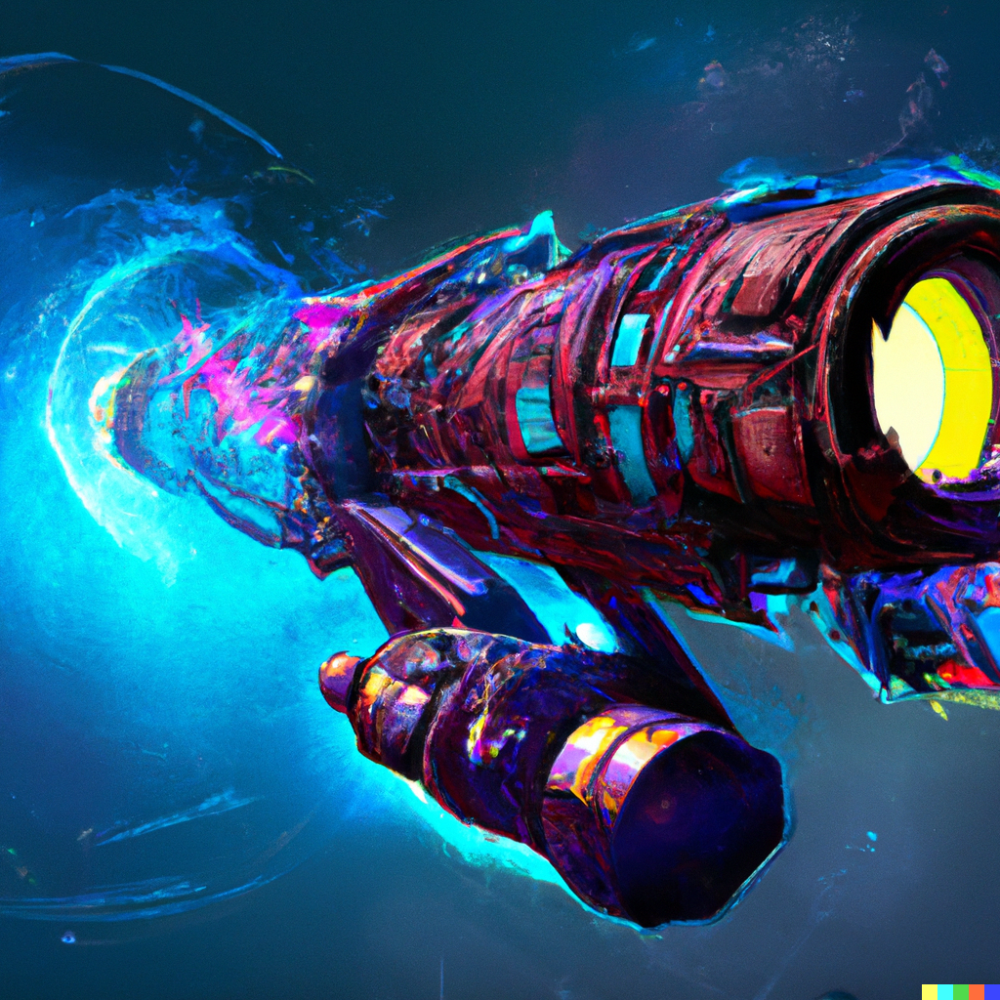

# Dispute Game Contracts • [](https://github.com/ethereum-optimism/cannon-v2-contracts/actions/workflows/test.yml) [](https://github.com/ethereum-optimism/cannon-v2-contracts/actions/workflows/doctoc.yml)

> **Note**
>
> Very early; WIP.

Smart Contracts for a generic on-chain Dispute Game, to be utilized in the [Cannon](https://github.com/ethereum-optimism/cannon) upgrade.

## Project Structure

```
├── assets
├── docs
├── foundry.toml
├── lib
│   ├── forge-std
│   ├── foundry-huff
│   └── huffmate
├── README.md
├── src
│   ├── DisputeGameFactory.huff
│   ├── DisputeGame_Fault.sol
│   ├── interfaces
│   │   ├── IDisputeGameFactory.sol
│   │   └── IDisputeGame.sol
│   ├── lib
│   │   ├── LibClock.sol
│   │   ├── LibHashing.sol
│   │   └── LibPosition.sol
│   ├── types
│   │   ├── Errors.sol
│   │   └── Types.sol
│   └── util
│       ├── Clone.sol
│       └── Initializable.sol
└── test
    ├── BigStepper.sol
    ├── DisputeGame_Fault.t.sol
    ├── lib
    │   ├── LibClock.t.sol
    │   └── LibPosition.t.sol
    └── util
        └── Initializable.t.sol
```

## Tasks

- [ ] Finalize tree traversal
- [ ] Implement bond mechanism
- [ ] Implement chess clock mechanism
- [ ] Docs
- [ ] Specs
- [ ] Tests
  - [ ] Unit / fuzz tests
  - [ ] Actor based invariant tests
  - [ ] State invariant tests
