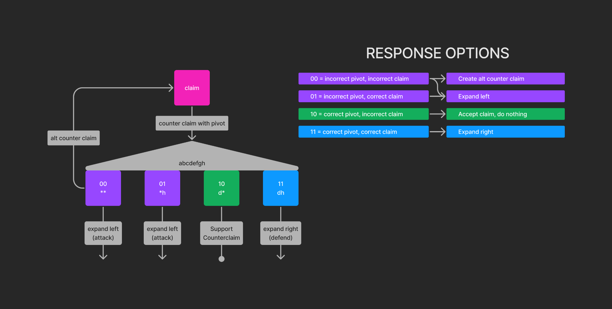

# `DisputeGame_Fault.sol` Specification

## Table of Contents

<!-- START doctoc generated TOC please keep comment here to allow auto update -->
<!-- DON'T EDIT THIS SECTION, INSTEAD RE-RUN doctoc TO UPDATE -->

- [Introduction](#introduction)
- [Claims and Counterclaims](#claims-and-counterclaims)
- [Incentive Compatibility (Bonding)](#incentive-compatibility-bonding)
- [Chess Clock](#chess-clock)
- [Interface](#interface)
- [Response Options](#response-options)
- [Resolution](#resolution)

<!-- END doctoc generated TOC please keep comment here to allow auto update -->

## Introduction

*TODO*

## Claims and Counterclaims

The primitive data structure used in this game is a `Claim`. `Claim`s have several properties:
1. They **always** disagree with their parent (Sans the `Root Claim`, which has no parent.)
1. They resolve to `true` or `false`. At the time of their creation, their resolution value is unknown.

A `Counterclaim` is a `Claim` that nests below an existing `Claim`. Remember, Claims **always** disagree with their parents, hence the name `Counterclaim`.

## Incentive Compatibility (Bonding)

A critical property of the `DisputeGame` is that it must be **incentive compatible**. Incentive compatibility, in this game, defines that players are rewarded for telling the truth and penalized for lying.

To make the `DisputeGame` incentive compatible, it is enforced that each `Claim` must have a `Bond` attached to it. This `Bond` **must** cover the cost of creating a possible `Counterclaim` against the created `Claim`.

To calculate the `Bond`, the following formula is used:
`Bond = gas_cost * base_fee * safety_factor + off_chain_proof_generation_cost`

|             Component             |                                                                                                                        Description                                                                                                                         |
|-----------------------------------|------------------------------------------------------------------------------------------------------------------------------------------------------------------------------------------------------------------------------------------------------------|
| `gas_cost`                        | The gas required to create a potential `Counterclaim`.                                                                                                                                                                                                     |
| `base_fee`                        | The current L1 base fee at the time of the `Claim`'s creation.                                                                                                                                                                                             |
| `safety_factor`                   | The `safety_factor` is derived from an on-chain oracle that tracks the fluctuation in the L1 base fee over a period of 1 week. It exists to ensure that, despite fluctuations in the L1 base fee, the bond may cover the cost of a possible counter claim. |
| `off_chain_proof_generation_cost` | The `off_chain_proof_generation_cost` is a rough estimation to cover the cost of hardware, electricity, etc. required to run the challenge agent for a single counter claim.                                                                               |

During the [resolution](#resolution) phase of the game, bonds attached to `Claim`s that resolve to `false` will be paid out to the `Counterclaim` that disproved them. See the [resolution](#resolution) for more details on how the payout mechanism functions.

*TODO - Expand and discuss caveats*

## Chess Clock

Because this `DisputeGame` will be run during a fault proof window (currently 7 days on Optimism Mainnet), another core property is that the game **must** resolve within a given timelimit. This is due to the fact that we must have an answer as to the truthiness of the root claim **before** the fault proof window has passed in order to make a final decision within a reasonable timeframe.

To ensure this property, we integrate a `Chess Clock` mechanism. Each side of the master clock will begin with `FAULT_PROOF_WINDOW_SECONDS / 2 - buffer` seconds. When the root claim is made, it is akin to an opening move in chess. The claimant "clicks" their clock, beginning the clock of a potential challenger. When (or if) a challenger responds, they will "click" their clock, beginning the clock belonging to the root claim.

If an alternative counter claim is made throughout the game, the chess clock will be inherited from the grandparent `Claim`, and a parallel clock is spawned.

*TODO - Expand*

## Interface
*TODO*

## Response Options

For any given claim with a counter claim attached, an observer may respond with one of four options. In the diagram below, the observer's opinions of the two claims are encoded within two bits. The first represents the observer's opinion on the counter claim, and the second, the top-level claim.
* `00` = Incorrect pivot, incorrect claim.  
  In the case where we as the observer disagree with a claim as well as an attached counter claim, we want to create two counter claims:
    1. Counter claim against the top-level claim.
    2. Counter claim against the pivot claim.

  The reason we do this is that, in our version of the truth, both claims are incorrect. Because of this, we want to ensure that they get countered so that we may receive their bonds after the game has been resolved.
* `01` = Incorrect pivot, correct claim.  
  In the case where we as the observer agree with a top-level claim, but disagree with an attached counter claim, we want to attach a counter claim and expand left. This is because when we disagree with a counter claim, we can be sure that the earliest disagreement may be found to the left of it.
* `10` = Correct pivot, incorrect claim.  
  In the case where we as the observer agree with a counter claim, but disagree with the claim that the counter claim was created under, we do nothing. If the counter claim hadn't already existed, it is the same one that we would have supplied.
* `11` = Correct pivot, correct claim.  
  In the case where we as the observer agree with both the top-level claim and the counter claim below it, we defend the counter claim for now and expand right. This is because counter claims have the property that they *always* disagree with their parents- we agree with the top-level claim, so we can be sure that we will find the earliest disagreement to the right of the counter claim.

The first action of **any** game by a party who disagrees with a `Root Claim` is to `attack` the root claim by expanding left. That is, their only response option as an opening move is `01`.

*TODO - Expand*

## Resolution
*TODO*
