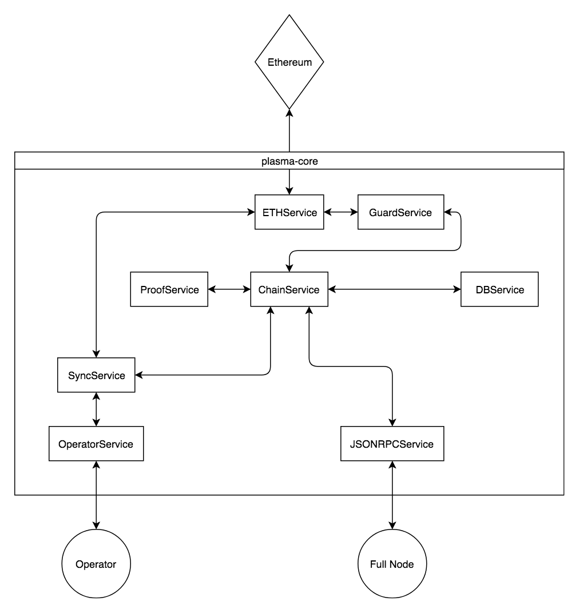

============
Architecture
============
This document describes, in detail, the architecture of ``plasma-core``.
If you're a new contributor to ``plasma-core``, welcome!
Hopefully this document will help you better understand how ``plasma-core`` works under the hood.

plasma-core 101
===============
``plasma-core`` is composed of a set of *services* that, when woven together, form (almost) a complete node!
Each of these services performs a very specific role.
A more in-depth explanation of each individual service is available in the *Service API Reference* section of our documentation.

Architecture Diagram
====================
This diagram shows the basic architecture of ``plasma-core``:

    PG Plasma Architecture Diagram

External services
=================
``plasma-core`` talks to three external services: **Ethereum**, the plasma chain **Operator**, and user **applications**.
These three services are *outside* of the scope of ``plasma-core``.
Instead, ``plasma-core`` provides interfaces through which it can talk to and hear from these external services.

ContractService
---------------
ContractService_ handles interactions with the plasma chain contract, like submitting deposits or starting withdrawals.
Non-contract specific Ethereum interactions are handled by ETHService_.

ETHService
----------
ETHService_ exposes the functionality necessary to read information from Ethereum.
``ETHService`` is used for non-contract specific interactions.

OperatorService
---------------
As its name suggests, OperatorService_ handles all communication with the plasma chain operator_.
This includes sending and receiving plasma chain transactions.

JSONRPCService
--------------
The JSONRPCService_ acts as a handler for commands sent by user **applications**.
By default, applications must interact *directly* with ``JSONRPCService``.
``plasma-core`` can be extended to expose additional interfaces to ``JSONRPCService``, such as an HTTP API.

Internal services
=================
The remaining services of ``plasma-core`` manage things internally.

SyncService
-----------
Possibly the most important internal service, SyncService_ ensures that your node always has the latest transactions.
``SyncService`` watches Ethereum for any new plasma chain blocks and automatically pulls any necessary information from the Operator.
``SyncService`` makes sure your balances are always up-to-date and that you can always send transactions when you need to!

ChainService
------------
ChainService_ is another extremely important internal service.
``ChainService`` manages ``plasma-core``'s internal blockchain.
This includes storing any necessary transaction and block information.
``ChainService`` also handles returning information about the stored local state with convenient wrapper functions.

GuardService
------------
GuardService_ takes on the important role of keeping your funds safe at all times.
The ``GuardService`` keeps a constant eye on Ethereum and blocks others from trying to move funds without your permission.
``GuardService`` queries Ethereum through the ``ETHService`` and pulls other relevant user data from ``ChainService``.

DBService
---------
DBService_ simply provides a database that ``ChainService`` uses to store user data.
Currently, we support two database backends, LevelDB_ and an in-memory ephemeral database (``EphemDB``).
Most services talk to ``ChainService`` to retrieve data from ``DBService`` instead of talking to ``DBService`` directly.

.. _ContractService: services/contract.html
.. _ETHService: services/eth.html
.. _OperatorService: services/operator.html
.. _operator: specs/operator.html
.. _JSONRPCSErvice: services/jsonrpc.html
.. _SyncService: services/sync.html
.. _ChainService: services/chain.html
.. _GuardService: services/guard.html
.. _DBService: services/db.html
.. _LevelDB: http://leveldb.org
