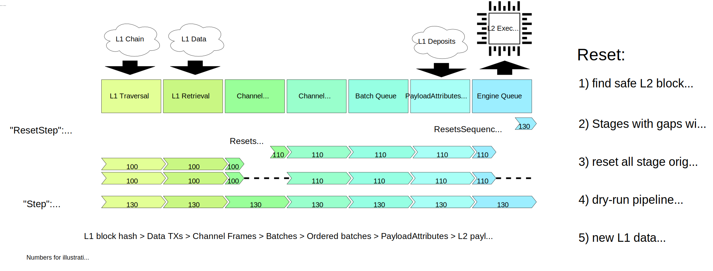

# L2 block derivation specification

<!-- All glossary references in this file. -->
[g-payload-attr]: glossary.md#payload-attributes
[g-block]: glossary.md#block
[g-exec-engine]: glossary.md#execution-engine
[g-reorg]: glossary.md#re-organization
[g-receipts]: glossary.md#receipt
[g-inception]: glossary.md#L2-chain-inception
[g-deposit-contract]: glossary.md#deposit-contract
[g-deposited]: glossary.md#deposited-transaction
[g-l1-attr-deposit]: glossary.md#l1-attributes-deposited-transaction
[g-user-deposited]: glossary.md#user-deposited-transaction
[g-deposits]: glossary.md#deposits
[g-l1-attr-predeploy]: glossary.md#l1-attributes-predeployed-contract
[g-depositing-call]: glossary.md#depositing-call
[g-depositing-transaction]: glossary.md#depositing-transaction
[g-sequencing-window]: glossary.md#sequencing-window
[g-sequencing]: glossary.md#sequencing
[g-sequencer-batch]: glossary.md#sequencer-batch


<!-- START doctoc generated TOC please keep comment here to allow auto update -->
<!-- DON'T EDIT THIS SECTION, INSTEAD RE-RUN doctoc TO UPDATE -->
**Table of Contents**
TODO

<!-- END doctoc generated TOC please keep comment here to allow auto update -->

# L2 block derivation

[Block derivation][g-derivation] is the process of building a chain of L2 [blocks][g-block] from a chain of L1 data.

The L1 data can be thought of as a stream, and L2 rollup nodes are the ***readers***, transforming their state with the inputs.

The L2 batcher nodes are the ***writers*** to the stream: they take L2 changes and submit the necessary data to L1.
Others can then reproduce the same L2 changes.

Consuming the stream presents an inductive process:
given that we know the last L2 block derived from the previous [sequencing window][g-sequencing-window], as well as the
next [sequencing window][g-sequencing-window], then we can derive [payload attributes] of the next L2 blocks.

To derive the whole L2 chain from scratch, we simply start with the L2 genesis block as the last L2 block, and the
block at height `L2_CHAIN_INCEPTION + 1` as the start of the next sequencing window.
Then we iteratively apply the derivation process, using the [derivation pipeline](#derivation-pipeline) process outlined below.

> **TODO** specify genesis block

## Rollup Stream format

The stream is ***multiplexed*** and ***buffered***, to handle serve the required properties:

- There may be different concurrent data submissions to L1
- There may be different actors that submit the data, the system cannot rely on a single EOA nonce value.
- The fraud proof processes submitted data, which has to be bounded
- The submissions confirmed on L1 may be confirmed out of order
- The L1 may [reorganize][g-reorg], requiring the submissions to reset to a previous point
- The L2 grows, and does so in smaller intervals than L1
- The L2 may have bursts that cannot be fully confirmed in a single piece of submitted data

The multiplexed and buffered stream consists of:

- L1 data transactions: any form of L1 data from which frames can be read, tagged with the L1 blockhash, number and timestamp.
- Channels: independent of each other, a bounded stream submitted by a single actor, encoding a range of L2 bock derivation inputs.
- Frames: numbered slices of channel data, which can be confirmed on L1 out of order and mixed with other channels.

The types of data are illustrated in the diagram below.


### Frame format:

```text
frame = channel_id | frame_number | frame_data_length | frame_data | is_last

channel_id        = bytes32  # identifies the channel to add frame_data to
frame_number      = uvarint  # identifies the index of frame_data in the channel
frame_data_length = uvarint  # frame_data_length == len(frame_data)
frame_data        = bytes    # data to add to the channel, after frame max(frame_number-1, 0)
is_last           = bool     # 1 byte, channel is closed if 1, stays open if 0, invalid otherwise
```

### L1 transaction data format:

```text
transaction_data = version_byte | rollup_payload

# version_byte == 0:
rollup_payload = frame ...   #  one or more frames, concatenated

# 0 padding may be used to right-pad the rollup_payload.
# This padding will be interpreted as channel 0, to be ignored.

# version_byte != 0: invalid, reserved for future use.
```

## Derivation Pipeline

Derivation is abstracted as a pipeline of stages, that indicate if they either:
- Can be resumed
- Need data from the lower stage before continuing
- Error if they cannot be resumed (the pipeline should be completely reset)

On a pipeline "step", stages are attempted in order from the last (Engine Queue) to the first (L1 Data Source):
if a stage returns `EOF` (End-Of-File, exhausted data) then the next stage is attempted,
until no `EOF` is returned by the stage anymore.

This pipeline abstraction enables the node to iterate on the derivation process, and retry any steps that are recoverable.
E.g. a connection problem to an execution-engine will not require a long range of L1 data to be re-read.

The pipeline consists of:
1. The L1 Data source: traverses the L1 chain one block at a time and fetches the corresponding data-inputs
2. The Channel Bank: parses data-inputs, buffering raw channel frames
3. The Channel Input Reader: reads channels one at a time, decompressing and decoding the data into batches
4. The Batch Queue: buffers and orders batches for at most a full sequencing window, and dequeues as soon as possible
5. The PayloadAttributes Queue: reads a batch and outputs payload attributes
6. The Engine Queue: buffers payload attributes, as well as full execution payloads that were received out-of-band,
   to consolidate or process with the external Engine.

Note that each of the stages in the pipeline (up to the Batch Queue) track the L1 origin that was last involved to
derive the data read from the previous stage.
The Batch Queue then uses the inclusion information to enforce timely adoption of a new L1 origin,
and thus liveness of user deposits without relying on the sequencer.

### Recovering from L1 reorgs



The Derivation Pipeline assumes linear progression of the L1 chain.
It is also applicable for batch processing, meaning that any given point in time, the canonical L2 chain is given by
processing the whole L1 chain since the [L2 chain inception][g-inception].

If the L1 Chain re-orgs, the rollup node must re-derive sections of the L2 chain such that it derives the same L2 chain
that a rollup node would derive if it only followed the new L1 chain.

A [reorg][g-reorg] can be recovered without re-deriving the full L2 chain, by resetting the pipeline as follows:
1. Reset the Engine Queue
2. Reset the Batch Queue, starting at the common L1 origin found during the Engine Queue reset.
3. Reset the stages down until the Channel Bank, wiping the contents and copying the safe origin of the Batch Queue.
4. Reset the Channel Bank
5. Reset the L1 source by wiping any buffered data, and copying the safe origin of the Channel Bank.

When walking back on the L2 chain, care should be taken to not walk past the rollup or L1 genesis.

After the resets are performed (possibly in smaller iterative chain traversal steps),
the regular pipeline derivation can dry-run to heal the buffer contents
(i.e. drop any outputs of a stage that lags behind the next stage closer to L2).

#### Resetting the Engine Queue

The engine queue has two starting points:
- The `safe` block: everything up to and including this block can be fully derived from the canonical L1 chain.
- The `unsafe` block: local data that serves the sequencer and happy-path sync,
  considered to be "unsafe" while not confirmed on L1 yet.

Starting at the previous `safe` head the execution knows of (i.e. fully derivable from L1 chain),
traverse back the L2 chain until a block with a canonical L1 origin is found.
This L2 block will be the `safe` head.

The `unsafe` block starts as the last known tip of the L2 chain,
but is reset back to equal the `safe` block if at any point the `unsafe` block height is known but non-canonical.
An `unsafe` head with an origin beyond the `safe` origin is considered "plausible":
retaining the existing data is preferable, but it may be reorganized at a later point if consolidation with the `safe` chain fails.


#### Resetting the Batch Queue

The Batch Queue is reset back by an additional `SEQUENCING_WINDOW` number of L1 blocks,
to ensure that if the sequencing window for a L2 block has changed since it was derived,
that L2 block is re-derived.

The first L1 block of the sequencing window contains the L1 attributes for that L2 block.
The end of the sequencing window is the canonical L1 block whose number is `SEQUENCING_WINDOW` larger than the start.
The end of the window must be selected by number otherwise the sequencer would not be able to create batches.
The problem with selecting the end of the window by number is that when an L1 reorg occurs,
the blocks (and thus batches) in the window could change.
We must find the first L2 block whose complete sequencing window is unchanged in the reorg.

[merge]: https://ethereum.org/en/eth2/merge/

#### Resetting the Channel Bank

In the case of the Channel Bank the origin has to be reset further back,
by a full `CHANNEL_TIMEOUT` behind the desired L1 origin to continue the pipeline from.
The pipeline will drop the outputs from the Channel Bank stage until it has caught up to the next origins.

This ensures the reset is performed in the same pipeline of small recoverable specs, without additional complexity.

The rollback by a full `CHANNEL_TIMEOUT` is required to avoid previous channel frames from missing in the Channel Bank,
when it continues from the new safe L1 origin that was selected after the reorg.

#### Reorgs Post-Merge

Note that post-[merge], the depth of re-orgs will be bounded by the [L1 finality delay][l1-finality]
(every 2 epochs in the happy case, approximately 12 minutes).

(\*) Post-merge, this is only possible for 12 minutes. In practice, we'll pick an already-finalized L1 block as L2
inception point to preclude the possibility of a re-org past genesis, at the cost of a few empty blocks at the start of
the L2 chain.


### L1 Data Source

The first stage starts at a L1 origin, and moves the next L1 origin on a read.
If there is no next L1 origin yet, the stage returns an `EOF` like an intermediate stage would, to indicate all input was exhausted,
and the next pipeline step may need to be triggered only after a hint of new inputs (e.g. the L1 head changed).

After retrieving the next L1 origin, the data for the origin is retrieved from a [Data Availability Source](#data-availability-source).

#### Data Availability Source

A data availability source fetches a list of bytestrings corresponding to a certain L1 block hash/number combination.

By default, ethereum calldata is supported as data-availability source.

Transactions of the queried block are traversed, and filtered by receiver and sender:
- The transaction receiver MUST be the sequencer inbox address
- The transaction must be signed by a recognized batch submitter account


### ChannelBank

#### Constants

```text
CHANNEL_TIMEOUT = 600   # time in seconds until a channel is pruned from the channel bank
MAX_CHANNEL_BANK_SIZE = 100_000_000  # max size of the combined channels in the channel bank
FRAME_OVERHEAD = 200    # space each frame in a channel takes, even without frame contents
```

The channel bank processes L1 transactions and buffers the encoded frames to be read.

Only future frames are buffered. If there is a full frame ready to read, it MUST be read first before a new L1 transaction can be processed.

The channel bank does not handle reorgs, see the recovering-from-L1-reorgs section for information how these are handled.

The channel bank tracks:

- The collection of open channels, ordered in a FIFO queue. The first seen channel has priority.
- `currentL1Origin`: the current L1 block, updated every time a new block is appended to the L1 chain, before any of the data of the block is processed in the bank.

Channel IDs are random `bytes32` value. In the future we may enforce it to be a hash of the sender and a channel nonce or other piece of information,
to separate control of channels between different submitters.

When `channel.first_seen + CHANNEL_TIMEOUT < currentL1Origin.timestamp` an open channel is removed, cannot be re-instantiated anymore, and cannot be read from anymore.
When a frame is missing this limits the amount of time that later frames pile up, preventing potential out-of-memory DoS and enabling a new channel to be read.

A channel in the bank tracks:

- `time`: timestamp that the first frame was seen with, part of the identity of the channel.
- `progress`: the frame number of the current frame to read, which may not be buffered yet. Initially 0.
- `ends_at`: the frame number of the frame that closed the channel. Initially set to a max uint64 integer value, mark there is no end.
- The existing collection of frames tagged with their respective origin information. Each entry is keyed by frame number.
- `size`: the amount of data the open channel has buffered.
- Its channel ID and index in the priority queue.

The channel bank processes L1 data as follows:

1. Read the version number of the L1 data, check if it is 0, the data is invalid if not.
2. Determine the `total_size` of the bank by summing the `size` of all channels in the bank.
   For as long as `total_size > MAX_CHANNEL_BANK_SIZE`    prune the first-seen channel (i.e. lowest `time`) and reduce `total_size` by that channel `size` .
   The first-seen channel is pruned first, since this is the channel that fails to be read before the bank became this large.
3. Read the frames in a loop:
4. Parse the frame data
5. If the frame references a known `channel`: ignore the frame if it hits the timeout condition: `channel.time + CHANNEL_TIMEOUT < currentL1Origin.timestamp`
6. Process the frame in the corresponding channel in the bank. A new channel marked with `first_seen_timestamp = tx_data.timestamp` is created first if the channel does not yet exist.

A channel processes a frame as follows:

1. The frame is ignored if `progress > frame_number`: a frame with equal or lower ID was previously read, no duplicates are allowed, the first included frame is canonical.
2. The frame is ignored if `endsAt < frame_number`: a frame cannot be added after closing the channel
3. The frame is ignored if a frame with equal `frame_number` exists.
4. The channel stores the frame, keyed by `frame_number` and tagged with `currentL1Origin`
5. `endsAt` is set to `frame_number` if `is_last`, i.e. a closing frame does not close a channel before it can be read from, but does mark when it gets closed.
6. The channel `size` increases by `len(frame_data) + FRAME_OVERHEAD` to keep track of the amount of data that is buffered.

All channels that can be read MUST be read before processing new L1 transaction data.

A read from the channel bank is processed as:

1. Check if the first-seen channel is timed out, or closed.
2. If yes, then the channel can be removed, and the data is returned
3. If not, the channel is incomplete and the bank is unchanged. An EOF should indicate that the bank needs the next L1 data.

A read from a channel in the bank is processed as:
1. Read starting from frame number `0`, and continue until the next frame cannot be found.

### Channel Input Reader

The Channel Input Reader tracks which L1 block was involved in the last read from the stream, enabling the derivation to filter read contents by inclusion time.

The reader can be reused for the next channel after a reader error, but it should reset before doing so.
Errors to recover this way may be expected, e.g. if a channel times out or if the submitted data cannot be decompressed or decoded.

The reader decompresses the input with ZLIB, without dict.
The reader then decodes the input as an RLP stream of `BatchData` entries.
The RLP stream as a whole is limited to reading `MAX_RLP_BYTES_PER_CHANNEL"` to avoid reading too far,
e.g. due to a "zip-bomb" (when the decompression stream emits unexpected amounts of data).

Decode `BatchData` entries, each entry is prefixed with a version byte.
Unknown versions are invalid just like malformatted `BatchData`, and the pipeline should move to the next frame.

#### Batch encoding

A batch is versioned by prefixing with a version byte: `BatchData = batch_version ++ content`
and encoded as a byte-string (including version prefix byte) in the bundle RLP list.

`<batch_version>`: `<name> = <content>`
- `0`: `BatchV1 = RLP([epoch, timestamp, transaction_list])`

Batch contents:

- `epoch` is the sequencing window epoch, i.e. the first L1 block number
- `timestamp` is the L2 timestamp of the block
- `transaction_list` is an RLP encoded list of [EIP-2718] encoded transactions.

[EIP-2718]: https://eips.ethereum.org/EIPS/eip-2718


### Batch Queue

TODO(josh): this changes to more eager batch-derivation, requiring less buffering of batches in the happy case.

The Batch Queue buffers a full [sequencing window][g-sequencing-window] of data tagged with L1 origins,
and then derives payloads attributes as:

- Of the *first* block in the window only:
  - L1 block attributes:
    - block number
    - timestamp
    - basefee
    - *random* (the output of the [`RANDOM` opcode][random])
  - L1 log entries emitted for [user deposits][g-deposits], augmented with a [sourceHash](./deposits.md#).
- Of each batch in the window:
    - Batches not matching filter criteria are ignored:
      - `batch.epoch == sequencing_window.epoch`, i.e. for this sequencing window
      - `(batch.timestamp - genesis_l2_timestamp) % block_time == 0`, i.e. timestamp is aligned
      - `min_l2_timestamp <= batch.timestamp < max_l2_timestamp`, i.e. timestamp is within range
        - `min_l2_timestamp = prev_l2_timestamp + l2_block_time`
          - `prev_l2_timestamp` is the timestamp of the previous L2 block: the last block of the previous epoch,
            or the L2 genesis block timestamp if there is no previous epoch.
          - `l2_block_time` is a configurable parameter of the time between L2 blocks
        - `max_l2_timestamp = max(l1_timestamp + max_sequencer_drift, min_l2_timestamp + l2_block_time)`
          - `l1_timestamp` is the timestamp of the L1 block associated with the L2 block's epoch
          - `max_sequencer_drift` is the most a sequencer is allowed to get ahead of L1
      - The batch is the first batch with `batch.timestamp` in this sequencing window,
        i.e. one batch per L2 block number.
      - The batch only contains sequenced transactions, i.e. it must NOT contain any Deposit-type transactions.

Note that after the above filtering `min_l2_timestamp >= l1_timestamp` always holds,
i.e. a L2 block timestamp is always equal or ahead of the timestamp of the corresponding L1 origin block.

[random]: https://eips.ethereum.org/EIPS/eip-4399

A sequencing window is derived into a variable number of L2 blocks, defined by a range of timestamps:

- Starting at `min_l2_timestamp`, as defined in the batch filtering.
- Up to and including (including only if aligned with L2 block time)
  `new_head_l2_timestamp = max(highest_valid_batch_timestamp, next_l1_timestamp - 1, min_l2_timestamp)`
  - `highest_valid_batch_timestamp = max(batch.timestamp for batch in filtered_batches)`,
    or `0` if no there are no `filtered_batches`.
    `batch.timestamp` refers to the L2 block timestamp encoded in the batch.
  - `next_l1_timestamp` is the timestamp of the next L1 block.

The L2 chain is extended to `new_head_l2_timestamp` with blocks at a fixed block time (`l2_block_time`).
This means that every `l2_block_time` that has no batch is interpreted as one with no sequenced transactions.


### Payload Attributes Deriver

Payload Attributes are derived by combining transactions derived from the referenced L1 origin, with transactions from the batch:

- *[deposited transactions][g-deposited]*: two kinds:
  - derived from the L1 chain: a single *[L1 attributes deposited transaction][g-l1-attr-deposit]* (always first).
  - derived from [receipts][g-receipts]: zero or more *[user-deposited transactions][g-user-deposited]*.
- *[sequenced transactions][g-sequencing]*: derived from [sequencer batches][g-sequencer-batch],
  zero or more regular transactions, signed by L2 users.


#### Reading L1 inputs

The L1 attributes are read from the L1 block header, while deposits are read from the block's [receipts][g-receipts].
Refer to the [**deposit contract specification**][deposit-contract-spec] for details on how deposits are encoded as log
entries. The deposited and sequenced transactions are combined when the Payload Attributes are constructed.

[deposit-contract-spec]: deposits.md#deposit-contract

##### Encoding the L1 Attributes Deposited Transaction

The [L1 attributes deposited transaction][g-l1-attr-deposit] is a call that submits the L1 block attributes (listed
above) to the [L1 attributes predeployed contract][g-l1-attr-predeploy].

To encode the L1 attributes deposited transaction, refer to the following sections of the deposits spec:

- [The Deposited Transaction Type](deposits.md#the-deposited-transaction-type)
- [L1 Attributes Deposited Transaction](deposits.md#l1-attributes-deposited-transaction)

##### Encoding User-Deposited Transactions

A [user-deposited-transactions][g-deposited] is an L2 transaction derived from a [user deposit][g-deposits] submitted on
L1 to the [deposit contract][g-deposit-contract]. Refer to the [deposit contract specification][deposit-contract-spec]
for more details.

The user-deposited transaction is derived from the log entry emitted by the [depositing call][g-depositing-call], which
is stored in the [depositing transaction][g-depositing-transaction]'s log receipt.

To encode user-deposited transactions, refer to the following sections of the deposits spec:

- [The Deposited Transaction Type](deposits.md#the-deposited-transaction-type)
- [User-Deposited Transactions](deposits.md#user-deposited-transactions)

#### Deriving all Payload Attributes of a sequencing window

Each of the derived `PayloadAttributes` starts with a L1 Attributes transaction.
Like other derived deposits, this does not have to be batch-submitted, and exposes the required L1 information for the
process of finding the sync starting point of the L2 chain, without requiring L2 state access.

The [User-deposited] transactions are all put in the first of the derived `PayloadAttributes`,
inserted after the L1 Attributes transaction, before any [sequenced][g-sequencing] transactions.

#### Building individual Payload Attributes

[payload attributes]: #building-individual-payload-attributes

From the timestamped transaction lists derived from the sequencing window, the rollup node constructs [payload
attributes][g-payload-attr] as an [expanded version][expanded-payload] of the [`PayloadAttributesV1`] object, which
includes the additional `transactions` and `noTxPool` fields.

Each of the timestamped transaction lists translates to a `PayloadAttributesV1` as follows:

- `timestamp` is set to the timestamp of the transaction list.
- `random` is set to the *random* `execution_payload.prev_randao` L1 block attribute
- `suggestedFeeRecipient` is set to an address determined by the system
- `transactions` is the array of the derived transactions: deposited transactions and sequenced transactions.
  All encoded with [EIP-2718].
- `noTxPool` is set to `true`, to use the exact above `transactions` list when constructing the block.

[expanded-payload]: exec-engine.md#extended-payloadattributesv1
[`PayloadAttributesV1`]: https://github.com/ethereum/execution-apis/blob/main/src/engine/specification.md#payloadattributesv1


### Engine Queue

The Engine Queue buffers payload-attributes derived in the previous stage,
and attempts to consolidate or process them to a linked [Execution Engine][g-exec-engine].

If the "unsafe head" (speculative tip of L2 chain) is ahead of the "safe head" (derived tip of L2 chain),
then consolidation is attempted: if the payload attributes match, the previously "unsafe" block can be regarded as "safe".

However, if consolidation fails, the engine "unsafe" head is set back to the "safe" head.

#### Consolidating payload attributes

The "unsafe" block in question is retrieved from the engine, and the following attributes are checked to be exactly equal:
- block `parent_hash`
- block `timestamp`
- block `randao`
- block `transactions_list` (first length, then equality of each of the encoded transactions)

#### Processing payload attributes

Let

- `refL2` be the (hash of) the current L2 chain head
- `refL1` be the (hash of) the L1 block from which `refL2` was derived
- `finalizedRef` be the (hash of) the L2 block that can be fully derived from finalized L1 input data.
- `payloadAttributes` be some previously derived [payload attributes] for the L1 block with number `l1Number(refL1) + 1`

Then we can apply the following pseudocode logic to update the state of both the rollup driver and execution engine:

```javascript
// request a new execution payload
forkChoiceState = {
    headBlockHash: refL2,
    safeBlockHash: refL2,
    finalizedBlockHash: finalizedRef,
}
[status, payloadID, rpcErr] = engine_forkchoiceUpdatedV1(forkChoiceState, payloadAttributes)
if (rpcErr != null) soft_error()
if (status != "VALID") payload_error()

// retrieve and execute the execution payload
[executionPayload, rpcErr] = engine_executePayloadV1(payloadID)
if (rpcErr != null) soft_error()

[status, rpcErr] = engine_executePayloadV1(executionPayload)
if (rpcErr != null) soft_error()
if (status != "VALID") payload_error()

refL2 = l2Hash(executionPayload)

// update head to new refL2
forkChoiceState = {
    headBlockHash: refL2,
    safeBlockHash: refL2,
    finalizedBlockHash: finalizedRef,
}
[status, payloadID, rpcErr] = engine_forkchoiceUpdatedV1(refL2, null)
if (rpcErr != null) soft_error()
if (status != "SUCCESS") payload_error()
```

Error handling:
- A `payload_error()` means the inputs were wrong, and should thus be dropped from the queue, and not reattempted.
- A `soft_error()` means that the interaction failed by chance, and should be reattempted.
- If the function completes without error, the attributes were applied successfully,
  and can be dropped from the queue while the tracked "safe head" is updated.

TODO: `finalizedRef` is not being changed yet, but can be set to point to a L2 block fully derived from data up to a finalized L1 block.

The following JSON-RPC methods are part of the [execution engine API][exec-engine]:

[exec-engine]: exec-engine.md

- [`engine_forkchoiceUpdatedV1`] — updates the forkchoice (i.e. the chain head) to `headBlockHash` if different, and
  instructs the engine to start building an execution payload given payload attributes the second argument isn't `null`
- [`engine_getPayloadV1`] — retrieves a previously requested execution payload
- [`engine_executePayloadV1`] — executes an execution payload to create a block

[`engine_forkchoiceUpdatedV1`]: exec-engine.md#engine_forkchoiceUpdatedV1
[`engine_getPayloadV1`]: exec-engine.md#engine_executePayloadV1
[`engine_executePayloadV1`]: exec-engine.md#engine_executePayloadV1

The execution payload is an object of type [`ExecutionPayloadV1`].

[`ExecutionPayloadV1`]: https://github.com/ethereum/execution-apis/blob/main/src/engine/specification.md#executionpayloadv1

Within the `forkChoiceState` object, the properties have the following meaning:

- `headBlockHash`: block hash of the last block of the L2 chain, according to the rollup driver.
- `safeBlockHash`: same as `headBlockHash`.
- `finalizedBlockHash`: the hash of the L2 block that can be fully derived from finalized L1 data, making it impossible to derive anything else.
