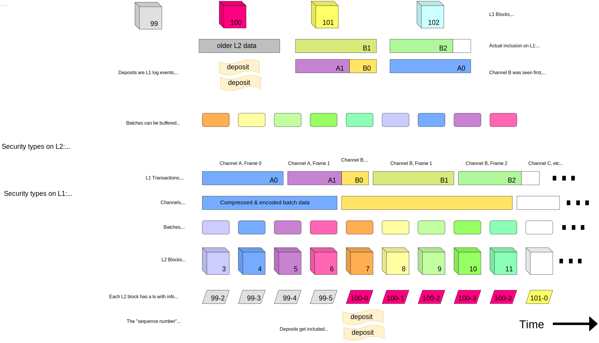

# L2 Chain Derivation Specification

<!-- All glossary references in this file. -->
[g-derivation]: glossary.md#L2-chain-derivation
[g-payload-attr]: glossary.md#payload-attributes
[g-block]: glossary.md#block
[g-exec-engine]: glossary.md#execution-engine
[g-reorg]: glossary.md#chain-re-organization
[g-receipts]: glossary.md#receipt
[g-inception]: glossary.md#L2-chain-inception
[g-deposit-contract]: glossary.md#deposit-contract
[g-deposited]: glossary.md#deposited-transaction
[g-l1-attr-deposit]: glossary.md#l1-attributes-deposited-transaction
[g-user-deposited]: glossary.md#user-deposited-transaction
[g-deposits]: glossary.md#deposits
[g-deposit-contract]: glossary.md#deposit-contract
[g-l1-attr-predeploy]: glossary.md#l1-attributes-predeployed-contract
[g-depositing-call]: glossary.md#depositing-call
[g-depositing-transaction]: glossary.md#depositing-transaction
[g-sequencing]: glossary.md#sequencing
[g-sequencer]: glossary.md#sequencer
[g-sequencing-epoch]: glossary.md#sequencing-epoch
[g-sequencing-window]: glossary.md#sequencing-window
[g-sequencer-batch]: glossary.md#sequencer-batch
[g-l2-genesis]: glossary.md#l2-genesis-block
[g-l2-chain-inception]: glossary.md#L2-chain-inception
[g-batcher-transaction]: glossary.md#batcher-transaction
[g-avail-provider]: glossary.md#data-availability-provider
[g-batcher]: glossary.md#batcher
[g-l2-output]: glossary.md#l2-output-root
[g-fault-proof]: glossary.md#fault-proof
[g-channel]: glossary.md#channel
[g-channel-frame]: glossary.md#channel-frame
[g-rollup-node]: glossary.md#rollup-node
[g-channel-timeout]: glossary.md#channel-timeout
[g-block-time]: glossary.md#block-time
[g-time-slot]: glossary.md#time-slot
[g-consolidation]: glossary.md#unsafe-block-consolidation
[g-safe-l2-head]: glossary.md#safe-l2-head
[g-safe-l2-block]: glossary.md#safe-l2-block
[g-unsafe-l2-head]: glossary.md#unsafe-l2-head
[g-unsafe-l2-block]: glossary.md#unsafe-l2-block
[g-unsafe-sync]: glossary.md#unsafe-sync
[g-l1-origin]: glossary.md#l1-origin
[g-deposit-tx-type]: glossary.md#deposited-transaction-type
[g-finalized-l2-head]: glossary.md#finalized-l2-head
[g-system-config]: glossary.md#system-configuration

<!-- START doctoc generated TOC please keep comment here to allow auto update -->
<!-- DON'T EDIT THIS SECTION, INSTEAD RE-RUN doctoc TO UPDATE -->
**Table of Contents**

- [Overview](#overview)
  - [Eager Block Derivation](#eager-block-derivation)
- [Batch Submission](#batch-submission)
  - [Sequencing & Batch Submission Overview](#sequencing--batch-submission-overview)
  - [Batch Submission Wire Format](#batch-submission-wire-format)
    - [Batcher Transaction Format](#batcher-transaction-format)
    - [Frame Format](#frame-format)
    - [Channel Format](#channel-format)
    - [Batch Format](#batch-format)
- [Architecture](#architecture)
  - [L2 Chain Derivation Pipeline](#l2-chain-derivation-pipeline)
    - [L1 Traversal](#l1-traversal)
    - [L1 Retrieval](#l1-retrieval)
    - [Frame Queue](#frame-queue)
    - [Channel Bank](#channel-bank)
      - [Pruning](#pruning)
      - [Timeouts](#timeouts)
      - [Reading](#reading)
      - [Loading frames](#loading-frames)
    - [Channel Reader (Batch Decoding)](#channel-reader-batch-decoding)
    - [Batch Queue](#batch-queue)
    - [Payload Attributes Derivation](#payload-attributes-derivation)
    - [Engine Queue](#engine-queue)
      - [Engine API usage](#engine-api-usage)
      - [Forkchoice synchronization](#forkchoice-synchronization)
      - [L1-consolidation: payload attributes matching](#l1-consolidation-payload-attributes-matching)
      - [L1-sync: payload attributes processing](#l1-sync-payload-attributes-processing)
      - [Processing unsafe payload attributes](#processing-unsafe-payload-attributes)
    - [Resetting the Pipeline](#resetting-the-pipeline)
      - [Finding the sync starting point](#finding-the-sync-starting-point)
      - [Resetting derivation stages](#resetting-derivation-stages)
      - [About reorgs Post-Merge](#about-reorgs-post-merge)
- [Deriving Payload Attributes](#deriving-payload-attributes)
  - [Deriving the Transaction List](#deriving-the-transaction-list)
  - [Building Individual Payload Attributes](#building-individual-payload-attributes)

<!-- END doctoc generated TOC please keep comment here to allow auto update -->

# Overview

> **Note** the following assumes a single sequencer and batcher. In the future, the design will be adapted to
> accommodate multiple such entities.

[L2 chain derivation][g-derivation] — deriving L2 [blocks][g-block] from L1 data — is one of the main responsibility of
the [rollup node][g-rollup-node], both in validator mode, and in sequencer mode (where derivation acts as a sanity check
on sequencing, and enables detecting L1 chain [re-organizations][g-reorg]).

The L2 chain is derived from the L1 chain. In particular, each L1 block is mapped to an L2 [sequencing
epoch][g-sequencing-epoch] comprising multiple L2 blocks. The epoch number is defined to be equal to the corresponding
L1 block number.

To derive the L2 blocks in an epoch `E`, we need the following inputs:

- The L1 [sequencing window][g-sequencing-window] for epoch `E`: the L1 blocks in the range `[E, E + SWS)` where `SWS`
  is the sequencing window size (note that this means that epochs are overlapping). In particular, we need:
  - The [batcher transactions][g-batcher-transaction] included in the sequencing window. These allow us to
      reconstruct [sequencer batches][g-sequencer-batch] containing the transactions to include in L2 blocks (each batch
      contains a list of L2 blocks).
    - Note that it is impossible to have a batcher transaction containing a batch relative to epoch `E` on L1 block
        `E`, as the batch must contain the hash of L1 block `E`.
  - The [deposits][g-deposits] made in L1 block `E` (in the form of events emitted by the [deposit
      contract][g-deposit-contract]).
  - The L1 block attributes from L1 block `E` (to derive the [L1 attributes deposited transaction][g-l1-attr-deposit]).
- The state of the L2 chain after the last L2 block of epoch `E - 1`, or — if epoch `E - 1` does not exist — the
  [L2 genesis state][g-l2-genesis].
  - An epoch `E` does not exist if `E <= L2CI`, where `L2CI` is the [L2 chain inception][g-l2-chain-inception].

To derive the whole L2 chain from scratch, we simply start with the [L2 genesis state][g-l2-genesis], and the [L2 chain
inception][g-l2-chain-inception] as first epoch, then process all sequencing windows in order. Refer to the
[Architecture section][architecture] for more information on how we implement this in practice.
The L2 chain may contain pre-Bedrock history, but the L2 genesis here refers to the first Bedrock L2 block.

Each epoch may contain a variable number of L2 blocks (one every `l2_block_time`, 2s on Optimism), at the discretion of
[the sequencer][g-sequencer], but subject to the following constraints for each block:

- `min_l2_timestamp <= block.timestamp <= max_l2_timestamp`, where
  - all these values are denominated in seconds
  - `min_l2_timestamp = l1_timestamp`
    - This ensures that the L2 timestamp is not behind the L1 origin timestamp.
  - `block.timestamp = prev_l2_timestamp + l2_block_time`
    - `prev_l2_timestamp` is the timestamp of the last L2 block of the previous epoch
    - `l2_block_time` is a configurable parameter of the time between L2 blocks (on Optimism, 2s)
  - `max_l2_timestamp = max(l1_timestamp + max_sequencer_drift, min_l2_timestamp + l2_block_time)`
    - `l1_timestamp` is the timestamp of the L1 block associated with the L2 block's epoch
    - `max_sequencer_drift` is the most a sequencer is allowed to get ahead of L1

Put together, these constraints mean that there must be an L2 block every `l2_block_time` seconds, and that the
timestamp for the first L2 block of an epoch must never fall behind the timestamp of the L1 block matching the epoch.

Post-merge, Ethereum has a fixed [block time][g-block-time] of 12s (though some slots can be skipped). It is thus
expected that with a 2-second L2 block time, most of the time, each epoch will contain `12/2 = 6` L2 blocks.
The sequencer can however lengthen or shorten epochs (subject to above constraints).
The rationale is to maintain liveness in case of either a skipped slot on L1, or a temporary loss of connection to L1 —
which requires longer epochs.
Shorter epochs are then required to avoid L2 timestamps drifting further and further ahead of L1.

Note that `min_l2_timestamp + l2_block_time` ensures that a new L2 batch can always be processed, even if the
`max_sequencer_drift` is exceeded. However, when exceeding the `max_sequencer_drift`, progression to the next L1 origin
is enforced, with an exception to ensure the minimum timestamp bound (based on this next L1 origin) can be met in the
next L2 batch, and `len(batch.transactions) == 0` continues to be enforced while the `max_sequencer_drift` is exceeded.
See [Batch Queue] for more details.

## Eager Block Derivation

In practice, it is often not necessary to wait for a full sequencing window of L1 blocks in order to start deriving the
L2 blocks in an epoch. Indeed, as long as we are able to reconstruct sequential batches, we can start deriving the
corresponding L2 blocks. We call this *eager block derivation*.

However, in the very worst case, we can only reconstruct the batch for the first L2 block in the epoch by reading the
last L1 block of the sequencing window. This happens when some data for that batch is included in the last L1 block of
the window. In that case, not only can we not derive the first L2 block in the epoch, we also cannot derive any further
L2 block in the epoch until then, as they need the state that results from applying the epoch's first L2 block.
(Note that this only applies to *block* derivation. Batches can still be derived and tentatively queued,
we just won't be able to create blocks from them.)

------------------------------------------------------------------------------------------------------------------------

# Batch Submission

## Sequencing & Batch Submission Overview

The [sequencer][g-sequencer] accepts L2 transactions from users. It is responsible for building blocks out of these. For
each such block, it also creates a corresponding [sequencer batch][g-sequencer-batch]. It is also responsible for
submitting each batch to a [data availability provider][g-avail-provider] (e.g. Ethereum calldata), which it does via
its [batcher][g-batcher] component.

The difference between an L2 block and a batch is subtle but important: the block includes an L2 state root, whereas the
batch only commits to transactions at a given L2 timestamp (equivalently: L2 block number). A block also includes a
reference to the previous block (\*).

(\*) This matters in some edge case where a L1 reorg would occur and a batch would be reposted to the L1 chain but not
the preceding batch, whereas the predecessor of an L2 block cannot possibly change.

This means that even if the sequencer applies a state transition incorrectly, the transactions in the batch will still
be considered part of the canonical L2 chain. Batches are still subject to validity checks (i.e. they have to be encoded
correctly), and so are individual transactions within the batch (e.g. signatures have to be valid). Invalid batches and
invalid individual transactions within an otherwise valid batch are discarded by correct nodes.

If the sequencer applies a state transition incorrectly and posts an [output root][g-l2-output], then this output root
will be incorrect. The incorrect output root which will be challenged by a [fault proof][g-fault-proof], then replaced
by a correct output root **for the existing sequencer batches.**

Refer to the [Batch Submission specification][batcher-spec] for more information.

[batcher-spec]: batcher.md

## Batch Submission Wire Format

[wire-format]: #batch-submission-wire-format

Batch submission is closely tied to L2 chain derivation because the derivation process must decode the batches that have
been encoded for the purpose of batch submission.

The [batcher][g-batcher] submits [batcher transactions][g-batcher-transaction] to a [data availability
provider][g-avail-provider]. These transactions contain one or multiple [channel frames][g-channel-frame], which are
chunks of data belonging to a [channel][g-channel].

A [channel][g-channel] is a sequence of [sequencer batches][g-sequencer-batch] (for any L2 blocks) compressed
together. The reason to group multiple batches together is simply to obtain a better compression rate, hence reducing
data availability costs.

Channels might be too large to fit in a single [batcher transaction][g-batcher-transaction], hence we need to split it
into chunks known as [channel frames][g-channel-frame]. A single batcher transaction can also carry multiple frames
(belonging to the same or to different channels).

This design gives use the maximum flexibility in how we aggregate batches into channels, and split channels over batcher
transactions. It notably allows us to maximize data utilisation in a batcher transaction: for instance it allows us to
pack the final (small) frame of a window with large frames from the next window.

In the future this channel identification feature also allows the [batcher][g-batcher] to employ multiple signers
(private keys) to submit one or multiple channels in parallel (1).

(1) This helps alleviate issues where, because of transaction nonce values affecting the L2 tx-pool and thus inclusion:
multiple transactions made by the same signer are stuck waiting on the inclusion of a previous transaction.

Also note that we use a streaming compression scheme, and we do not need to know how many blocks a channel will end up
containing when we start a channel, or even as we send the first frames in the channel.

And by splitting channels across multiple data transactions, the L2 can have larger block data than the
data-availability layer may support.

All of this is illustrated in the following diagram. Explanations below.



The first line represents L1 blocks with their numbers. The boxes under the L1 blocks represent [batcher
transactions][g-batcher-transaction] included within the block. The squiggles under the L1 blocks represent
[deposits][g-deposits] (more specifically, events emitted by the [deposit contract][g-deposit-contract]).

Each colored chunk within the boxes represents a [channel frame][g-channel-frame]. So `A` and `B` are
[channels][g-channel] whereas `A0`, `A1`, `B0`, `B1`, `B2` are frames. Notice that:

- multiple channels are interleaved
- frames do not need to be transmitted in order
- a single batcher transaction can carry frames from multiple channels

In the next line, the rounded boxes represent individual [sequencer batches][g-sequencer-batch] that were extracted from
the channels. The four blue/purple/pink were derived from channel `A` while the other were derived from channel `B`.
These batches are here represented in the order they were decoded from batches (in this case `B` is decoded first).

> **Note** The caption here says "Channel B was seen first and will be decoded into batches first", but this is not a
> requirement. For instance, it would be equally acceptable for an implementation to peek into the channels and decode
> the one that contains the oldest batches first.

The rest of the diagram is conceptually distinct from the first part and illustrates L2 chain derivation after the
channels have been reordered.

The first line shows batcher transactions. Note that in this case, there exists an ordering of the batches that makes
all frames within the channels appear contiguously. This is not true in general. For instance, in the second
transaction, the position of `A1` and `B0` could have been inverted for exactly the same result — no changes needed in
the rest of the diagram.

The second line shows the reconstructed channels in proper order. The third line shows the batches extracted from the
channel. Because the channels are ordered and the batches within a channel are sequential, this means the batches are
ordered too. The fourth line shows the [L2 block][g-block] derived from each batch. Note that we have a 1-1 batch to
block mapping here but, as we'll see later, empty blocks that do not map to batches can be inserted in cases where there
are "gaps" in the batches posted on L1.

The fifth line shows the [L1 attributes deposited transaction][g-l1-attr-deposit] which, within each L2 block, records
information about the L1 block that matches the L2 block's epoch. The first number denotes the epoch/L1x number, while
the second number (the "sequence number") denotes the position within the epoch.

Finally, the sixth line shows [user-deposited transactions][g-user-deposited] derived from the [deposit
contract][g-deposit-contract] event mentioned earlier.

Note the `101-0` L1 attributes transaction on the bottom right of the diagram. Its presence there is only possible if
frame `B2` indicates that it is the last frame within the channel and (2) no empty blocks must be inserted.

The diagram does not specify the sequencing window size in use, but from this we can infer that it must be at least 4
blocks, because the last frame of channel `A` appears in block 102, but belong to epoch 99.

As for the comment on "security types", it explains the classification of blocks as used on L1 and L2.

- [Unsafe L2 blocks][g-unsafe-l2-block]:
- [Safe L2 blocks][g-safe-l2-block]:
- Finalized L2 blocks: refer to block that have been derived from [finalized][g-finalized-l2-head] L1 data.

These security levels map to the `headBlockHash`, `safeBlockHash` and `finalizedBlockHash` values transmitted when
interacting with the [execution-engine API][exec-engine].

### Batcher Transaction Format

Batcher transactions are encoded as `version_byte ++ rollup_payload` (where `++` denotes concatenation).

| `version_byte` | `rollup_payload`                               |
|----------------|------------------------------------------------|
| 0              | `frame ...` (one or more frames, concatenated) |

Unknown versions make the batcher transaction invalid (it must be ignored by the rollup node).
All frames in a batcher transaction must be parseable. If any one frame fails to parse, the all frames in the
transaction are rejected.

Batch transactions are authenticated by verifying that the `to` address of the transaction matches the batch inbox
address, and the `from` address matches the batch-sender address in the [system configuration][g-system-config] at the
time of the L1 block that the transaction data is read from.

### Frame Format

A [channel frame][g-channel-frame] is encoded as:

```text
frame = channel_id ++ frame_number ++ frame_data_length ++ frame_data ++ is_last

channel_id        = bytes16
frame_number      = uint16
frame_data_length = uint32
frame_data        = bytes
is_last           = bool
```

Where `uint32` and `uint16` are all big-endian unsigned integers. Type names should be interpreted to and
encoded according to [the Solidity ABI][solidity-abi].

[solidity-abi]: https://docs.soliditylang.org/en/v0.8.16/abi-spec.html

All data in a frame is fixed-size, except the `frame_data`. The fixed overhead is `16 + 2 + 4 + 1 = 23 bytes`.
Fixed-size frame metadata avoids a circular dependency with the target total data length,
to simplify packing of frames with varying content length.

where:

- `channel_id` is an opaque identifier for the channel. It should not be reused and is suggested to be random; however,
outside of timeout rules, it is not checked for validity
- `frame_number` identifies the index of the frame within the channel
- `frame_data_length` is the length of `frame_data` in bytes. It is capped to 1,000,000 bytes.
- `frame_data` is a sequence of bytes belonging to the channel, logically after the bytes from the previous frames
- `is_last` is a single byte with a value of 1 if the frame is the last in the channel, 0 if there are frames in the
  channel. Any other value makes the frame invalid (it must be ignored by the rollup node).

[batcher-spec]: batching.md

### Channel Format

A channel is encoded as `channel_encoding`, defined as:

```text
rlp_batches = []
for batch in batches:
    rlp_batches.append(batch)
channel_encoding = compress(rlp_batches)
```

where:

- `batches` is the input, a sequence of batches byte-encoded as per the next section ("Batch Encoding")
- `rlp_batches` is the concatenation of the RLP-encoded batches
- `compress` is a function performing compression, using the ZLIB algorithm (as specified in [RFC-1950][rfc1950]) with
  no dictionary
- `channel_encoding` is the compressed version of `rlp_batches`

[rfc1950]: https://www.rfc-editor.org/rfc/rfc1950.html

When decompressing a channel, we limit the amount of decompressed data to `MAX_RLP_BYTES_PER_CHANNEL` (currently
10,000,000 bytes), in order to avoid "zip-bomb" types of attack (where a small compressed input decompresses to a
humongous amount of data). If the decompressed data exceeds the limit, things proceeds as though the channel contained
only the first `MAX_RLP_BYTES_PER_CHANNEL` decompressed bytes. The limit is set on RLP decoding, so all batches that
can be decoded in `MAX_RLP_BYTES_PER_CHANNEL` will be accepted ven if the size of the channel is greater than
`MAX_RLP_BYTES_PER_CHANNEL`. The exact requirement is that `length(input) <= MAX_RLP_BYTES_PER_CHANNEL`.

While the above pseudocode implies that all batches are known in advance, it is possible to perform streaming
compression and decompression of RLP-encoded batches. This means it is possible to start including channel frames in a
[batcher transaction][g-batcher-transaction] before we know how many batches (and how many frames) the channel will
contain.

### Batch Format

[batch-format]: #batch-format

Recall that a batch contains a list of transactions to be included in a specific L2 block.

A batch is encoded as `batch_version ++ content`, where `content` depends on the `batch_version`:

| `batch_version` | `content`                                                                          |
|-----------------|------------------------------------------------------------------------------------|
| 0               | `rlp_encode([parent_hash, epoch_number, epoch_hash, timestamp, transaction_list])` |

where:

- `batch_version` is a single byte, prefixed before the RLP contents, alike to transaction typing.
- `rlp_encode` is a function that encodes a batch according to the [RLP format], and `[x, y, z]` denotes a list
  containing items `x`, `y` and `z`
- `parent_hash` is the block hash of the previous L2 block
- `epoch_number` and `epoch_hash` are the number and hash of the L1 block corresponding to the [sequencing
  epoch][g-sequencing-epoch] of the L2 block
- `timestamp` is the timestamp of the L2 block
- `transaction_list` is an RLP-encoded list of [EIP-2718] encoded transactions.

[RLP format]: https://ethereum.org/en/developers/docs/data-structures-and-encoding/rlp/
[EIP-2718]: https://eips.ethereum.org/EIPS/eip-2718

Unknown versions make the batch invalid (it must be ignored by the rollup node), as do malformed contents.

The `epoch_number` and the `timestamp` must also respect the constraints listed in the [Batch Queue][batch-queue]
section, otherwise the batch is considered invalid and will be ignored.

------------------------------------------------------------------------------------------------------------------------

# Architecture

[architecture]: #architecture

The above primarily describes the general encodings used in L2 chain derivation,
primarily how batches are encoded within [batcher transactions][g-batcher-transaction].

This section describes how the L2 chain is produced from the L1 batches using a pipeline architecture.

A verifier may implement this differently, but must be semantically equivalent to not diverge from the L2 chain.

## L2 Chain Derivation Pipeline

[pipeline]: #l2-chain-derivation-pipeline

Our architecture decomposes the derivation process into a pipeline made up of the following stages:

1. L1 Traversal
2. L1 Retrieval
3. Frame Queue
4. Channel Bank
5. Channel Reader (Batch Decoding)
6. Batch Queue
7. Payload Attributes Derivation
8. Engine Queue

The data flows from the start (outer) of the pipeline towards the end (inner).
From the innermost stage the data is pulled from the outermost stage.

However, data is *processed* in reverse order. Meaning that if there is any data to be processed in the last stage, it
will be processed first. Processing proceeds in "steps" that can be taken at each stage. We try to take as many steps as
possible in the last (most inner) stage before taking any steps in its outer stage, etc.

This ensures that we use the data we already have before pulling more data and minimizes the latency of data traversing
the derivation pipeline.

Each stage can maintain its own inner state as necessary. In particular, each stage maintains a L1 block reference
(number + hash) to the latest L1 block such that all data originating from previous blocks has been fully processed, and
the data from that block is being or has been processed. This allows the innermost stage to account for finalization of
the L1 data-availability used to produce the L2 chain, to reflect in the L2 chain forkchoice when the L2 chain inputs
become irreversible.

Let's briefly describe each stage of the pipeline.

### L1 Traversal

In the *L1 Traversal* stage, we simply read the header of the next L1 block. In normal operations, these will be new
L1 blocks as they get created, though we can also read old blocks while syncing, or in case of an L1 [re-org][g-reorg].

Upon traversal of the L1 block, the [system configuration][g-system-config] copy used by the L1 retrieval stage is
updated, such that the batch-sender authentication is always accurate to the exact L1 block that is read by the stage.

### L1 Retrieval

In the *L1 Retrieval* stage, we read the block we get from the outer stage (L1 traversal), and extract data from it.
By default, the rollup operates on calldata retrieved from [batcher transactions][g-batcher-transaction] in the block,
for each transaction:

- The receiver must be the configured batcher inbox address.
- The sender must match the batcher address loaded from the system config matching the L1 block of the data.

Each data-transaction is versioned and contains a series of [channel frames][g-channel-frame] to be read by the
Frame Queue, see [Batch Submission Wire Format][wire-format].

### Frame Queue

The Frame Queue buffers one data-transaction at a time,
decoded into [channel frames][g-channel-frame], to be consumed by the next stage.
See [Batcher transaction format](#batcher-transaction-format) and [Frame format](#frame-format) specifications.

### Channel Bank

The *Channel Bank* stage is responsible for managing buffering from the channel bank that was written to by the L1
retrieval stage. A step in the channel bank stage tries to read data from channels that are "ready".

Channels are currently fully buffered until read or dropped,
streaming channels may be supported in a future version of the ChannelBank.

To bound resource usage, the Channel Bank prunes based on channel size, and times out old channels.

Channels are recorded in FIFO order in a structure called the *channel queue*. A channel is added to the channel
queue the first time a frame belonging to the channel is seen.

#### Pruning

After successfully inserting a new frame, the ChannelBank is pruned:
channels are dropped in FIFO order, until `total_size <= MAX_CHANNEL_BANK_SIZE`, where:

- `total_size` is the sum of the sizes of each channel, which is the sum of all buffered frame data of the channel,
  with an additional frame-overhead of `200` bytes per frame.
- `MAX_CHANNEL_BANK_SIZE` is a protocol constant of 100,000,000 bytes.

#### Timeouts

The L1 origin that the channel was opened in is tracked with the channel as `channel.open_l1_block`,
and determines the maximum span of L1 blocks that the channel data is retained for, before being pruned.

A channel is timed out if: `current_l1_block.number > channel.open_l1_block.number + CHANNEL_TIMEOUT`, where:

- `current_l1_block` is the L1 origin that the stage is currently traversing.
- `CHANNEL_TIMEOUT` is a rollup-configurable, expressed in number of L1 blocks.

New frames for timed-out channels are dropped instead of buffered.

#### Reading

The channel-bank can only output data from the first opened channel.

Upon reading, while the first opened channel is timed-out, remove it from the channel-bank.

Once the first opened channel, if any, is not timed-out and is ready, then it is read and removed from the channel-bank.

A channel is ready if:

- The channel is closed
- The channel has a contiguous sequence of frames until the closing frame

If no channel is ready, the next frame is read and ingested into the channel bank.

#### Loading frames

When a channel ID referenced by a frame is not already present in the Channel Bank,
a new channel is opened, tagged with the current L1 block, and appended to the channel-queue.

Frame insertion conditions:

- New frames matching timed-out channels that have not yet been pruned from the channel-bank are dropped.
- Duplicate frames (by frame number) for frames that have not yet been pruned from the channel-bank are dropped.
- Duplicate closes (new frame `is_last == 1`, but the channel has already seen a closing frame and has not yet been
    pruned from the channel-bank) are dropped.

If a frame is closing (`is_last == 1`) any existing higher-numbered frames are removed from the channel.

Note that while this allows channel IDs to be reused once they have been pruned from the channel-bank, it is recommended
that batcher implementations use unique channel IDs.

### Channel Reader (Batch Decoding)

In this stage, we decompress the channel we pull from the last stage, and then parse
[batches][g-sequencer-batch] from the decompressed byte stream.

See [Batch Format][batch-format] for decompression and decoding specification.

### Batch Queue

[batch-queue]: #batch-queue

During the *Batch Buffering* stage, we reorder batches by their timestamps. If batches are missing for some [time
slots][g-time-slot] and a valid batch with a higher timestamp exists, this stage also generates empty batches to fill
the gaps.

Batches are pushed to the next stage whenever there is one sequential batch directly following the timestamp
of the current [safe L2 head][g-safe-l2-head] (the last block that can be derived from the canonical L1 chain).
The parent hash of the batch must also match the hash of the current safe L2 head.

Note that the presence of any gaps in the batches derived from L1 means that this stage will need to buffer for a whole
[sequencing window][g-sequencing-window] before it can generate empty batches (because the missing batch(es) could have
data in the last L1 block of the window in the worst case).

A batch can have 4 different forms of validity:

- `drop`: the batch is invalid, and will always be in the future, unless we reorg. It can be removed from the buffer.
- `accept`: the batch is valid and should be processed.
- `undecided`: we are lacking L1 information until we can proceed batch filtering.
- `future`: the batch may be valid, but cannot be processed yet and should be checked again later.

The batches are processed in order of the inclusion on L1: if multiple batches can be `accept`-ed the first is applied.
An implementation can defer `future` batches a later derivation step to reduce validation work.

The batches validity is derived as follows:

Definitions:

- `batch` as defined in the [Batch format section][batch-format].
- `epoch = safe_l2_head.l1_origin` a [L1 origin][g-l1-origin] coupled to the batch, with properties:
  `number` (L1 block number), `hash` (L1 block hash), and `timestamp` (L1 block timestamp).
- `inclusion_block_number` is the L1 block number when `batch` was first *fully* derived,
   i.e. decoded and output by the previous stage.
- `next_timestamp = safe_l2_head.timestamp + block_time` is the expected L2 timestamp the next batch should have,
  see [block time information][g-block-time].
- `next_epoch` may not be known yet, but would be the L1 block after `epoch` if available.
- `batch_origin` is either `epoch` or `next_epoch`, depending on validation.

Note that processing of a batch can be deferred until `batch.timestamp <= next_timestamp`,
since `future` batches will have to be retained anyway.

Rules, in validation order:

- `batch.timestamp > next_timestamp` -> `future`: i.e. the batch must be ready to process.
- `batch.timestamp < next_timestamp` -> `drop`: i.e. the batch must not be too old.
- `batch.parent_hash != safe_l2_head.hash` -> `drop`: i.e. the parent hash must be equal to the L2 safe head block hash.
- `batch.epoch_num + sequence_window_size < inclusion_block_number` -> `drop`: i.e. the batch must be included timely.
- `batch.epoch_num < epoch.number` -> `drop`: i.e. the batch origin is not older than that of the L2 safe head.
- `batch.epoch_num == epoch.number`: define `batch_origin` as `epoch`.
- `batch.epoch_num == epoch.number+1`:
  - If `next_epoch` is not known -> `undecided`:
    i.e. a batch that changes the L1 origin cannot be processed until we have the L1 origin data.
  - If known, then define `batch_origin` as `next_epoch`
- `batch.epoch_num > epoch.number+1` -> `drop`: i.e. the L1 origin cannot change by more than one L1 block per L2 block.
- `batch.epoch_hash != batch_origin.hash` -> `drop`: i.e. a batch must reference a canonical L1 origin,
  to prevent batches from being replayed onto unexpected L1 chains.
- `batch.timestamp < batch_origin.time` -> `drop`: enforce the min L2 timestamp rule.
- `batch.timestamp > batch_origin.time + max_sequencer_drift`: enforce the L2 timestamp drift rule,
  but with exceptions to preserve above min L2 timestamp invariant:
  - `len(batch.transactions) == 0`:
    - `epoch.number == batch.epoch_num`:
      this implies the batch does not already advance the L1 origin, and must thus be checked against `next_epoch`.
      - If `next_epoch` is not known -> `undecided`:
        without the next L1 origin we cannot yet determine if time invariant could have been kept.
      - If `batch.timestamp >= next_epoch.time` -> `drop`:
        the batch could have adopted the next L1 origin without breaking the `L2 time >= L1 time` invariant.
  - `len(batch.transactions) > 0`: -> `drop`:
    when exceeding the sequencer time drift, never allow the sequencer to include transactions.
- `batch.transactions`: `drop` if the `batch.transactions` list contains a transaction
  that is invalid or derived by other means exclusively:
  - any transaction that is empty (zero length byte string)
  - any [deposited transactions][g-deposit-tx-type] (identified by the transaction type prefix byte)

If no batch can be `accept`-ed, and the stage has completed buffering of all batches that can fully be read from the L1
block at height `epoch.number + sequence_window_size`, and the `next_epoch` is available,
then an empty batch can be derived with the following properties:

- `parent_hash = safe_l2_head.hash`
- `timestamp = next_timestamp`
- `transactions` is empty, i.e. no sequencer transactions. Deposited transactions may be added in the next stage.
- If `next_timestamp < next_epoch.time`: the current L1 origin is repeated, to preserve the L2 time invariant.
  - `epoch_num = epoch.number`
  - `epoch_hash = epoch.hash`
- If the batch is the first batch of the epoch, that epoch is used instead of advancing the epoch to ensure that
there is at least one L2 block per epoch.
  - `epoch_num = epoch.number`
  - `epoch_hash = epoch.hash`
- Otherwise,
  - `epoch_num = next_epoch.number`
  - `epoch_hash = next_epoch.hash`

### Payload Attributes Derivation

In the *Payload Attributes Derivation* stage, we convert the batches we get from the previous stage into instances of
the [`PayloadAttributes`][g-payload-attr] structure. Such a structure encodes the transactions that need to figure into
a block, as well as other block inputs (timestamp, fee recipient, etc). Payload attributes derivation is detailed in the
section [Deriving Payload Attributes section][deriving-payload-attr] below.

This stage maintains its own copy of the [system configuration][g-system-config], independent of the L1 retrieval stage.
The system configuration is updated with L1 log events whenever the L1 epoch referenced by the batch input changes.

### Engine Queue

In the *Engine Queue* stage, the previously derived `PayloadAttributes` structures are buffered and sent to the
[execution engine][g-exec-engine] to be executed and converted into a proper L2 block.

The stage maintains references to three L2 blocks:

- The [finalized L2 head][g-finalized-l2-head]: everything up to and including this block can be fully derived from the
  [finalized][l1-finality] (i.e. canonical and forever irreversible) part of the L1 chain.
- The [safe L2 head][g-safe-l2-head]: everything up to and including this block can be fully derived from the
  currently canonical L1 chain.
- The [unsafe L2 head][g-unsafe-l2-head]: blocks between the safe and unsafe heads are [unsafe
  blocks][g-unsafe-l2-block] that have not been derived from L1. These blocks either come from sequencing (in sequencer
  mode) or from [unsafe sync][g-unsafe-sync] to the sequencer (in validator mode).
  This is also known as the "latest" head.

Additionally, it buffers a short history of references to recently processed safe L2 blocks, along with references
from which L1 blocks each was derived.
This history does not have to be complete, but enables later L1 finality signals to be translated into L2 finality.

#### Engine API usage

To interact with the engine, the [execution engine API][exec-engine] is used, with the following JSON-RPC methods:

[exec-engine]: exec-engine.md

- [`engine_forkchoiceUpdatedV1`] — updates the forkchoice (i.e. the chain head) to `headBlockHash` if different, and
  instructs the engine to start building an execution payload if the payload attributes parameter is not `null`.
- [`engine_getPayloadV1`] — retrieves a previously requested execution payload build.
- [`engine_newPayloadV1`] — executes an execution payload to create a block.

[`engine_forkchoiceUpdatedV1`]: exec-engine.md#engine_forkchoiceupdatedv1
[`engine_getPayloadV1`]: exec-engine.md#engine_getpayloadv1
[`engine_newPayloadV1`]: exec-engine.md#engine_newpayloadv1

The execution payload is an object of type [`ExecutionPayloadV1`][eth-payload].

[eth-payload]: https://github.com/ethereum/execution-apis/blob/main/src/engine/paris.md#executionpayloadv1

#### Forkchoice synchronization

If there are any forkchoice updates to be applied, before additional inputs are derived or processed, then these are
applied to the engine first.

This synchronization may happen when:

- A L1 finality signal finalizes one or more L2 blocks: updating the "finalized" L2 block.
- A successful consolidation of unsafe L2 blocks: updating the "safe" L2 block.
- The first thing after a derivation pipeline reset, to ensure a consistent execution engine forkchoice state.

The new forkchoice state is applied with `engine_forkchoiceUpdatedV1`.
On forkchoice-state validity errors the derivation pipeline must be reset to recover to consistent state.

#### L1-consolidation: payload attributes matching

If the unsafe head is ahead of the safe head, then [consolidation][g-consolidation] is attempted, verifying that
existing unsafe L2 chain matches the derived L2 inputs as derived from the canonical L1 data.

During consolidation, we consider the oldest unsafe L2 block, i.e. the unsafe L2 block directly after the safe head. If
the payload attributes match this oldest unsafe L2 block, then that block can be considered "safe" and becomes the new
safe head.

The following fields of the derived L2 payload attributes are checked for equality with the L2 block:

- `parent_hash`
- `timestamp`
- `randao`
- `fee_recipient`
- `transactions_list` (first length, then equality of each of the encoded transactions, including deposits)

If consolidation succeeds, the forkchoice change will synchronize as described in the section above.

If consolidation fails, the L2 payload attributes will be processed immediately as described in the section below.
The payload attributes are chosen in favor of the previous unsafe L2 block, creating an L2 chain reorg on top of the
current safe block. Immediately processing the new alternative attributes enables execution engines like go-ethereum to
enact the change, as linear rewinds of the tip of the chain may not be supported.

#### L1-sync: payload attributes processing

[exec-engine-comm]: exec-engine.md#engine-api

If the safe and unsafe L2 heads are identical (whether because of failed consolidation or not), we send the L2 payload
attributes to the execution engine to be constructed into a proper L2 block.
This L2 block will then become both the new L2 safe and unsafe head.

If a payload attributes created from a batch cannot be inserted into the chain because of a validation error (i.e. there
was an invalid transaction or state transition in the block) the batch should be dropped & the safe head should not be
advanced. The engine queue will attempt to use the next batch for that timestamp from the batch queue. If no valid batch
is found, the rollup node will create a deposit only batch which should always pass validation because deposits are
always valid.

Interaction with the execution engine via the execution engine API is detailed in the [Communication with the Execution
Engine][exec-engine-comm] section.

The payload attributes are then processed with a sequence of:

- `engine_forkchoiceUpdatedV1` with current forkchoice state of the stage, and the attributes to start block building.
  - Non-deterministic sources, like the tx-pool, must be disabled to reconstruct the expected block.
- `engine_getPayload` to retrieve the payload, by the payload-ID in the result of the previous step.
- `engine_newPayload` to import the new payload into the execution engine.
- `engine_forkchoiceUpdatedV1` to make the new payload canonical,
   now with a change of both `safe` and `unsafe` fields to refer to the payload, and no payload attributes.

Engine API Error handling:

- On RPC-type errors the payload attributes processing should be re-attempted in a future step.
- On payload processing errors the attributes must be dropped, and the forkchoice state must be left unchanged.
  - Eventually the derivation pipeline will produce alternative payload attributes, with or without batches.
  - If the payload attributes only contained deposits, then it is a critical derivation error if these are invalid.
- On forkchoice-state validity errors the derivation pipeline must be reset to recover to consistent state.

#### Processing unsafe payload attributes

If no forkchoice updates or L1 data remain to be processed, and if the next possible L2 block is already available
through an unsafe source such as the sequencer publishing it via the p2p network, then it is optimistically processed as
an "unsafe" block. This reduces later derivation work to just consolidation with L1 in the happy case, and enables the
user to see the head of the L2 chain faster than the L1 may confirm the L2 batches.

To process unsafe payloads, the payload must:

- Have a block number higher than the current safe L2 head.
  - The safe L2 head may only be reorged out due to L1 reorgs.
- Have a parent blockhash that matches the current unsafe L2 head.
  - This prevents the execution engine individually syncing a larger gap in the unsafe L2 chain.
  - This prevents unsafe L2 blocks from reorging other previously validated L2 blocks.
  - This check may change in the future versions to adopt e.g. the L1 snap-sync protocol.

The payload is then processed with a sequence of:

- `engine_newPayloadV1`: process the payload. It does not become canonical yet.
- `engine_forkchoiceUpdatedV1`: make the payload the canonical unsafe L2 head, and keep the safe/finalized L2 heads.

Engine API Error handling:

- On RPC-type errors the payload processing should be re-attempted in a future step.
- On payload processing errors the payload must be dropped, and not be marked as canonical.
- On forkchoice-state validity errors the derivation pipeline must be reset to recover to consistent state.

### Resetting the Pipeline

It is possible to reset the pipeline, for instance if we detect an L1 [reorg (reorganization)][g-reorg].
**This enables the rollup node to handle L1 chain reorg events.**

Resetting will recover the pipeline into a state that produces the same outputs as a full L2 derivation process,
but starting from an existing L2 chain that is traversed back just enough to reconcile with the current L1 chain.

Note that this algorithm covers several important use-cases:

- Initialize the pipeline without starting from 0, e.g. when the rollup node restarts with an existing engine instance.
- Recover the pipeline if it becomes inconsistent with the execution engine chain, e.g. when the engine syncs/changes.
- Recover the pipeline when the L1 chain reorganizes, e.g. a late L1 block is orphaned, or a larger attestation failure.
- Initialize the pipeline to derive a disputed L2 block with prior L1 and L2 history inside a fault-proof program.

Handling these cases also means a node can be configured to eagerly sync L1 data with 0 confirmations,
as it can undo the changes if the L1 later does recognize the data as canonical, enabling safe low-latency usage.

The Engine Queue is first reset, to determine the L1 and L2 starting points to continue derivation from.
After this, the other stages are reset independent of each other.

#### Finding the sync starting point

To find the starting point, there are several steps, relative to the head of the chain traversing back:

1. Find the current L2 forkchoice state
   - If no `finalized` block can be found, start at the Bedrock genesis block.
   - If no `safe` block can be found, fallback to the `finalized` block.
   - The `unsafe` block should always be available and consistent with the above
     (it may not be in rare engine-corruption recovery cases, this is being reviewed).
2. Find the first L2 block with plausible L1 reference to be the new `unsafe` starting point,
   starting from previous `unsafe`, back to `finalized` and no further.
   - Plausible iff: the L1 origin of the L2 block is known and canonical, or unknown and has a block-number ahead of L1.
3. Find the first L2 block with an L1 reference older than the sequencing window, to be the new `safe` starting point,
   starting at the above plausible `unsafe` head, back to `finalized` and no further.
   - If at any point the L1 origin is known but not canonical, the `unsafe` head is revised to parent of the current.
   - The highest L2 block with known canonical L1 origin is remembered as `highest`.
   - If at any point the L1 origin in the block is corrupt w.r.t. derivation rules, then error. Corruption includes:
     - Inconsistent L1 origin block number or parent-hash with parent L1 origin
     - Inconsistent L1 sequence number (always changes to `0` for a L1 origin change, or increments by `1` if not)
   - If the L1 origin of the L2 block `n` is older than the L1 origin of `highest` by more than a sequence window,
     and `n.sequence_number == 0`, then the parent L2 block of `n` will be the `safe` starting point.
4. The `finalized` L2 block persists as the `finalized` starting point.
5. Find the first L2 block with an L1 reference older than the channel-timeout
   - The L1 origin referenced by this block which we call `l2base` will be the `base` for the L2 pipeline derivation:
     By starting here, the stages can buffer any necessary data, while dropping incomplete derivation outputs until
     L1 traversal has caught up with the actual L2 safe head.

While traversing back the L2 chain, an implementation may sanity-check that the starting point is never set too far
back compared to the existing forkchoice state, to avoid an intensive reorg because of misconfiguration.

Implementers note: step 1-4 are known as `FindL2Heads`. Step 5 is currently part of the Engine Queue reset.
This may change to isolate the starting-point search from the bare reset logic.

#### Resetting derivation stages

1. L1 Traversal: start at L1 `base` as first block to be pulled by next stage.
2. L1 Retrieval: empty previous data, and fetch the `base` L1 data, or defer the fetching work to a later pipeline step.
3. Frame Queue: empty the queue.
4. Channel Bank: empty the channel bank.
5. Channel Reader: reset any batch decoding state.
6. Batch Queue: empty the batch queue, use `base` as initial L1 point of reference.
7. Payload Attributes Derivation: empty any batch/attributes state.
8. Engine Queue:
   - Initialize L2 forkchoice state with syncing start point state. (`finalized`/`safe`/`unsafe`)
   - Initialize the L1 point of reference of the stage to `base`.
   - Require a forkchoice update as first task
   - Reset any finality data

Where necessary, stages starting at `base` can initialize their system-config from data encoded in the `l2base` block.

#### About reorgs Post-Merge

Note that post-[merge], the depth of reorgs will be bounded by the [L1 finality delay][l1-finality]
(2 L1 beacon epochs, or approximately 13 minutes, unless more than 1/3 of the network consistently disagrees).
New L1 blocks may be finalized every L1 beacon epoch (approximately 6.4 minutes), and depending on these
finality-signals and batch-inclusion, the derived L2 chain will become irreversible as well.

Note that this form of finalization only affects inputs, and nodes can then subjectively say the chain is irreversible,
by reproducing the chain from these irreversible inputs and the set protocol rules and parameters.

This is however completely unrelated to the outputs posted on L1, which require a form of proof like a fault-proof or
zk-proof to finalize. Optimistic-rollup outputs like withdrawals on L1 are only labeled "finalized" after passing a week
without dispute (fault proof challenge window), a name-collision with the proof-of-stake finalization.

[merge]: https://ethereum.org/en/upgrades/merge/
[l1-finality]: https://ethereum.org/en/developers/docs/consensus-mechanisms/pos/#finality

------------------------------------------------------------------------------------------------------------------------

# Deriving Payload Attributes

[deriving-payload-attr]: #deriving-payload-attributes

For every L2 block derived from L1 data, we need to build [payload attributes][g-payload-attr],
represented by an [expanded version][expanded-payload] of the [`PayloadAttributesV1`][eth-payload] object,
which includes additional `transactions` and `noTxPool` fields.

This process happens during the payloads-attributes queue ran by a verifier node, as well as during block-production
ran by a sequencer node (the sequencer may enable the tx-pool usage if the transactions are batch-submitted).

[expanded-payload]: exec-engine.md#extended-payloadattributesv1
[eth-payload]: https://github.com/ethereum/execution-apis/blob/main/src/engine/paris.md#payloadattributesv1

## Deriving the Transaction List

For each L2 block to be created by the sequencer, we start from a [sequencer batch][g-sequencer-batch] matching the
target L2 block number. This could potentially be an empty auto-generated batch, if the L1 chain did not include a batch
for the target L2 block number. [Remember][batch-format] that the batch includes a [sequencing
epoch][g-sequencing-epoch] number, an L2 timestamp, and a transaction list.

This block is part of a [sequencing epoch][g-sequencing-epoch],
whose number matches that of an L1 block (its *[L1 origin][g-l1-origin]*).
This L1 block is used to derive L1 attributes and (for the first L2 block in the epoch) user deposits.

Therefore, a [`PayloadAttributesV1`][expanded-payload] object must include the following transactions:

- one or more [deposited transactions][g-deposited], of two kinds:
  - a single *[L1 attributes deposited transaction][g-l1-attr-deposit]*, derived from the L1 origin.
  - for the first L2 block in the epoch, zero or more *[user-deposited transactions][g-user-deposited]*, derived from
    the [receipts][g-receipts] of the L1 origin.
- zero or more *[sequenced transactions][g-sequencing]*: regular transactions signed by L2 users, included in the
  sequencer batch.

Transactions **must** appear in this order in the payload attributes.

The L1 attributes are read from the L1 block header, while deposits are read from the L1 block's [receipts][g-receipts].
Refer to the [**deposit contract specification**][deposit-contract-spec] for details on how deposits are encoded as log
entries.

[deposit-contract-spec]: deposits.md#deposit-contract

## Building Individual Payload Attributes

[payload attributes]: #building-individual-payload-attributes

After deriving the transactions list, the rollup node constructs a [`PayloadAttributesV1`][extended-attributes] as
follows:

- `timestamp` is set to the batch's timestamp.
- `random` is set to the `prev_randao` L1 block attribute.
- `suggestedFeeRecipient` is set to the Sequencer Fee Vault address. See [Fee Vaults] specification.
- `transactions` is the array of the derived transactions: deposited transactions and sequenced transactions, all
  encoded with [EIP-2718].
- `noTxPool` is set to `true`, to use the exact above `transactions` list when constructing the block.
- `gasLimit` is set to the current `gasLimit` value in the [system configuration][g-system-config] of this payload.

[extended-attributes]: exec-engine.md#extended-payloadattributesv1
[Fee Vaults]: exec-engine.md#fee-vaults
