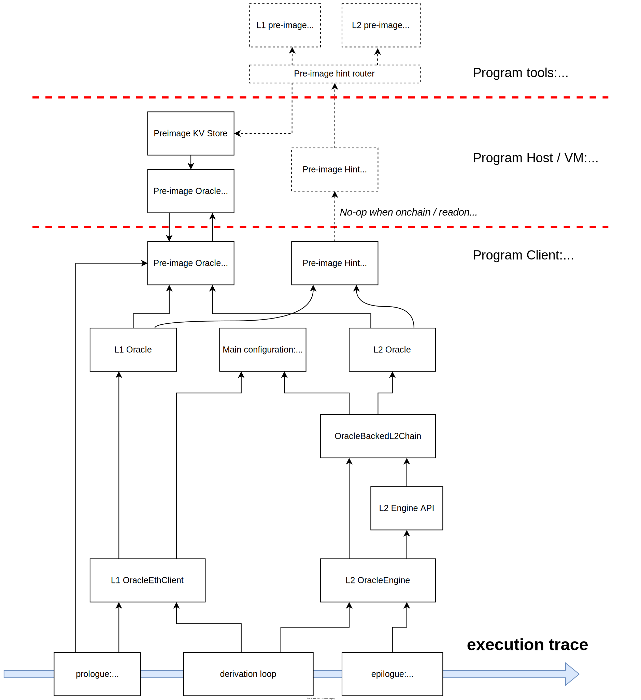

# Fault Proof

<!-- START doctoc generated TOC please keep comment here to allow auto update -->
<!-- DON'T EDIT THIS SECTION, INSTEAD RE-RUN doctoc TO UPDATE -->
**Table of Contents**

- [Overview](#overview)
- [Pre-image Oracle](#pre-image-oracle)
  - [Pre-image key types](#pre-image-key-types)
    - [Type `0`: Zero key](#type-0-zero-key)
    - [Type `1`: Local key](#type-1-local-key)
    - [Type `2`: Global keccak256 key](#type-2-global-keccak256-key)
    - [Type `3`: Global generic key](#type-3-global-generic-key)
    - [Type `4-128`: reserved range](#type-4-128-reserved-range)
    - [Type `129-255`: application usage](#type-129-255-application-usage)
  - [Bootstrapping](#bootstrapping)
  - [Hinting](#hinting)
  - [Pre-image communication](#pre-image-communication)
- [Fault Proof Program](#fault-proof-program)
  - [Prologue](#prologue)
  - [Main content](#main-content)
  - [Epilogue](#epilogue)
  - [Pre-image hinting routes](#pre-image-hinting-routes)
    - [`l1-header <blockhash>`](#l1-header-blockhash)
    - [`l1-transactions <blockhash>`](#l1-transactions-blockhash)
    - [`l1-receipts <blockhash>`](#l1-receipts-blockhash)
    - [`l2-header <blockhash>`](#l2-header-blockhash)
    - [`l2-transactions <blockhash>`](#l2-transactions-blockhash)
    - [`l2-code <codehash>`](#l2-code-codehash)
    - [`l2-state-node <nodehash>`](#l2-state-node-nodehash)
- [Fault Proof VM](#fault-proof-vm)
- [Fault Proof Interactive Dispute Game](#fault-proof-interactive-dispute-game)

<!-- END doctoc generated TOC please keep comment here to allow auto update -->

## Overview

A fault proof, also known as fraud proof or interactive game, consists of 3 components:

- [Program]: given a commitment to all rollup inputs (L1 data) and the dispute, verify the dispute statelessly.
- [VM]: given a stateless program and its inputs, trace any instruction step, and prove it on L1.
- [Interactive Dispute Game]: bisect a dispute down to a single instruction, and resolve the base-case using the VM.

Each of these 3 components may have different implementations, which can be combined into different proof stacks,
and contribute to proof diversity when resolving a dispute.

"Stateless execution" of the program, and its individual instructions, refers to reproducing
the exact same computation by authenticating the inputs with a [Pre-image Oracle][oracle].



## Pre-image Oracle

[oracle]: #Pre-image-Oracle

The pre-image oracle is the only form of communication between
the [Program] (in the [Client](#client) role) and the [VM] (in the [Server](#server) role).

The program uses the pre-image oracle to query any input data that is understood to be available to the user:

- The initial inputs to bootstrap the program. See [Bootstrapping](#bootstrapping).
- External data not already part of the program code. See [Pre-image hinting routes](#pre-image-hinting-routes).

The communication happens over a simple request-response wire protocol,
see [Pre-image communcation](#pre-image-communication).

### Pre-image key types

Pre-images are identified by a `bytes32` type-prefixed key:

- The first byte identifies the type of request.
- The remaining 31 bytes identify the pre-image key.

#### Type `0`: Zero key

The zero prefix is illegal. This ensures all pre-image keys are non-zero,
enabling storage lookup optimizations and avoiding easy mistakes with invalid zeroed keys in the EVM.

#### Type `1`: Local key

Information specific to the dispute: the remainder of the key may be an index, a string, a hash, etc.
Only the contract(s) managing this dispute instance may serve the value for this key:
it is localized and context-dependent.

This type of key is used for program bootstrapping, to identify the initial input arguments by index or name.

#### Type `2`: Global keccak256 key

This type of key uses a global pre-image store contract, and is fully context-independent and permissionless.
I.e. every key must have a single unique value, regardless of chain history or time.

Using a global store reduces duplicate pre-image registration work,
and avoids unnecessary contract redeployments per dispute.

This global store contract should be non-upgradeable.

Since `keccak256` is a safe 32-byte hash input, the first bit is overwritten with a `2` to derive the key,
while keeping the rest of the key "readable" (matching the original hash).

#### Type `3`: Global generic key

Reserved. This scheme allows for unlimited application-layer pre-image types without fault-proof VM redeployments.

This is a generic version of a global key store: `key = 0x03 ++ keccak256(x, sender)[1:]`, where:

- `x` is a `bytes32`, which can be a hash of an arbitrary-length type of cryptographically secure commitment.
- `sender` is a `bytes32` identifying the pre-image inserter address (left-padded to 32 bytes)

This global store contract should be non-upgradeable.

The global contract is permissionless: users can standardize around external contracts that verify pre-images
(i.e. a specific `sender` will always be trusted for a specific kind of pre-image).
The external contract verifies the pre-image before inserting it into the global store for usage by all
fault proof VMs without requiring the VM or global store contract to be changed.

Users may standardize around upgradeable external pre-image contracts,
in case the implementation of the verification of the pre-image is expected to change.

The store update function is `update(x bytes32, offset uint64, span uint8, value bytes32)`:

- `x` is the `bytes32` `x` that the pre-image `key` is computed with.
- Only part of the pre-image, starting at `offset`, and up to (incl.) 32 bytes `span` can be inserted at a time.
- Pre-images may have an undefined length (e.g. a stream), we only need to know how many bytes of `value` are usable.
- The key and offset will be hashed together to uniquely store the `value` and `span`, for later pre-image serving.

This enables fault proof programs to adopt any new pre-image schemes without VM update or contract redeployment.

It is up to the user to index the special pre-image values by this key scheme,
as there is no way to revert it to the original commitment without knowing said commitment or value.

#### Type `4-128`: reserved range

Range start and and both inclusive.

This range of key types is reserved for future usage by the core protocol.
E.g. version changes, contract migrations, chain-data, additional core features, etc.

`128` specifically (`1000 0000` in binary) is reserved for key-type length-extension
(reducing the content part to `30` or less key bytes), if the need arises.

#### Type `129-255`: application usage

This range of key types may be used by forks or customized versions of the fault proof protocol.

### Bootstrapping

Initial inputs are deterministic, but not necessarily singular or global:
there may be multiple different disputes at the same time, each with its own disputed claims and L1 context.

To bootstrap, the program requests the initial inputs from the VM, using pre-image key type `1`.

The VM is aware of the external context, and maps requested pre-image keys based on their type, i.e.
a local lookup for type `1`, or global one for `2`, and optionally support other key-types.

### Hinting

There is one more form of optional communication between client and server: pre-image hinting.
Hinting is optional, and *is a no-op* in a L1 VM implementation.

The hint itself comes at very low cost onchain: the hint can be a single `write` sys-call,
which is instant as the memory to write as hint does not actually need to be loaded as part of the onchain proof.

Hinting allows the program, when generating a proof offchain,
to instruct the VM what data it is interested in.

The VM can choose to execute the requested hint at any time: either locally (for standard requests),
or in a modular form by redirecting the hint to tooling that may come with the VM program.

Hints do not have to be executed directly: they may first just be logged to show the intents of the program,
and the latest hint may be buffered for lazy execution, or dropped entirely when in read-only mode (like onchain).

When the pre-image oracle serves a request, and the request cannot be served from an existing collection of pre-images
(e.g. a local pre-image cache) then the VM can execute the hint to retrieve the missing pre-image(s).
It is the responsiblity of the program to provide sufficient hinting for every pre-image request.
Some hints may have to be repeated: the VM only has to execute the last hint when handling a missing pre-image.

Note that hints may produce multiple pre-images:
e.g. a hint for an ethereum block with transaction list may prepare pre-images for the header,
each of the transactions, and the intermediate merkle-nodes that form the transactions-list Merkle Patricia Trie.

Hinting is implemented with a minimal wire-protocol over a blocking one-way stream:

```text
<request> := <length prefix> <hint bytes> <end>
<length prefix> := big-endian uint32  # length of <hint bytes>
<hint bytes> := byte sequence
<end> := 0 byte
```

The `<end>` trailing zero byte allows the server to block the program
(since the communication is blocking) until the hint is processed.

### Pre-image communication

Pre-images are communicated with a minimal wire-protocol over a blocking two-way stream.
This protocol can be implemented with blocking read/write syscalls.

```text
<request> := <bytes32>  # the type-prefixed pre-image key

<response> := <length prefix> <pre-image bytes>

<length prefix> := big-endian uint64  # length of <pre-image bytes>, note: uint64
<hint bytes> := byte sequence  #
```

The `<length prefix>` here may be arbitrarily high:
the client can stop reading at any time if the required part of the pre-image has been read.

After the client writes new `<request>` bytes, the server should be prepared to respond with
the pre-image starting from `offset == 0` upon `read` calls.

The server may limit `read` results artificially to only a small amount of bytes at a time,
even though the full pre-image is ready: this is expected regular IO protocol,
and the client will just have to continue to read the small results at a time,
until 0 bytes are read, indicating EOF.
This enables the server to serve e.g. at most 32 bytes at a time or align reads with VM memory structure,
to limit the amount of VM state that changes per syscall instruction,
and thus keep the proof size per instruction bounded.

## Fault Proof Program

[Program]: #Fault-Proof-Program

The Fault Proof Program defines the verification of claims of the state-transition outputs
of the L2 rollup as a pure function of L1 data.

The `op-program` is the reference implementation of the program, based on `op-node` and `op-geth` implementations.

The program consists of:

- Prologue: load the inputs, given minimal bootstrapping, with possible test-overrides.
- Main content: process the L2 state-transition, i.e. derive the state changes from the L1 inputs.
- Epilogue: inspect the state changes to verify the claim.

### Prologue

The program is bootstrapped with two primary inputs:

- `l1_head`: the L1 block hash that will be perceived as the tip of the L1 chain,
  authenticating all prior L1 history.
- `dispute`: identity of the claim to verify.

Bootstrapping happens through special input requests to the host of the program.

Additionally, there are *implied* inputs, which are *derived from the above primary inputs*,
but can be overridden for testing purposes:

- `l2_head`: the L2 block hash that will be perceived as the previously agreed upon tip of the L2 chain,
  authenticating all prior L2 history.
- Chain configurations: chain configuration may be baked into the program,
  or determined from attributes of the identified `dispute` on L1.
  - `l1_chain_config`: The chain-configuration of the L1 chain (also known as `l1_genesis.json`)
  - `l2_chain_config`: The chain-configuration of the L2 chain (also known as `l2_genesis.json`)
  - `rollup_config`: The rollup configuration used by the rollup-node (also known as `rollup.json`)

The implied inputs rely on L1-introspection to load attributes of the `dispute` through the
[dispute game interface](./dispute-game-interface.md), in the L1 history up and till the specified `l1_head`.
The `dispute` may be the claim itself, or a pointer to specific prior claimed data in L1,
depending on the dispute game interface.

Implied inputs are loaded in a "prologue" before the actual core state-transition function executes.
During testing a simplified prologue that loads the overrides may be used.

> Note: only the test-prologues are currently supported, since the dispute game interface is actively changing.

### Main content

To verify a claim about L2 state, the program first reproduces
the L2 state by applying L1 data to prior agreed L2 history.

This process is also known as the [L2 derivation process](./derivation.md),
and matches the processing in the [rollup node](./rollup-node.md) and [execution-engine](./exec-engine.md).

The difference is that rather than retrieving inputs from an RPC and applying state changes to disk,
the inputs are loaded through the [pre-image oracle][oracle] and the changes accumulate in memory.

The derivation executes with two data-sources:

- Interface to read-only L1 chain, backed by the pre-image oracle:
  - The `l1_head` determines the view over the available L1 data: no later L1 data is available.
  - The implementation of the chain traverses the header-chain from the `l1_head` down to serve by-number queries.
  - The `l1_head` is the L1 unsafe head, safe head, and finalized head.
- Interface to L2 engine API
  - Prior L2 chain history is backed by the pre-image oracle, similar to the L1 chain:
    - The initial `l2_head` determines the view over the initial available L2 history: no later L2 data is available.
    - The implementation of the chain traverses the header-chain from the `l2_head` down to serve by-number queries.
    - The `l2_head` is the initial L2 unsafe head, safe head, and finalized head.
  - New L2 chain history accumulates in memory.
    - Although the pre-image oracle can be used to retrieve data by hash if memory is limited,
      the program should prefer to keep the newly created chain data in memory, to minimize pre-image oracle access.
    - The L2 unsafe head, safe head, and finalized L2 head will potentially change as derivation progresses.
    - L2 state consists of the diff of changes in memory,
      and any unchanged state nodes accessible through the read-only L2 history view.

See [Pre-image routes](#pre-image-routes) for specifications of the pre-image oracle backing of these data sources.

Using these data-sources, the derivation pipeline is processed till we hit one of two conditions:

- `EOF`: when we run out of L1 data, the L2 chain will not change further, and the epilogue can start.
- Eager epilogue condition: depending on the type of claim to verify,
  if the L2 result irreversible (i.e. no later L1 inputs can override it),
  the processing may end early when the result is ready.
  E.g. when asserting state at a specific L2 block, rather than the very tip of the L2 chain.

### Epilogue

While the main-content produces the disputed L2 state already,
the epilogue concludes what this means for the disputed claim.

The program produces a binary output to verify the claim, using a standard single-byte Unix exit-code:

- a `0` for success, i.e. the claim is correct.
- a non-zero code for failure, i.e. the claim is incorrect.
  - `1` should be preferred for identifying an incorrect claim.
  - Other non-zero exit codes may indicate runtime failure,
    e.g. a bug in the program code may resolve in a kind of `panic` or unexpected error.
    Safety should be preferred over liveness in this case, and the `claim` will fail.

To assert the disputed claim, the epilogue, like the main content,
can introspect L1 and L2 chain data and post-process it further,
to then make a statement about the claim with the final exit code.

A disputed output-root may be disproven by first producing the output-root, and then comparing it:

1. Retrieve the output attributes from the L2 chain view: the state-root, block-hash, withdrawals storage-root.
2. Compute the output-root, as the [proposer should compute it](./proposals.md#l2-output-commitment-construction).
3. If the output-root matches the `claim`, exit with code 0. Otherwise, exit with code 1.

> Note: the dispute game interface is actively changing, and may require additional claim assertions.
> the output-root epilogue may be replaced or extended for general L2 message proving.

### Pre-image hinting routes

The fault proof program implements hint handling for the VM to use,
as well as any program testing outside of VM environment.
This can be exposed via a CLI, or alternative inter-process API.

Every instance of `<blockhash>` in the below routes is `0x`-prefixed, lowercase, hex-encoded.

#### `l1-header <blockhash>`

Requests the host to prepare the L1 block header RLP pre-image of the block `<blockhash>`.

#### `l1-transactions <blockhash>`

Requests the host to prepare the list of transactions of the L1 block with `<blockhash>`:
prepare the RLP pre-images of each of them, including transactions-list MPT nodes.

#### `l1-receipts <blockhash>`

Requests the host to prepare the list of receipts of the L1 block with `<blockhash>`:
prepare the RLP pre-images of each of them, including receipts-list MPT nodes.

#### `l2-header <blockhash>`

Requests the host to prepare the L2 block header RLP pre-image of the block `<blockhash>`.

#### `l2-transactions <blockhash>`

Requests the host to prepare the list of transactions of the L2 block with `<blockhash>`:
prepare the RLP pre-images of each of them, including transactions-list MPT nodes.

#### `l2-code <codehash>`

Requests the host to prepare the L2 smart-contract code with the given `<codehash>`.

#### `l2-state-node <nodehash>`

Requests the host to prepare the L2 MPT node preimage with the given `<nodehash>`.

## Fault Proof VM

[VM]: #Fault-Proof-VM

A fault proof VM implements:

- a smart-contract to verify a single execution-trace step, e.g. a single MIPS instruction.
- a CLI command to generate a proof of a single execution-trace step.
- a CLI command to compute a VM state-root at step N

A fault proof VM relies on a fault proof program to provide an interface
for fetching any missing pre-images based on hints.

The VM emulates the program, as prepared for the VM target architecture,
and generates the state-root or instruction proof data as requested through the VM CLI.

Refer to the documentation of the fault proof VM for further usage information.

Fault Proof VMs:

- [Cannon]: big-endian 32-bit MIPS proof, by OP Labs, in active development.
- [Asterisc]: little-endian 64-bit RISC-V proof, by `@protolambda`, in active development.

[Cannon]: https://github.com/ethereum-optimism/cannon
[Asterisc]: https://github.com/protolambda/asterisc

## Fault Proof Interactive Dispute Game

[Interactive Dispute Game]: #Fault-Proof-Interactive-Dispute-Game

The interactive dispute game allows actors to resolve a dispute with an onchain challenge-response game
that bisects the execution trace of the VM, bounded with a base-case that proves a VM trace step.

The game is multi-player: different non-aligned actors may participate when bonded.

Response time is allocated based on the remaining time in the branch of the tree and alignment with the claim.
The allocated response time is limited by the dispute-game window,
and any additional time necessary based on L1 fee changes when bonds are insufficient.

> Note: the timed, bonded, bisection dispute game is in development.
> Also see [dispute-game specs](./dispute-game.md) for general dispute game system specifications,
> And [dispute-game-interface specs](./dispute-game-interface.md) for dispute game interface specifications.
