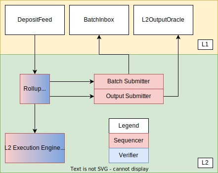
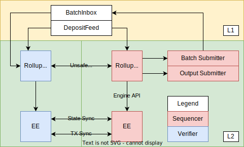
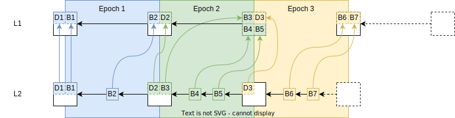
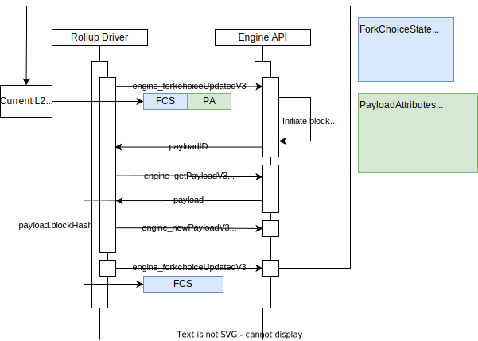

# Optimism Overview

<!-- START doctoc generated TOC please keep comment here to allow auto update -->
<!-- DON'T EDIT THIS SECTION, INSTEAD RE-RUN doctoc TO UPDATE -->
**Table of Contents**

- [Architecture Design Goals](#architecture-design-goals)
- [Components](#components)
  - [L1 Components](#l1-components)
  - [L2 Components](#l2-components)
  - [Transaction/Block Propagation](#transactionblock-propagation)
- [Key Interactions In Depth](#key-interactions-in-depth)
  - [Deposits](#deposits)
  - [Block Derivation](#block-derivation)
    - [Overview](#overview)
    - [Epochs and the Sequencing Window](#epochs-and-the-sequencing-window)
    - [Block Derivation Loop](#block-derivation-loop)
  - [Engine API](#engine-api)

<!-- END doctoc generated TOC please keep comment here to allow auto update -->

This document is a high-level technical overview of the Optimism protocol. It aims to explain how the protocol works in
an informal manner, and direct readers to other parts of the specification so that they may learn more.

This document assumes you've read the [introduction](./introduction.md).

## Architecture Design Goals

- **Execution-Level EVM Equivalence:** The developer experience should be identical to L1 except where L2 introduces a
fundamental difference.
  - No special compiler.
  - No unexpected gas costs.
  - Transaction traces work out-of-the-box.
  - All existing Ethereum tooling works - all you have to do is change the chain ID.
- **Maximal compatibility with ETH1 nodes:** The implementation should minimize any differences with a vanilla Geth
node, and leverage as many existing L1 standards as possible.
  - The execution engine/rollup node use the ETH2 Engine API to build the canonical L2 chain.
  - The execution engine leverages Geth's existing mempool and sync implementations, including snap sync.
- **Minimize state and complexity:**
  - Whenever possible, services contributing to the rollup infrastructure are stateless.
  - Stateful services can recover to full operation from a fresh DB using the peer-to-peer network and on-chain sync
mechanisms.
  - Running a replica is as simple as running a Geth node.

## Components



### L1 Components

- **OptimismPortal**: A feed of L2 transactions which originated as smart contract calls in the L1 state.
  - The `OptimismPortal` contract emits `TransactionDeposited` events, which the rollup driver reads in order to process
deposits.
  - Deposits are guaranteed to be reflected in the L2 state within the _sequencing window_.
  - Beware that _transactions_ are deposited, not tokens. However deposited transactions are a key part of implementing
token deposits (tokens are locked on L1, then minted on L2 via a deposited transaction).
- **BatchInbox**: An L1 address to which the Batch Submitter submits transaction batches.
  - Transaction batches include L2 transaction calldata, timestamps, and ordering information.
  - The BatchInbox is a regular EOA address. This lets us pass on gas cost savings by not executing any EVM code.

- **L2OutputOracle**: A smart contract that stores [L2 output roots](./glossary.md#l2-output) for use with withdrawals
and fault proofs.

### L2 Components

- **Rollup Node**:
  - A standalone, stateless binary.
  - Receives L2 transactions from users.
  - Syncs and verifies rollup data on L1.
  - Applies rollup-specific block production rules to synthesize blocks from L1.
  - Appends blocks to the L2 chain using the Engine API.
  - Handles L1 reorgs.
  - Distributes unsubmitted blocks to other rollup nodes.
- **Execution Engine (EE)**:
  - A vanilla Geth node with minor modifications to support Optimism.
  - Maintains L2 state.
  - Sync state to other L2 nodes for fast onboarding.
  - Serves the Engine API to the rollup node.
- **Batch Submitter**
  - A background process that submits [transaction batches](./glossary.md#sequencer-batch) to the `BatchInbox` address.
- **Output Submitter**
  - A background process that submits L2 output commitments to the `L2OutputOracle`.

### Transaction/Block Propagation

**Spec links:**

- [Execution Engine](./exec-engine.md)

Since the EE uses Geth under the hood, Optimism uses Geth's built-in peer-to-peer network and transaction pool to
propagate transactions. The same network can also be used to propagate submitted blocks and support snap-sync.

Unsubmitted blocks, however, are propagated using a separate peer-to-peer network of Rollup Nodes. This is optional,
however, and is provided as a convenience to lower latency for verifiers and their JSON-RPC clients.

The below diagram illustrates how the sequencer and verifiers fit together:



## Key Interactions In Depth

### Deposits

**Spec links:**

- [Deposits](./deposits.md)

Optimism supports two types of deposits: user deposits, and L1 attributes deposits. To perform a user deposit, users
call the `depositTransaction` method on the `OptimismPortal` contract. This in turn emits `TransactionDeposited` events,
which the rollup node reads during block derivation.

L1 attributes deposits are used to register L1 block attributes (number, timestamp, etc.) on L2 via a call to the L1
Attributes Predeploy. They cannot be initiated by users, and are instead added to L2 blocks automatically by the rollup
node.

Both deposit types are represented by a single custom EIP-2718 transaction type on L2.

### Block Derivation

#### Overview

The rollup chain can be deterministically derived given an L1 Ethereum chain. The fact that the entire rollup chain can
be derived based on L1 blocks is _what makes Optimism a rollup_. This process can be represented as:

```text
derive_rollup_chain(l1_blockchain) -> rollup_blockchain
```

Optimism's block derivation function is designed such that it:

- Requires no state other than what is easily accessible using L1 and L2 execution engine APIs.
- Supports sequencers and sequencer consensus.
- Is resilient to sequencer censorship.

#### Epochs and the Sequencing Window

The rollup chain is subdivided into epochs. There is a 1:1 correspondence between L1 block numbers and epoch numbers.

For L1 block number `n`, there is a corresponding rollup epoch `n` which can only be derived after a _sequencing window_
worth of blocks has passed, i.e. after L1 block number `n + SEQUENCING_WINDOW_SIZE` is added to the L1 chain.

Each epoch contains at least one block. Every block in the epoch contains an L1 info transaction which contains
contextual information about L1 such as the block hash and timestamp. The first block in the epoch also contains all
deposits initiated via the `OptimismPortal` contract on L1. All L2 blocks can also contain _sequenced transactions_,
i.e.  transactions submitted directly to the sequencer.

Whenever the sequencer creates a new L2 block for a given epoch, it must submit it to L1 as part of a _batch_, within
the epoch's sequencing window (i.e. the batch must land before L1 block `n + SEQUENCING_WINDOW_SIZE`). These batches are
(along with the `TransactionDeposited` L1 events) what allows the derivation of the L2 chain from the L1 chain.

The sequencer does not need for a L2 block to be batch-submitted to L1 in order to build on top of it. In fact, batches
typically contain multiple L2 blocks worth of sequenced transaction. This is what enables
_fast transaction confirmations_ on the sequencer.

Since transaction batches for a given epoch can be submitted anywhere within the sequencing window, verifiers must
search all blocks within the window for transaction batches. This protects against the uncertainty of transaction
inclusion of L1. This uncertainty is also why we need the sequencing window in the first place: otherwise the sequencer
could retroactively add blocks to an old epoch, and validators wouldn't know when they can finalize an epoch.

The sequencing window also prevents censorship by the sequencer: deposits made on a given L1 block will be included in
the L2 chain at worst after `SEQUENCING_WINDOW_SIZE` L1 blocks have passed.

The following diagram describes this relationship, and how L2 blocks are derived from L1 blocks (L1 info transactions
have been elided):



#### Block Derivation Loop

A sub-component of the rollup node called the _rollup driver_ is actually responsible for performing block derivation.
The rollup driver is essentially an infinite loop that runs the block derivation function. For each epoch, the block
derivation function performs the following steps:

1. Downloads deposit and transaction batch data for each block in the sequencing window.
2. Converts the deposit and transaction batch data into payload attributes for the Engine API.
3. Submits the payload attributes to the Engine API, where they are converted into blocks and added to the canonical
chain.

This process is then repeated with incrementing epochs until the tip of L1 is reached.

### Engine API

The rollup driver doesn't actually create blocks. Instead, it directs the execution engine to do so via the Engine API.
For each iteration of the block derivation loop described above, the rollup driver will craft a _payload attributes_
object and send it to the execution engine. The execution engine will then convert the payload attributes object into a
block, and add it to the chain. The basic sequence the rollup driver is as follows:

1. Call `engine_forkChoiceUpdatedV1` with the payload attributes object. We'll skip over the details of the fork choice
state parameter for now - just know that one of its fields is the L2 chain's `headBlockHash`, and that it is set to the
block hash of the tip of the L2 chain. The Engine API returns a payload ID.
2. Call `engine_getPayloadV1` with the payload ID returned in step 1. The engine API returns a payload object that
includes a block hash as one of its fields.
3. Call `engine_newPayloadV1` with the payload returned in step 2.
4. Call `engine_forkChoiceUpdatedV1` with the fork choice parameter's `headBlockHash` set to the block hash returned in
step 2. The tip of the L2 chain is now the block created in step 1.

The swimlane diagram below visualizes the process:


