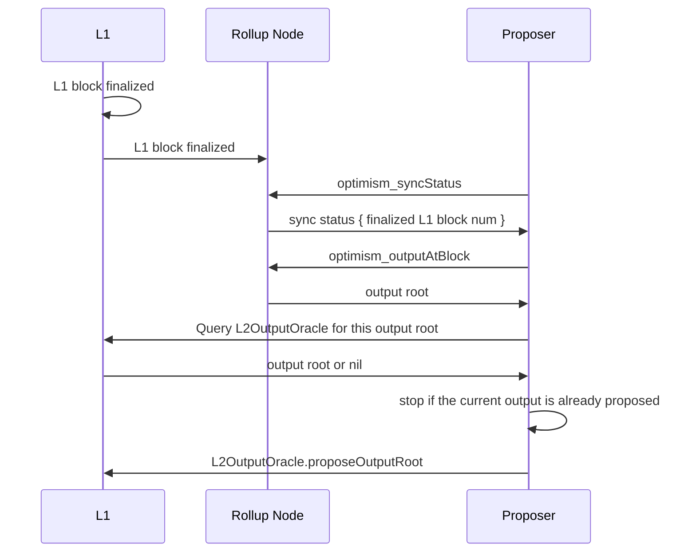

# L2 Output Root Proposals Specification

<!-- All glossary references in this file. -->

[g-rollup-node]: glossary.md#rollup-node
[g-mpt]: glossary.md#merkle-patricia-trie

<!-- START doctoc generated TOC please keep comment here to allow auto update -->
<!-- DON'T EDIT THIS SECTION, INSTEAD RE-RUN doctoc TO UPDATE -->
**Table of Contents**

- [Proposing L2 Output Commitments](#proposing-l2-output-commitments)
  - [L2OutputOracle v1.0.0](#l2outputoracle-v100)
  - [L2OutputOracle v2.0.0](#l2outputoracle-v200)
- [L2 Output Commitment Construction](#l2-output-commitment-construction)
- [L2 Output Oracle Smart Contract](#l2-output-oracle-smart-contract)
  - [Configuration](#configuration)
- [Security Considerations](#security-considerations)
  - [L1 Reorgs](#l1-reorgs)
- [Summary of Definitions](#summary-of-definitions)
  - [Constants](#constants)

<!-- END doctoc generated TOC please keep comment here to allow auto update -->

After processing one or more blocks the outputs will need to be synchronized with the settlement layer (L1)
for trustless execution of L2-to-L1 messaging, such as withdrawals.
These output proposals act as the bridge's view into the L2 state.
Actors called "Proposers" submit the output roots to the settlement layer (L1) and can be contested with a fault proof,
with a bond at stake if the proof is wrong. The [op-proposer](../op-proposer/) in one such implementation of a proposer.

_Note_: Fault proofs on Optimism are not fully specified at this time. Although fault proof
construction and verification [is implemented in Cannon][cannon],
the fault proof game specification and integration of a output-root challenger into the [rollup-node][g-rollup-node]
are part of later specification milestones.

[cannon]: https://github.com/ethereum-optimism/cannon

## Proposing L2 Output Commitments

The proposer's role is to construct and submit output roots, which are commitments to the L2's state,
to the `L2OutputOracle` contract on L1 (the settlement layer). To do this, the proposer periodically
queries the [rollup node](./rollup-node.md) for the latest output root derived from the latest
[finalized](rollup-node.md#finalization-guarantees) L1 block. It then takes the output root and
submits it to the `L2OutputOracle` contract on the settlement layer (L1).

### L2OutputOracle v1.0.0

The submission of output proposals is permissioned to a single account. It is expected that this
account continues to submit output proposals over time to ensure that user withdrawals do not halt.

The [L2 output proposer](../op-proposer) is expected to submit output roots on a deterministic
interval based on the configured `SUBMISSION_INTERVAL` in the `L2OutputOracle`. The larger
the `SUBMISSION_INTERVAL`, the less often L1 transactions need to be sent to the `L2OutputOracle`
contract, but L2 users will need to wait a bit longer for an output root to be included in L1 (the settlement layer)
that includes their intention to withdrawal from the system.

The honest `op-proposer` algorithm assumes a connection to the `L2OutputOracle` contract to know
the L2 block number that corresponds to the next output proposal that must be submitted. It also
assumes a connection to an `op-node` to be able to query the `optimism_syncStatus` RPC endpoint.

```python
import time

while True:
    next_checkpoint_block = L2OutputOracle.nextBlockNumber()
    rollup_status = op_node_client.sync_status()
    if rollup_status.finalized_l2.number >= next_checkpoint_block:
        output = op_node_client.output_at_block(next_checkpoint_block)
        tx = send_transaction(output)
    time.sleep(poll_interval)
```

A `CHALLENGER` account can delete multiple output roots by calling the `deleteL2Outputs()` function
and specifying the index of the first output to delete, this will also delete all subsequent outputs.

### L2OutputOracle v2.0.0

The submission of output proposals is permissionless and there is no interval at which output
proposals must be submitted at. It is expected that users will "just in time" propose an output
proposal to facilitate their own withdrawal. A bond must be placed with an output proposal to
disincentivize the proposal of malicious outputs. If it can be proven that the output is malicious,
either via fault proof or by an attestation proof, then the bond can be slashed and used as a
payment to the users who paid for gas to remove the malicious output.

The `op-proposer` can still be used to submit output proposals. A naive implementation of the
`op-proposer` will submit output proposals on an interval. However, this is not required, and other
proposer implementations may submit valid outputs at any time. A more ideal implementation
will use heuristics such as time of last submission or number of pending withdrawals that have
yet to be included in an output proposal.

A single iteration of this proposer (posting one output root to L1) is depicted below:



Since there may be multiple proposers running simultaneously when permissionless output proposals are enabled,
the [op-proposer](../op-proposer/) will check that it's output root has not been posted for the given L2 block
number before sending the proposal transaction. This is shown in the sequence diagram above when the `Proposer`
queries the `L2OutputOracle` for the output root. If it receives an output root that is equal to the one it
received from the rollup node, it will **not** send this output root in a transaction to the `L2OutputOracle`.

Also note, while the [op-proposer](../op-proposer/) implementation submits outputs _only_ based on finalized
or safe L2 blocks, other proposer implementations may submit outputs corresponding to unsafe (non-finalized)
L2 blocks. This comes with risk as it will be possible for [batchers](./batcher.md) to submit L2 blocks that
do not correspond to the output that have already been made available (implying those outputs are now _invalid_).

Version `v2.0.0` includes breaking changes to the `L2OutputOracle` ABI.

## L2 Output Commitment Construction

The `output_root` is a 32 byte string, which is derived based on the a versioned scheme:

```pseudocode
output_root = keccak256(version_byte || payload)
```

where:

1. `version_byte` (`bytes32`) a simple version string which increments anytime the construction of the output root
   is changed.

2. `payload` (`bytes`) is a byte string of arbitrary length.

In the initial version of the output commitment construction, the version is `bytes32(0)`, and the payload is defined
as:

```pseudocode
payload = state_root || withdrawal_storage_root || latest_block_hash
```

where:

1. The `latest_block_hash` (`bytes32`) is the block hash for the latest L2 block.

1. The `state_root` (`bytes32`) is the Merkle-Patricia-Trie ([MPT][g-mpt]) root of all execution-layer accounts.
   This value is frequently used and thus elevated closer to the L2 output root, which removes the need to prove its
   inclusion in the pre-image of the `latest_block_hash`. This reduces the merkle proof depth and cost of accessing the
   L2 state root on L1.

1. The `withdrawal_storage_root` (`bytes32`) elevates the Merkle-Patricia-Trie ([MPT][g-mpt]) root of the [Message
   Passer contract](./withdrawals.md#the-l2tol1messagepasser-contract) storage. Instead of making an MPT proof for a
   withdrawal against the state root (proving first the storage root of the L2toL1MessagePasser against the state root,
   then the withdrawal against that storage root), we can prove against the L2toL1MessagePasser's storage root directly,
   thus reducing the verification cost of withdrawals on L1.

## L2 Output Oracle Smart Contract

L2 blocks are produced at a constant rate of `L2_BLOCK_TIME` (2 seconds).
A new L2 output MUST be appended to the chain once per `SUBMISSION_INTERVAL` which is based on a number of blocks.
The exact number is yet to be determined, and will depend on the design of the fault proving game.

The L2 Output Oracle contract implements the following interface:

```solidity
/**
 * @notice The number of the first L2 block recorded in this contract.
 */
uint256 public startingBlockNumber;

/**
 * @notice The timestamp of the first L2 block recorded in this contract.
 */
uint256 public startingTimestamp;

/**
 * @notice Accepts an L2 outputRoot and the timestamp of the corresponding L2 block. The
 * timestamp must be equal to the current value returned by `nextTimestamp()` in order to be
 * accepted.
 * This function may only be called by the Proposer.
 *
 * @param _l2Output      The L2 output of the checkpoint block.
 * @param _l2BlockNumber The L2 block number that resulted in _l2Output.
 * @param _l1Blockhash   A block hash which must be included in the current chain.
 * @param _l1BlockNumber The block number with the specified block hash.
*/
  function proposeL2Output(
      bytes32 _l2Output,
      uint256 _l2BlockNumber,
      bytes32 _l1Blockhash,
      uint256 _l1BlockNumber
  )

/**
 * @notice Deletes all output proposals after and including the proposal that corresponds to
 *         the given output index. Only the challenger address can delete outputs.
 *
 * @param _l2OutputIndex Index of the first L2 output to be deleted. All outputs after this
 *                       output will also be deleted.
 */
function deleteL2Outputs(uint256 _l2OutputIndex) external

/**
 * @notice Computes the block number of the next L2 block that needs to be checkpointed.
 */
function getNextBlockNumber() public view returns (uint256)
```

### Configuration

The `startingBlockNumber` must be at least the number of the first Bedrock block.
The `startingTimestamp` MUST be the same as the timestamp of the start block.

The first `outputRoot` proposed will thus be at height `startingBlockNumber + SUBMISSION_INTERVAL`

## Security Considerations

### L1 Reorgs

If the L1 has a reorg after an output has been generated and submitted, the L2 state and correct output may change
leading to a faulty proposal. This is mitigated against by allowing the proposer to submit an
L1 block number and hash to the Output Oracle when appending a new output; in the event of a reorg, the block hash
will not match that of the block with that number and the call will revert.

## Summary of Definitions

### Constants

| Name                  | Value   | Unit    |
| --------------------- | ------- | ------- |
| `SUBMISSION_INTERVAL` | `120`   | blocks  |
| `L2_BLOCK_TIME`       | `2`     | seconds |
