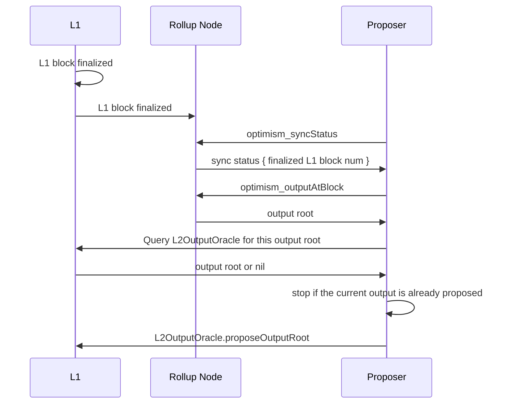

<!-- DOCTOC SKIP -->
# Proposer

The proposer, or output proposer, is an actor that is responsible for submitting L2 output roots
to the settlement layer (L1 in bedrock's case).

## Background

Initially, the v1 settlement layer smart contract that received these output roots, `L2OutputOracle`,
specified a single, permissioned proposer. In this version, output roots were required to be
submitted by said proposer once every `SUBMISSION_INTERVAL` blocks.

In the next iteration of the `L2OutputOracle`, [v2.0.0](./proposals.md#-L2OutputOracle-v2.0.0), the proposer is
no longer permissioned. Anyone can submit an output root to the `L2OutputOracle` contract.
This is coined _Permissionless Output Proposals_.

## Permissionless Architecture

The [op-proposer](../op-proposer/) is an implementation of an output proposer. In order to post
outputs to the `L2OutputOracle`, the proposer needs to periodically query the [rollup node](./rollup-node.md)'s
[`optimism_outputAtBlock` rpc method](./rollup-node.md#l2-output-rpc-method) for the latest output root derived
from the latest [finalized](rollup-node.md#finalization-guarantees) L1 block.

It then takes the output root and submits it to the `L2OutputOracle` contract on the settlement layer (L1).

A single iteration of the proposer (posting one output root to L1) is depicted below:

Since there may be multiple proposers running simultaneously when permissionless output proposals are enabled,
the [op-proposer](../op-proposer/) will check that it's output root has not been posted for the given L2 block
number before sending the proposal transaction. This is shown in the sequence diagram above when the `Proposer`
queries the `L2OutputOracle` for the output root. If it receives an output root that is equal to the one it
received from the rollup node, it will **not** send this output root in a transaction to the `L2OutputOracle`.

Note that the [op-proposer](../op-proposer/) implementation by default will submit output roots at the
`SUBMISSION_INTERVAL` from v1 of the `L2OutputOracle` contract. This is to allow for backwards compatibility
in the UX of outputs being posted to the settlement layer. However, this is not a requirement and other proposer
implementations may choose to submit output roots at any time.

Additionally, a proposer implementation may submit output commitments that correspond to unsafe (non-finalized)
L2 blocks but this comes with risk as it will be possible to submit L2 blocks that do not correspond to the
output commitments that have already been made available.
