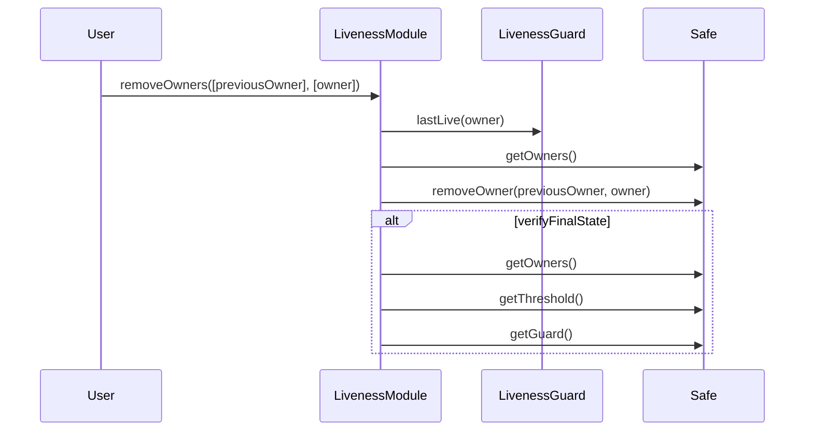

# Safe Liveness Checking

<!-- START doctoc generated TOC please keep comment here to allow auto update -->
<!-- DON'T EDIT THIS SECTION, INSTEAD RE-RUN doctoc TO UPDATE -->
**Table of Contents**

- [Liveness checking Mechanism](#liveness-checking-mechanism)
- [Liveness checking methodology](#liveness-checking-methodology)
  - [The liveness guard](#the-liveness-guard)
  - [The liveness module](#the-liveness-module)
  - [Owner removal call flow](#owner-removal-call-flow)
  - [Shutdown](#shutdown)
  - [Security Properties](#security-properties)
    - [In the guard](#in-the-guard)
    - [In the module](#in-the-module)
  - [Interdependency between the guard and module](#interdependency-between-the-guard-and-module)
- [Operational considerations](#operational-considerations)
  - [Manual validation of new owner liveness](#manual-validation-of-new-owner-liveness)
  - [Deploying the liveness checking system](#deploying-the-liveness-checking-system)
  - [Modify the liveness checking system](#modify-the-liveness-checking-system)
    - [Replacing the module](#replacing-the-module)
    - [Replacing the guard](#replacing-the-guard)

<!-- END doctoc generated TOC please keep comment here to allow auto update -->

## Liveness checking Mechanism

The Security Council uses a specially extended Safe multisig contract to ensure that
any loss of access to a signer's keys is identified and addressed within a predictable period of
time.

This mechanism is intended only to be used to remove signers who have lost access to their keys, or
are otherwise inactive. It is not intended to be used to remove signers who are acting in bad faith,
or any other subjective criteria, such cases should be addressed by governance, and the removal
handled via the standard Safe ownership management functionality.

## Liveness checking methodology

This is achieved using two types of contracts which the Safe contract has built-in support for:

1. **Guard contracts:** can execute pre- and post- transaction checks.
1. **Module contracts:** a contract which is added to the Safe by the signers, and thenceforth is
   authorized to execute transactions via the Safe. This means the module must properly implement
   auth conditions internally.

### The liveness guard

For implementing liveness checks a `LivenessGuard` is created which receives the signatures from
each executed transaction, and tracks the latest time at which a transaction was signed by each
signer. This time is made publicly available by calling a `lastLive(address)(Timestamp)` method.

Owners are recorded in this mapping in one of 4 ways:

1. Upon deployment, the guard reads the current set of owners from the Safe contract.
1. When a new owner is added to the safe. Similarly, when an owner is removed from the Safe, its
   entry is deleted from the mapping.
1. When a transaction is executed, the signatures on that transaction are passed to the guard and
   used to identify the signers. If more than the required number of signatures is provided, they
   are ignored.
1. An owner may call the contract's `showLiveness()()` method directly in order to prove liveness.

Note that the first two methods do not require the owner to actually sign anything. However these mechanisms
are necessary to prevent new owners from being removed before they have had a chance to show liveness.

### The liveness module

A `LivenessModule` is also created which does the following:

1. Has a function `removeOwners()` that anyone may call to specify one or more owners to be removed from the
   Safe.
1. The Module would then check the `LivenessGuard.lastLive()` to determine if the signer is
   eligible for removal.
1. If so, it will call the Safe's `removeSigner()` to remove the non-live signer, and if necessary
   reduce the threshold.
1. When a member is removed, the signing parameters are modified such that `M/N` is the lowest ratio
   which remains greater than or equal to 75%. Using integer math, this can be expressed as `M = (N * 75 + 99) / 100`.

### Owner removal call flow

The following diagram illustrates the flow for removing a single owner. The `verifyFinalState`
box indicates calls to the Safe which ensure the final state is valid.

### Shutdown

In the unlikely event that the signer set (`N`) is reduced below the allowed minimum number of
   owners, then (and only then) is a shutdown mechanism activated which removes the existing
   signers, and hands control of the multisig over to a predetermined entity.

### Security Properties

The following security properties must be upheld:

#### In the guard

1. Signatures are assigned to the correct signer.
1. Non-signers are unable to create a record of having signed.
1. An owner cannot be censored or griefed such that their signing is not recorded.
1. Owners may demonstrate liveness either by signing a transaction or by calling directly to the
   guard.
1. It must be impossible for the guard's `checkTransaction` or `checkAfterExecution` method to
   permanently revert given any calldata and the current state.
1. The guard correctly handles updates to the owners list, such that new owners are recorded, and
   removed owners are deleted.
   1. An `ownersBefore` enumerable set variable is used to accomplish this, it must be emptied at
      the end of the `checkAfterExecution` call.

#### In the module

1. During a shutdown the module correctly removes all signers, and converts the safe to a 1 of 1.
1. The module only removes an owner if they have not demonstrated liveness during the interval, or
     if enough other owners have been removed to activate the shutdown mechanism.
1. The module correctly sets the Safe's threshold upon removing a signer.

Note: neither the module nor guard attempt to prevent a quorum of owners from removing either the liveness
module or guard. There are legitimate reasons they might wish to do so. Moreover, if such a quorum
of owners exists, there is no benefit to removing them, as they are defacto 'sufficiently live'.

### Interdependency between the guard and module

The guard has no dependency on the module, and can be used independently to track liveness of
Safe owners.

This means that the module can be removed or replaced without any affect on the guard.

The module however does have a dependency on the guard; if the guard is removed from the Safe, then
the module will no longer be functional and calls to its `removeOwners` function will revert.

## Operational considerations

### Manual validation of new owner liveness

As [noted above](#the-liveness-guard) newly added owners are recorded in the guard without
necessarily having signed a transaction. Off-chain validation of the liveness of an address must
therefore be done prior to adding a new owner.

### Deploying the liveness checking system

[deploying]: #deploying-the-liveness-checking-system

The module and guard are intended to be deployed and installed on the safe in the following
sequence:

1. Deploy the guard contract
   2. The guard's constructor will read the Safe's owners and set a timestamp
1. Deploy the module.
1. Set the guard on the safe.
1. Enable the module on the safe.

This order of operations is necessary to satisfy the constructor checks in the module, and is
intended to prevent owners from being immediately removable.

Note that changes to the owners set should not be made between the time the module is deployed, and
when it is enabled on the Safe, otherwise the checks made in the module's constructor may be
invalidated. If such changes are made, a new module should be deployed.

### Modify the liveness checking system

Changes to the liveness checking system should be done in the following manner:

#### Replacing the module

The module can safely be removed without affecting the operation of the guard. A new module can then
be added.

Note: none of the module's parameters are modifiable. In order to update the security properties
enforced by the module, it must be replaced.

#### Replacing the guard

The safe can only have one guard contract at a time, and if the guard is removed the module will
cease to function. This does not affect the ability of the Safe to operate normally, however the
module should be removed as a best practice.

If a new guard is added, eg. as a means of upgrading it, then a new module will also need to be
deployed and enabled. Once both the guard and module have been removed, they can be replaced
according to the steps in the [Deployment][deploying] section above.
