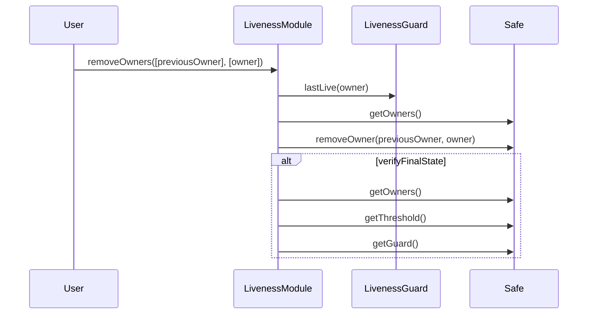

# Safe Liveness Checking

<!-- START doctoc generated TOC please keep comment here to allow auto update -->
<!-- DON'T EDIT THIS SECTION, INSTEAD RE-RUN doctoc TO UPDATE -->
**Table of Contents**

- [Liveness Checking Mechanism](#liveness-checking-mechanism)
- [Liveness checking methodology](#liveness-checking-methodology)
  - [The Liveness Guard](#the-liveness-guard)
  - [The Liveness Module](#the-liveness-module)
  - [Owner removal call flow](#owner-removal-call-flow)
  - [Shutdown](#shutdown)
  - [Security Properties](#security-properties)
  - [Interdependency between the Guard and Module](#interdependency-between-the-guard-and-module)
  - [Deployment](#deployment)

<!-- END doctoc generated TOC please keep comment here to allow auto update -->

## Liveness Checking Mechanism

The Security Security Council uses a specially extended Safe multisig contract to ensure that
any loss of access to a signer's keys is identified and addressed within a predictable period of
time.

This mechanism is intended only to be used to remove signers who have lost access to their keys, or
are otherwise inactive. It is not intended to be used to remove signers who are acting in bad faith,
or any other subjective criteria, such cases should be addressed by governance, and the removal
handled via the standard Safe ownership management functionality.

## Liveness checking methodology

This is achieved using two types of contracts which the Safe contract has built-in support for:

1. **Guard contracts:** can execute pre- and post- transaction checks.
1. **Module contracts:** a contract which is added to the Safe by the signers, and thenceforth is
   authorized to execute transactions via the Safe. This means the module must properly implement
   auth conditions internally.

### The Liveness Guard

For implementing liveness checks a `LivenessGuard` is created which receives the signatures from
each executed transaction, and tracks the latest time at which a transaction was signed by each
signer. This time is made publicly available by calling a `lastLive(address)(Timestamp)` method.

Signers may also call the contract's `showLiveness()()` method directly in order to prove liveness.

### The Liveness Module

A `LivenessModule` is also created which does the following:

1. Has a function `removeOwner()` that anyone may call to specify an owner to be removed from the
   Safe.
1. The Module would then check the `LivenessGuard.lastLive()` to determine if the signer is
   eligible for removal.
1. If so, it will call the Safe's `removeSigner()` to remove the non-live signer, and if necessary
   reduce the threshold.
1. When a member is removed, the signing parameters are modified such that `M/N` is the lowest ratio
   which remains greater than or equal to 75%. Using integer math, this can be expressed as `M = (N * 75 + 99) / 100`.

### Owner removal call flow

The following diagram illustrates the flow for removing a single owner. The `verifyFinalState`
box indicates calls to the Safe which ensure the final state is valid.

### Shutdown

In the unlikely event that the signer set (`N`) is reduced below the allowed threshold, then (and only then) is a
   shutdown mechanism activated which removes the existing signers, and hands control of the
   multisig over to a predetermined entity.

### Security Properties

The following security properties must be upheld:

1. Signatures are assigned to the correct signer.
1. Non-signers are unable to create a record of having signed.
1. A signer cannot be censored or grieffed such that their signing is not recorded.
1. Signers may demonstrate liveness either by signing a transaction or by calling directly to the
   guard.
1. The module only removes a signer if they have demonstrated liveness during the interval, or
     if necessary to convert the safe to a 1 of 1.
1. The module sets the correct 75% threshold upon removing a signer.
1. During a shutdown the module correctly removes all signers, and converts the safe to a 1 of 1.

### Interdependency between the Guard and Module

The Guard has no dependency on the Module, and can be used independently to track liveness of
Safe owners. The Module however does have a dependency on the Guard, only one guard contract can
be set on the Safe, and the Module will be unable to function if the Guard is removed.

### Deployment

The module are guard are intended to be deployed and installed on the safe in the following sequence:

1. Deploy the guard contract, this will set a timestamp for each existing owner on the Safe.
1. Deploy the module.
1. Enable the module on the safe.
1. Set the guard on the safe.

This order of operations is necessary to satisfy the constructor checks in the module, and is
intended to prevent owners from being immediately removable.
