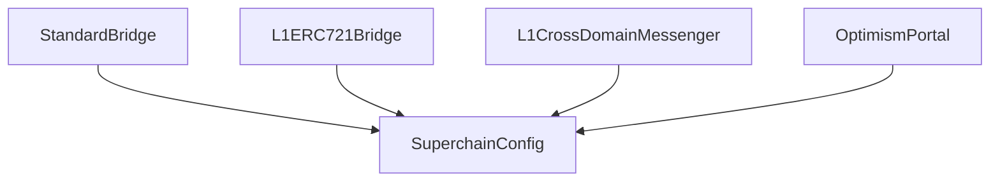

# Superchain Configuration

The SuperchainConfig contract is used to manage global configuration values for multiple OP Chains within
a single Superchain network.

<!-- START doctoc generated TOC please keep comment here to allow auto update -->
<!-- DON'T EDIT THIS SECTION, INSTEAD RE-RUN doctoc TO UPDATE -->
**Table of Contents**

- [Configurable values](#configurable-values)
- [Configuration data flow](#configuration-data-flow)
  - [Pausability](#pausability)
    - [Paused identifiers](#paused-identifiers)
    - [Scope of pausability](#scope-of-pausability)

<!-- END doctoc generated TOC please keep comment here to allow auto update -->

## Configurable values

Configurability of the Superchain is currently limited to two values:

The `SuperchainConfig` contract manages the following configuration values:

- `PAUSED_SLOT`: A boolean value indicating whether the Superchain is paused.
- `GUARDIAN_SLOT`: The address of the guardian, which can pause and unpause the system.

## Configuration data flow

All contracts which read from the `SuperchainConfig` contract hold its address as storage values
in the proxy account, and call directly to it when reading configuration data.

### Pausability

The Superchain pause feature is a safety mechanism designed to temporarily halt withdrawals from the system in
an emergency situation. The Guardian role is authorized to pause and unpause the system.

#### Paused identifiers

When the system is paused the `Paused(string identifier)` event is emitted. This allows for the
caller to provide additional information to be used during incident response.

#### Scope of pausability

The pause applies specifically to withdrawals of assets from the L1 bridge contracts. The L2 bridge contracts
are not pausable, on the basis that issues on L2 can be addressed more easily by a hard fork in the consensus
layer.

When the Pause is activated, the following methods are disabled:

1. `OptimismPortal.proveWithdrawalTransaction()`
1. `OptimismPortal.finalizeWithdrawalTransaction()`
1. `L1CrossDomainMessenger.relayMessage()`
1. `StandardBridge.finalizeBridgeERC20()`
1. `StandardBridge.finalizeBridgeETH()`
1. `L1ERC721Bridge.finalizeBridgeERC721()`
