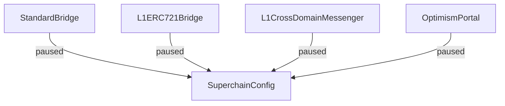

# Superchain Pause

The whole damn superchain can be paused.

WIP

<!-- START doctoc generated TOC please keep comment here to allow auto update -->
<!-- DON'T EDIT THIS SECTION, INSTEAD RE-RUN doctoc TO UPDATE -->
**Table of Contents**

- [Pausability flow](#pausability-flow)
- [SuperchainConfig is `immutable`](#superchainconfig-is-immutable)

<!-- END doctoc generated TOC please keep comment here to allow auto update -->

## Pausability flow

## SuperchainConfig is `immutable`

The `SuperchainConfig` value is stored in the bytecode of the implementation contracts. This ensures
that it will be consistent across all contracts in all OP Chains.
