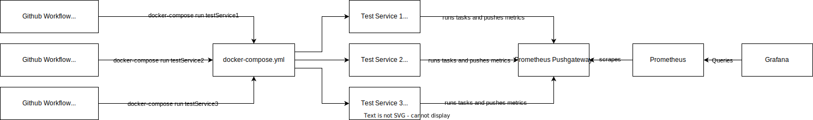
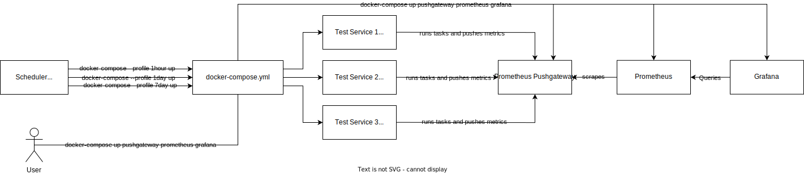

# User Facing Monitoring

This project allows you to create _Test Services_ which are Docker containers configured to run a set of tasks, generate metrics, and push those metrics to a Prometheus Pushgateway that can later be scraped and queried by a Grafana dashboard

This project has two modes of execution: CI and local

## CI Execution



Starting from left to right in the above diagram:

1. Github Workflow files are created for each time interval Test Services should be ran
    - All Test Services that should be ran for a specific time interval (e.g. 1 hour) should be defined in the same Github Workflow file
2. Github will run a workflow at its specified time interval, triggering all of it's defined Test Services to run
3. `docker-compose.yml` builds and runs each Test Service, setting any environment variables that can be sourced from Github secrets
4. Each Test Service will run its defined tasks, generate its metrics, and push them to an already deployed instance of Prometheus Pushgateway
5. An already deployed instance of Prometheus will scrape the Pushgateway for metrics
6. An already deployed Grafana dashboard will query Prometheus for metric data to display

### Mocking CI Execution Locally

Thanks to [Act](https://github.com/nektos/act), Github actions can be "ran" locally for testing. Here's how:

1. [Install Act](https://github.com/nektos/act#installation-through-package-managers)
    - For MacOS: `brew install act`
2. [Generate](https://docs.github.com/en/enterprise-server@3.6/authentication/keeping-your-account-and-data-secure/managing-your-personal-access-tokens#creating-a-personal-access-token) a Github access token
    - I believe it only needs permission to read from repositories
3. Copy secrets file: `cp .secrets.example .secrets` and fill it out
4. Create `~/.actrc` and copy the following into it:
```bash
-P ubuntu-latest=catthehacker/ubuntu:full-18.04
-P ubuntu-latest=catthehacker/ubuntu:full-18.04
-P ubuntu-18.04=catthehacker/ubuntu:full-18.04
```
5. Spin up the Pushgateway, Prometheus, and Grafana containers: `docker-compose up pushgateway prometheus grafana`
    - Optionally, you could specify a remote Pushgateway and Prometheus instance to push metrics to in `.secrets`
        - `PROMETHEUS_SERVER_URL` and `PROMETHEUS_PUSHGATEWAY_URL`
6. Run `act -W .github/workflows/YOUR_WORKFLOW_FILE.yml -s GITHUB_TOKEN=YOUR_TOKEN --secret-file ./ufm-test-services/.secrets --container-architecture linux/amd64`
    - `--container-architecture linux/amd64` is necessary if running on MacOS, but may be different for you
    - Downloading the Github Actions Docker image takes a while and is pretty big, so you might need to allocate more resources to Docker, or `docker prune`/remove no longer needed images/containers/volumes

Following these steps will use `act` to mock the Github Actions environment using a Docker container. The Github Actions container will then spin up a nested container to run each Test Service. Each Test Service _should_ be configured to generate and push metrics to the given Pushgateway, so after `act` finishes execution, you should be able to login into Grafana and view the dashboards

## Local Execution

### Running With Scheduler



Starting from left to right in the above diagram:

1. Copy env file: `cp .env.example .env` and fill it out
    - If you want to run local instances of the Pushgateway, Prometheus, and Grafana, you can run:
        ```bash
        docker-compose up pushgateway prometheus grafana
        ```
        to spin those up. Otherwise, you should override the defaults URLs in the `.env` for:
        - `PROMETHEUS_SERVER_URL` and `PROMETHEUS_PUSHGATEWAY_URL`
3. You'll need to setup some sort of scheduler to run your Test Services at specific time intervals
    - For Linux/MacOS this can be accomplished using `cron`
        - Edit your `cron` job file using `crontab -e`
        - Here is some example code to get you started, also found in `crontab.example` file:
            ```bash
            # Needs to point to docker, otherwise you'll get the error: exec: "docker": executable file not found in $PATH
            PATH=/

            # Runs every 1 hour
            0 * * * * /usr/local/bin/docker-compose -f /path/to/docker-compose.yml --profile 1hour up -d

            # Runs every 1 day
            0 12 * * * /usr/local/bin/docker-compose -f /path/to/docker-compose.yml --profile 1day up -d

            # Runs every 7 days
            0 12 */7 * * /usr/local/bin/docker-compose -f /path/to/docker-compose.yml --profile 7day up -d
            ```

### Running Manually

1. Copy env file: `cp .env.example .env` and fill it out
2. Run `docker-compose` for which ever Test Service you'd like to run e.g.:
    - `docker-compose run testService1`
    - `docker-compose --profile 1hour up`

## Test Services

If you're trying to run a specific Test Service, make sure to check out their `README.md`s, as they may have some required prerequisites to setup before they'll run as expected
